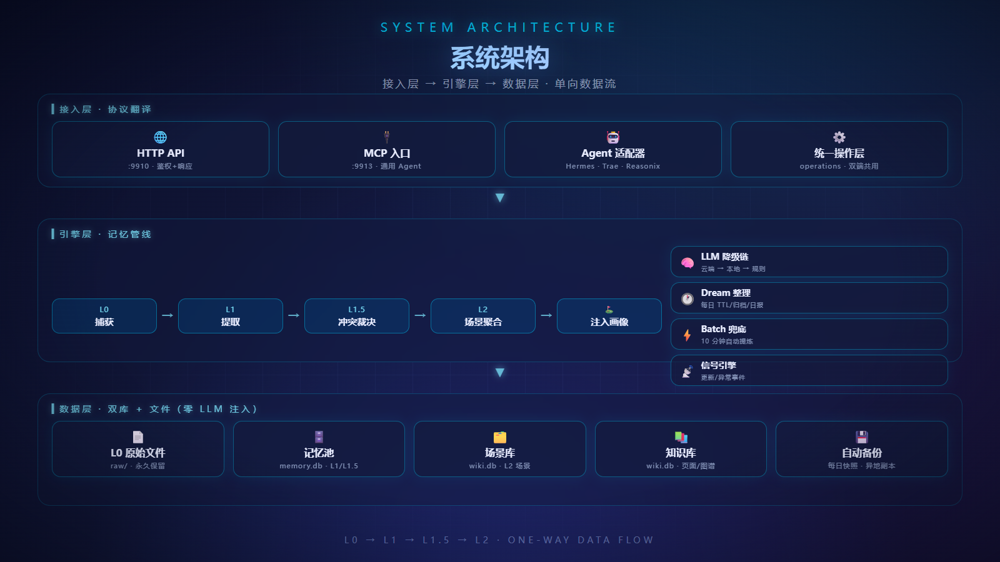
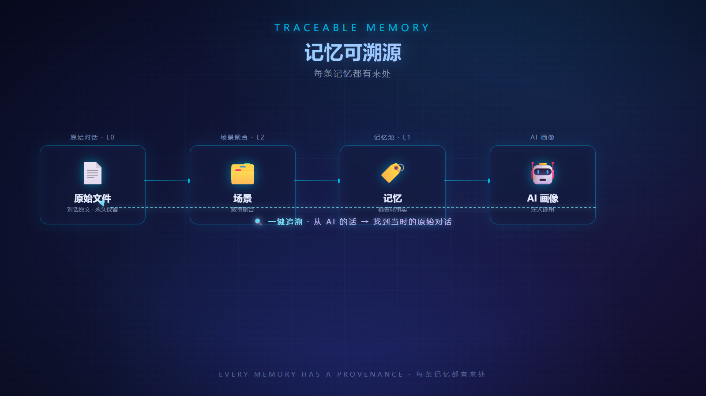
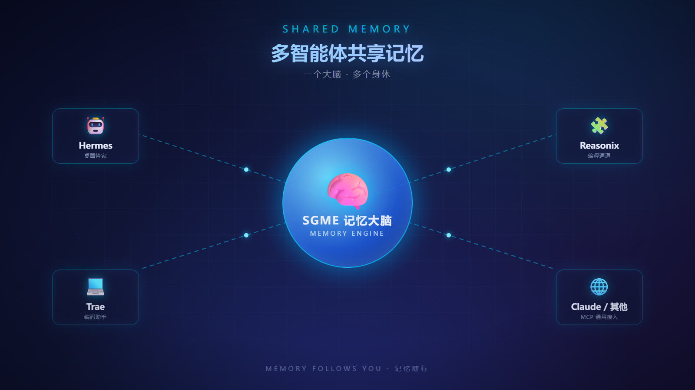
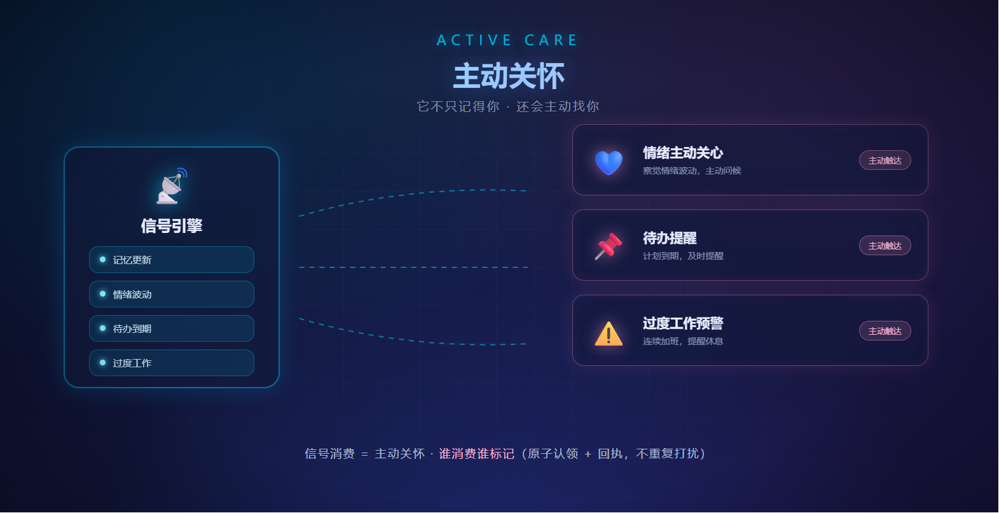
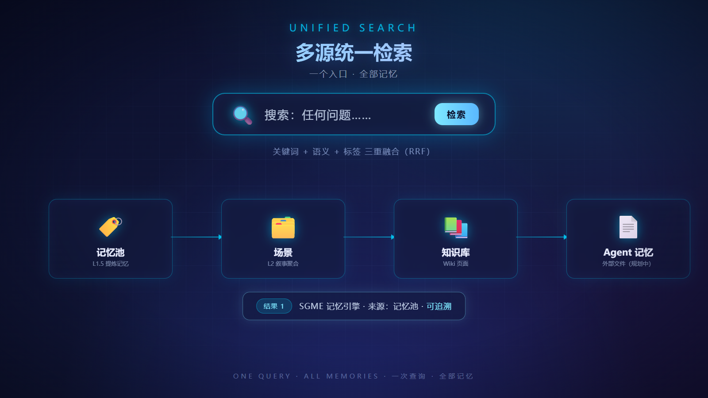
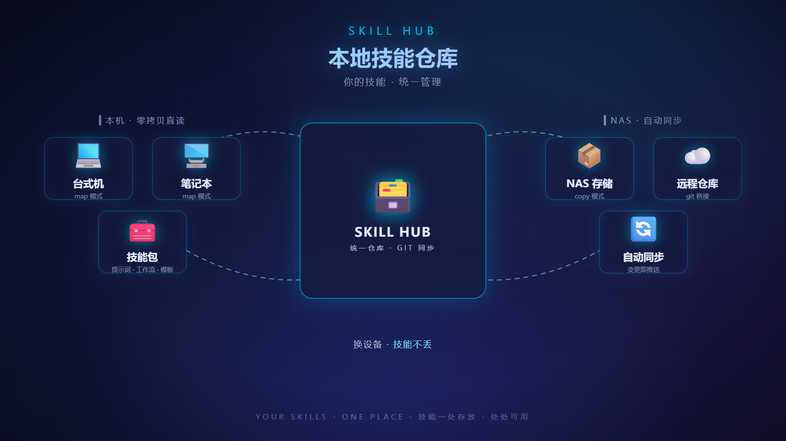
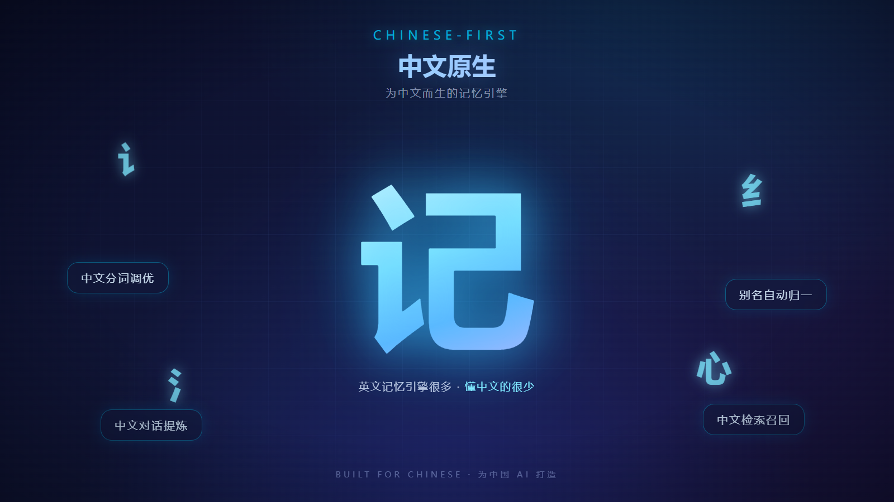
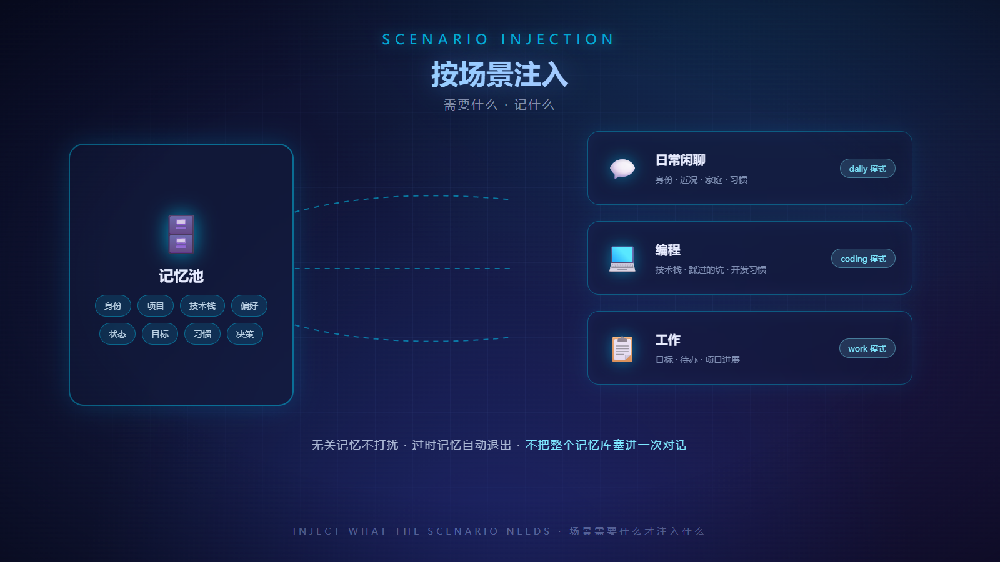
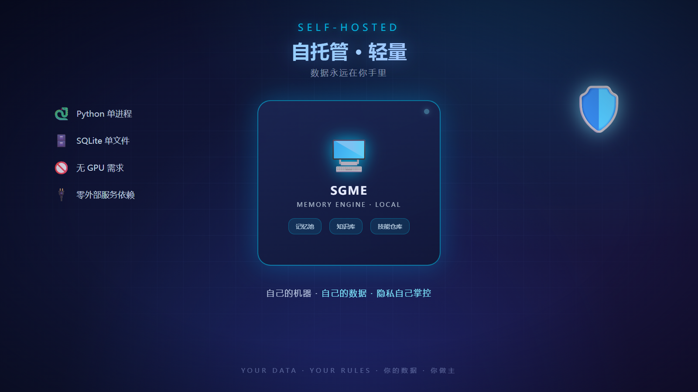

英文版：[English](README.md)

# SGME — 拾光记忆引擎

你的 AI，从此记得你——拾光记忆引擎，它记得你们聊过的每一件事，还会主动关心你。

[](https://www.python.org/)
[](LICENSE)

## 你的 AI 为什么总是忘记你

你的 AI 助手是不是也这样：

- 昨天刚说过的事，今天又要重新交代一遍
- 每次新会话都要自我介绍：「我是谁、我在做什么项目、我喜欢什么」
- 换台电脑、换个人工智能，过去的对话全归零
- 和喜欢的 AI 角色聊得正投入，换了会话、换了软件，它就「忘了你」

因为 AI 默认没有记忆——每次对话都是「第一次见面」。

**SGME 解决这个问题**：它像一个记忆中枢，接住你和 AI 的每一段对话，提炼成结构化的记忆，在下次对话时自动送到 AI 面前。你不需要重复，它都记得。

## 它是怎么工作的

三步，全部自动：

1. **捕获**：你和 AI 的对话自动保存为原始记录（L0 原始层，磁盘上的 Markdown 文件，永久保留）
2. **提炼**：原始对话被提炼成一条条标签化记忆（事实、偏好、项目状态、决策……），自动去重、合并、发现矛盾
3. **注入**：每次对话开始时，AI 自动收到与你相关的记忆——按当前场景挑选，不是全量加载。日常闲聊只带身份与近况，编程时只带项目相关的记忆（技术栈、踩过的坑、开发习惯），场景需要什么就注入什么



## 核心卖点

### 记忆可溯源——每条记忆都有来处

AI 说出的每一句话，背后都有据可查：从画像一路追回当时的原始对话。记忆不是黑盒——「它为什么知道这件事」「它什么时候知道的」，点开就能看到源头。



### 多智能体共享记忆——一个大脑，多个身体

Hermes、DSH……你的所有 AI 共享同一个记忆大脑。在这边聊的事，那边自动知道；台式机、笔记本、NAS 部署的 AI，记忆互通。AI 之间不再各说各话。



### 主动关怀——它不只记得你，还会主动找你

SGME 不只会被动等你来问。你的记忆更新、情绪波动、待办到期、连续熬夜……它会主动发出信号，让 AI 主动来关心你——不是冷冰冰的通知，是「记得你今天有件事」的惦记。信号消费 = 主动关怀，谁消费谁标记（原子认领 + 回执），不会重复打扰，也不会漏掉。



### 人格洞察——不只记住你的事，还懂你这个人

每一次对话都在悄悄沉淀一份活的人格画像：决策风格、做事习惯、质量标准……以证据加权的方式累积成「倾向」，绝不轻易下定论。每月一次自动校准让画像持续进化（附带娱乐级 MBTI 评测），并在每轮对话中自动注入——你的 AI 不只记得你经历过什么，还懂得用你舒服的方式跟你说话。全程本地、条条可溯源、随时可关闭。


### 多源统一检索——一个入口，全部记忆

一个检索入口同时召回记忆池与知识库：关键词 + 语义 + 标签三重融合排序，每条结果都能追回源头。SGME 记忆、场景、知识库一站式召回；agent 自带记忆文件的统一接入已在规划中。



### 本地技能仓库 skill hub——你的技能，统一管理

你自己积累的 skill（提示词、工作流、模板）统一存放，本机直接读写，NAS 上自动同步。换设备不丢技能。



### 共享知识库——你的 AI 们共同书写的 wiki

记忆旁边就是共享知识库。扔文件、URL、粘贴的文字进去，SGME 自动分类、打标签、建立关联，你接入的每一个 AI 都能检索和引用。AI 学到有用经验时，可以把它写回 wiki（自进化），知识在会话间不断累积，而不是每次重新发现。每一条记录都带着来源和作者——可溯源，绝不是黑盒。

### 中文原生——为中文而生的记忆引擎

针对中文检索调优，中文对话的记忆提炼和召回效果更好。英文记忆引擎很多，懂中文的很少。



### 按场景注入——需要什么记什么

记忆不是全量加载。SGME 根据当前场景自动挑选相关记忆注入：日常闲聊只带身份与近况，编程时只带项目相关（技术栈、踩过的坑、开发习惯），工作模式带工作计划与进度。无关记忆不打扰，过时记忆自动退出——不会拿三年前的旧情报忽悠 AI，也不会把整个记忆库塞进一次对话。



### 零 LLM 成本——注入不花一分钱

画像注入是纯结构化 SQL 查询，不调用大模型——每次对话的记忆注入零 token 成本。竞品按调用计费，SGME 免费。


### 自托管轻量——数据永远在你手里

单机 Python + SQLite 就能跑，不需要 GPU，不需要外部数据库服务。记忆数据存在你自己的机器上，隐私自己掌控。



## 更多能力

- **记忆标记**：AI 记错了？标记「不采用」并备注指正，数据保留不删除，可随时撤销
- **自动管理记忆有效期**：过时的记忆自动退出注入（比如过期的项目状态），保留可溯源，不会拿旧情报误导 AI
- **15 维度标签体系**：身份、项目、技术栈、偏好……自动分类，维度可动态扩展，别名自动归一（「Python」和「python」是同一个）
- **冲突提炼**：同一件事说了两遍自动合并，说了矛盾的版本自动发现并裁决
- **混合检索**：BM25 关键词 + 向量语义 + 标签过滤三重融合，不装向量库也能跑
- **内置评测框架**：提炼质量用数据证明（L1 F1、检索排序调优），不是靠信任
- **自动备份恢复**：每日自动备份、快照轮转、异地副本，数据不丢
- **本地知识库 wiki**：共享、自进化的知识库——扔文件、URL、文字进去，自动分类打标签、建立关联，AI 可检索引用；AI 可把经验写回，知识不断累积
- **多协议接入**：HTTP + MCP 双入口，内置主流 AI 适配器一键接入；其他 AI 走 MCP 通用协议，或自己开发适配器

## 快速开始

```bash
# 1. 创建虚拟环境（项目自包含）
python -m venv .venv
# Windows: .venv\Scripts\activate  /  macOS/Linux: source .venv/bin/activate

# 2. 安装依赖
pip install -e .[dev]

# 3. 启动 Server（端口 9910）
python -m sgme
# 正式使用建议配置密钥（写入 config/.env，服务自动加载）：
#   SGME_ADMIN_KEY=<随机串>   SGME_AGENT_KEY=<随机串>   # 生成：python -c "import secrets;print(secrets.token_hex(32))"
# 不配置时使用内置默认 key（仅限本机首次体验，启动有告警；配置后默认 key 即失效 403）
#   SGME_BEARER_TOKEN 可选：传输层令牌，默认关闭（localhost 旁路）
# 模型 Key（可选，支持免费档）：提炼主链智谱 GLM-4.7-Flash（永久免费）→ 备用 deepseek；向量检索硅基流动 BAAI/bge-m3（零费用）。
# Key 缺失时 /v1/health 的 model_config.missing_keys 会列出缺哪些——按 docs/guide/免费模型Key申请指南.md 申请免费 Key 即可。
#   ZHIPU_API_KEY=<智谱key>   SILICONFLOW_API_KEY=<硅基流动key>

# 4. 运行测试
pytest tests/ -q
```

详见 [docs/runbook.md](docs/runbook.md)（运维手册：启动/环境变量/验证命令）。

## 安装为 DSH 插件（DeepSeek Harness）

SGME 自带一个原生 DeepSeek Harness 插件——`dsh-sgme`（Cordis SDK）：会话首步画像注入、`memory_search` / `wiki_search` / `wiki_pages` / `wiki_page` 工具、`/sgme` 命令、逐轮会话入库、**自进化自动回写经验**（turn/end → evolve，W4）。

```bash
# 一条命令从 npm 安装（推荐）
dsh plugin --profile web add dsh-sgme

# 或直接从仓库安装
dsh plugin --profile web add github:freehul/sgme
```

启动 `dsh` 前确保 SGME 密钥可见（`SGME_BASE_URL` / `SGME_AGENT_KEY` / `SGME_ADMIN_KEY`）；`adapters/dsh/install.py` 可自动注册 agent 并写入密钥。完整指南见 [adapters/dsh/README.md](adapters/dsh/README.md)。

## 接入你的 AI —— 给 AI Agent 的话

> 以下内容写给 **AI Agent** 阅读。如果你是 AI Agent（或编码代理）：你的主人已经安装了 SGME。请完成自我配置——**优先方式：连上 MCP 后调 `agent_onboarding()`，按返回的 self_config 段把模板写入你自己的身份文件（位置按你的工具机制自选，只要求结果）**；无 MCP 能力时，把下方提示词手动写入你的身份文件（Hermes → SOUL.md；Claude Code → CLAUDE.md；其它 → AGENTS.md），然后照它运行。

### 提示词（复制到你的身份文件）

你有一个长期记忆引擎 SGME（ShiGuang Memory Engine），运行在本机。它的职责：把我们的会话提炼成标签化记忆，按场景注入回来，让你不再失忆。

**服务发现**（找不到 SGME 时按序执行）

1. 探测 http://<sgme-host>:9910/v1/health —— host 取自环境变量 `SGME_HTTP_HOST` 或 `~/.sgme/install.json` 的 `http.host`（默认 `localhost`）
2. 失败读 ~/.sgme/install.json（地址/端口/Key 引用）
3. 仍失败 → 向主人报告「SGME 未发现」

**接口**：HTTP API http://<sgme-host>:9910 ｜ MCP http://<sgme-host>:9913/mcp —— 地址统一从环境变量（`SGME_HTTP_URL`/`SGME_MCP_URL`）或 `~/.sgme/install.json` 解析，禁止硬编码具体主机；请求头 `X-API-Key`（key 由主人配置：config/.env 的 `SGME_ADMIN_KEY`/`SGME_AGENT_KEY`，或管理员签发的 `agt_*` key；默认 key 仅限首次本机体验，配置后即失效 403）

**使用纪律**（五条铁律）

1. 每轮对话结束 append 当前轮次——纯落盘零 LLM 成本，崩溃不丢
2. 会话结束 refine_trigger(async_mode=true) 触发提炼
3. 对话开始时 inject 按场景取画像 / search 检索相关记忆
4. 主动关怀靠消费信号——**信号消费=主动关怀，谁消费谁标记**：拿到 care_* 信号后 signal_claim 原子认领 → 关怀用户 → signal_ack 回执。获取信号两条路：短连接（无常驻）每次对话开始 signal_pull；长连接（常驻，**首选**）挂 SSE `GET /v1/events/stream?subscriber_id=<agent_id>` 实时推送
5. 对话开始时（或用户指定角色时）role_list 看可用角色 → role_assemble(role_id) 拿人设并按其说话——**换皮不换芯**，角色只是沟通外皮，记忆池不动

**事件对接**（主动关怀触发源，常驻 agent 必读）：事件三类——care_*（关怀）、memory_updated（记忆更新）、anomaly_warn（异常）。三种接法：SSE 长连 `GET /v1/events/stream?subscriber_id=<agent_id>`（实时 + Last-Event-ID 断线补偿）、游标拉取 `GET /v1/events/pull?subscriber_id=<agent_id>`（定时轮询）、MCP `signal_pull`（会话内）。SSE/pull 走 HTTP :9910 带 X-API-Key；signal_pull 走 MCP。

**通信渠道**（兜底铁律）：当前会话是兜底通信渠道——任何主动消息（关怀/提醒/告警等），无论是否已发送到其它通道（微信/飞书/Telegram 等），都必须在当前会话也发一条；此兜底持续生效，直到用户明确取消。

**强制查询**：涉及用户/项目历史事实的问题（之前/以前/上次/还记得…），必须先 search 再回答，不得直接说「不知道」；查询不到时如实说明"记忆库中未找到"。

**写入格式**：content 首行必须是 `# {ISO时间戳} {role}`（user/assistant），否则返回 422

**批量提炼纪律**：≥20 文件必须分批（每批≤20）+ 批间 30–60 秒；429 失败不立即重试（交服务端 batch_scan 兜底）；永远 async 模式

**向量引擎接入**（`health()` 返回 `vector.available=false` 或 `vector.connectivity=false` 时执行）：本地优先、云端免费降级——推荐本地 Ollama 或 LM Studio 跑 `bge-m3`（1024 维；云端硅基流动 `BAAI/bge-m3` 免费自动兜底，同维度切换不重灌索引）。探测 `curl http://127.0.0.1:11434/api/tags`（Ollama）/ `curl http://127.0.0.1:1234/v1/models`（LM Studio）→ 缺模型则 `ollama pull bge-m3`（或 LM Studio 搜索下载）→ 在 `config/sgme.yaml` 写 `search.vector` 段（`base_url` / `model: bge-m3` / `fallbacks`）并重启 SGME → 再 `health()` 直到 `vector.connectivity=true`。不推荐 llama.cpp（模型状态无人维护，清理显存后即失联）。

**完整工具清单与用法**：见 [docs/agent-onboarding.md](docs/agent-onboarding.md)，或连上 MCP 后调 `agent_onboarding` 工具

**接入自检**：连接成功后第一件事调 `agent_onboarding()`——返回版本、全部工具清单与快速上手，确认无 403/超时即接入成功

> ⚠️ **一致性声明**：本提示词段与 `agent_onboarding()` 返回的 `self_config.template`（版本标记 `SGME-ONBOARDING-v2`）若出现内容漂移，**以模板为准**——接入时优先复制模板，本段仅作快速参考。

### 放置位置

| 你的平台 | 身份文件 |
|---|---|
| Hermes | SOUL.md（身份 + 行为准则） |
| WorkBuddy | SOUL.md（身份 + 行为准则） |
| Claude Code | CLAUDE.md |
| DeepSeek Harness (DSH) | AGENTS.md（项目级自动加载） |
| 通用 / 其它（走 MCP 通用接入） | AGENTS.md（项目级自动加载） |

## 服务化部署（Windows 服务）

daemon 常驻方案：用 NSSM 注册为 Windows 服务，**开机自启 + 崩溃自动重启**（AppExit Restart + AppRestartDelay 5s + sc failure 三级重启），避免手动拉起后电脑重启失效。

**安装**（管理员 PowerShell/CMD 运行）：

```bat
scripts\install_sgme_service.bat
```

脚本会：移除旧服务 → 以 `.venv\Scripts\python.exe -m sgme` 注册服务 `SGME`（LocalSystem）→ 配置日志轮转（`tmp\sgme-service.log`，10MB）→ 启动。

**状态检查 / 卸载**：

```bat
sc query SGME          :: RUNNING + AUTO_START 为正常
netstat -ano | findstr :9910
sc stop SGME && sc delete SGME   :: 卸载
```

## 目录结构

```text
sgme/
├── config.py        # 配置加载 + 唯一读写方（llm.yaml/registry/sgme.yaml；filter_keys/apply_section/persist_config）
├── data/            # 三库连接/建表/DAO（memory/session/wiki）+ stats_dao（统计唯一出口）
│   └── search/      # BM25 + 向量 + RRF 融合检索（原 sgme/search 并入）
├── llm/             # LLM 降级链（主模型按 providers.yaml 用户设定，rule drop_batch 兜底）
├── raw/             # L0 文件读写（frontmatter + 消息块 + 增量段）
├── engine/          # 核心引擎（l1/l15/l2/refine/prune/health/normalize）
│   └── pipeline.py  # 管线编排唯一出口（append_l0 写 L0 + L1→L1.5→L2 串联）
├── operations/      # 统一操作层（append/inject/search/memory/refine/stats/health/config，HTTP+MCP 共用）
├── profile/         # 模板引擎（template / inject / tier0 摘要）
├── log/             # 统一日志（get_logger 唯一入口，控制台+JSON 双格式）
├── refinery/        # 知识提炼引擎（ingest/extract/validate/output，服务 wiki）
├── skills_hub/      # 技能仓库扩展（map/copy 双模式，skills_hub.enabled）
├── wiki/            # wiki 知识库扩展（/v1/wiki/* 端点，wiki.enabled）
├── signal/          # 信号引擎（事件发布 / SSE / pull 游标）
├── backup/          # 备份恢复（快照分层 / 冷归档 / 异地副本）
├── mcp_server.py    # MCP 出口（9913，与 HTTP 共享业务层，入口不互相依赖）
└── server/          # FastAPI（HTTP 壳：鉴权 + 参数解析 + 响应组装）
migrations/          # 一次性数据迁移（0001 三库拆分，python -m migrations 执行）
docs/design/         # 架构/数据模型/接口契约设计文档（第一公民）
templates/           # 预定义 4 模式模板（daily/coding/work/full）
prompts/             # 提炼提示词（含 MIT 来源标注）
registry/            # 维度注册表 + 别名表
config/              # 运行时配置
```

## 设计文档

| 文档 | 内容 |
|---|---|
| [SGME-架构设计-v0.9.md](docs/design/SGME-架构设计-v0.9.md) | **架构总纲（v0.9 文档整理合并版）**——数据流/双库/维度/注入/鉴权/备份 + 接口契约/数据模型/LLM降级链/模板引擎/提示词/分词并入 |
| [SGME-实施变更记录-v0.9.md](docs/design/SGME-实施变更记录-v0.9.md) | **实施变更记录（B 系列）**——每次改动的背景/方案/验证/教训，兼运维手册 |
| [SGME-评测基线-PRD-v0.1.md](docs/design/SGME-评测基线-PRD-v0.1.md) | #32 提炼质量评测基线 |
| [SGME-评测框架设计-v0.1.md](docs/design/SGME-评测框架设计-v0.1.md) | #32 评测框架 |
| [SGME-L0文件格式-v0.1.md](docs/design/SGME-L0文件格式-v0.1.md) | 原始层文件格式/增量段 |

## 合规声明

本项目为 Python 自研实现，仅借鉴 [TencentDB-Agent-Memory](https://github.com/Tencent/TencentDB-Agent-Memory)（MIT License）的设计思想（分层蒸馏、冲突提炼四动作、BM25+向量+RRF、heat 热度管理），**未直接引用其代码或提示词文本**。本项目代码遵循 MIT License（见 [LICENSE](LICENSE)）。

## 许可证

[MIT](LICENSE) © 2026 freehul
