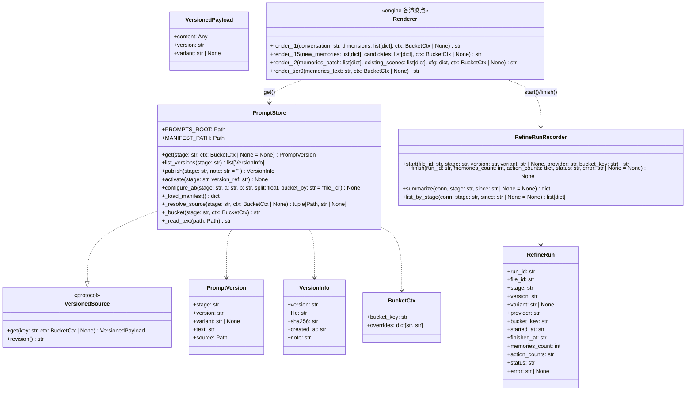
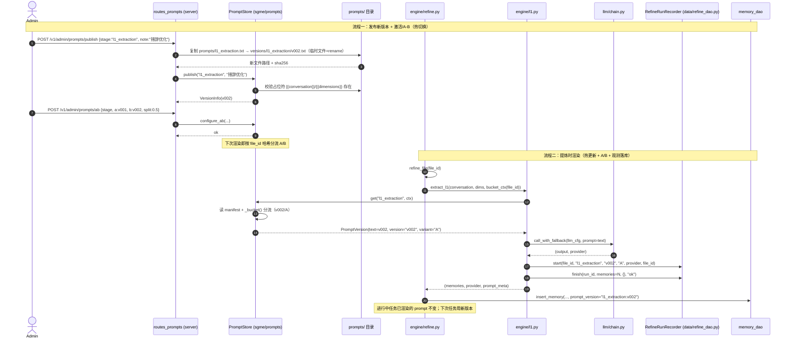

# 拾光记忆引擎（SGME）架构设计

> 版本：1.0（正式版，2026-08-22）
> 日期：2026-08-11（v0.9）→ 2026-08-22（v1.0 升版）
> 地位：本文档为 SGME 的**唯一架构依据**，描述基于现有代码逻辑的当前实现状态（Python 3.11 + SQLite + FastAPI）。
> 关联：`docs/requirements/SGME-Backlog-v0.2.md`（需求锚）、`docs/design/SGME-实施变更记录-v0.9.md`（实施变更记录）。
> 升版说明：v1.0 在 v0.9 基础上补齐 v0.9 之后落地功能（ST-34 自动更新 / Care Engine / Docker 部署 / 三池 / WebUI），并对齐降级链免费化（agnes 主位三免费兜底）；B 系列实施记录继续累积于实施变更记录 v0.9 文件（累计档案，不随版本改名）。

---

## 1. 系统架构总览

SGME 是单用户 Agent 记忆引擎 Server：把 Agent 会话提炼为标签化记忆，按模式模板注入画像。数据流单向：L0 原始文件 → L1 标签化记忆（memory.db）→ L1.5 冲突提炼 → L2 场景；画像 = 模板查询结果，无物化。

- **存储：三库 + 文件**——`memory.db`（记忆池 + L2 场景 + 向量 + 信号 + 提炼审计 + 维度注册表）、`session.db`（会话索引 raw_files + 提炼游标 refine_cursor）、`wiki.db`（扩展，wiki 启用时创建）、`raw/sessions/`（L0 原始 MD 文件，不入库）
- **入口**：FastAPI HTTP :9910（`/v1/*` + `/v1/admin/*`）+ MCP :9913（同进程、独立监听端口）；两层共享同一 engine，功能等价（§14.3）
- **核心约束**（详见 §2 与 AGENTS.md）：数据流单向、维度一律注册表 id、注入零 LLM（纯结构化 SQL）、TTL 起算 updated_at、L1.5 候选池全量召回不截断（可配向量预筛限流）、Supersession 归档不删除、LLM 降级链、密钥不落盘、提炼健康自检、文档是第一公民

---

## 2. 设计原则（锁定）

核心约束（与 AGENTS.md「架构约束」一致，本文档为详细展开）：

1. **数据流单向**：L0 原始文件 → L1 标签化记忆（memory.db）→ L1.5 冲突提炼 → L2 场景；画像 = 模板查询结果，无物化
2. **三库 + 文件**：memory.db（记忆池）、session.db（会话索引 + 游标）、wiki.db（扩展，wiki 启用时创建）、raw/（原始 MD 文件）；`*.db`、`raw/`、`tmp/` 不入 git
3. **维度一律用注册表 id**（identity / projects / ...），API 请求侧不收中文名；中文仅展示
4. **TTL**：动态维度默认（status 7d / focus·tasks 30d / projects·goals 90d），**起算 updated_at**（update/merge 续期）；过期退出注入、保留可溯源
5. **注入零 LLM**：模板查询 = 纯结构化 SQL（标签过滤 + 排序 + limit + time_window + TTL 过滤）；FTS5/向量仅 /search
6. **模板查询默认排序**：动态维度 updated_at DESC，静态维度 priority DESC
7. **L1.5 候选池**：标签预过滤 OR、**不截断全量召回**（默认路径）、按上下文预算贪心装箱分批、同一新记忆只进一批；单记忆候选超预算才允许 top-k 截断并记 anomaly_warn；**候选池向量预筛（l15.prescreen，2026-08-12 成本治理）**：启用时候选 = 向量 Top-K ∪ 维度 Top-N（priority 降序），单记忆候选 ≤ vector_top_k + dimension_top_n（默认 50+50）；embed 不可达/向量检索异常自动回退全量召回（宁贵勿漏）
8. **Supersession**：旧值归档不删除（memory_archive 表），判等锚点 memory_id
9. **LLM 降级链**：agnes（agnes-2.5-flash，免费主模型）→ siliconflow（DeepSeek-V4-Flash，免费）→ rule drop_batch（2026-08-29 zhipu 免费 Key 失效移出链，B121）；模型名含 pro/reasoner/thinking 或命中 gemma-4-12b-qat 拒绝加载
10. **密钥不落盘**：只引用环境变量名；API Key 铁律——禁止在代码/配置里硬编码密码
11. **提炼健康自检**：refined_at / last_refined_seq 水位推进，停摆产 anomaly_warn
12. **文档是第一公民**：改设计先改 docs，代码与文档不一致视为缺陷
13. **核心最小化**：SGME 核心仅包含记忆引擎必需模块；可选功能（wiki 知识库、skills-hub、外部适配器）作为扩展模块独立管理，禁用时核心功能零影响

---

## 3. SGME 引擎 — 模块与职责

### 3.1 核心模块（14 个，不可删除）

| 模块 | 职责 | 备注 |
|------|------|------|
| **data/** | 数据库连接管理 + 全部 CRUD + 检索实现 | 含 data/search/（FTS5 + 向量 + RRF） |
| **engine/** | 提炼管线（L1→L1.5→L2）+ 健康检查 + 裁员 | 核心业务逻辑唯一归属 |
| **config/** | 配置加载 + 读写 + 落盘 | |
| **llm/** | LLM provider 适配 + 降级链 + 供应商配置管理 | |
| **profile/** | 画像注入（模板查询 + Tier0 摘要） | |
| **prompts/** | 提示词模板 + 版本管理（PromptStore） | |
| **log/** | 统一日志 | |
| **server/** | FastAPI HTTP 入口（端口 9910） | |
| **signal/** | 事件信号发布 | |
| **raw/** | L0 原始文件格式 I/O | |
| **segment.py** | 会话内容分段（顶层公共分词模块，jieba/懒加载） | |
| **backup/** | 数据库备份管理 | |
| **operations/** | 统一操作层 | 收敛 HTTP+MCP 的参数校验+调用+错误处理 |
| **refinery/** | 知识提炼引擎 | ingest + extract + validate，服务 wiki 提炼 |

### 3.2 扩展模块（4 个，可禁用）

| 模块 | 职责 | 开关 |
|------|------|------|
| **wiki/** | 知识库管理（wiki.db + 实时渲染 + 按需导出） | `wiki.enabled` |
| **adapters/** | 官方 Agent 适配器（hermes / dsh） | 各 adapter 独立 install.py |
| **skills-hub/** | 用户自有技能仓库（map/copy 双模式） | `skills_hub.enabled` |
| **mcp_server.py** | MCP 协议入口（无适配 Agent 的通用接入） | `SGME_MCP_DISABLED=1` |

### 3.3 模块依赖图

```
入口层（协议翻译，无业务逻辑）
  server/ (HTTP :9910) ──→ operations/ ──→ engine/
  mcp_server (MCP :9913) ──→ operations/ ──→ refinery/
  adapters/ (HTTP 客户端) ──→ HTTP :9910

业务层
  engine/     → data/ llm/ prompts/ profile/ signal/
  refinery/   → data/ llm/
  profile/    → data/
  wiki/       → data/ refinery/

数据层
  data/       → memory.db session.db (wiki.db)
  data/search/ → FTS5 + 向量 + RRF

基础设施
  config/ log/ raw/ backup/ signal/ segment.py
```

---

## 4. 司辰调度管理器（SCSM）

SCSM 是 SGME 的外部调度方，经 HTTP 调用 SGME 端点（`/v1/append`、`/v1/inject`、`/v1/search`、`/v1/admin/*`）编排 Agent 会话沉淀与记忆消费：`RegistryMirror` 同步 Agent 清单（§22 5.2）、monitor 触发器据 `/v1/health` 自愈、模板管理界面读写 `/v1/admin/templates`。端口 **9911** 为 SCSM daemon 预留。SCSM 侧契约见 SCSM 仓库（AgentDispatch 契约等），本文档只描述 SGME 侧接口。

---

## 5. Agent 侧

Agent 接入分两路：有官方适配器的（Hermes / DSH）经 `sgme/adapters/` 深度集成（HTTP `/v1/*` :9910），其余 Agent 走 MCP（:9913）通用接入。Agent 会话经 `POST /v1/append` 沉淀为 L0 原始文件，经 `POST /v1/inject` 获取画像，经 `POST /v1/search` 检索记忆。多 Agent 以 `agent_id` 区分（仅溯源，不做隔离）。

---

## 6. 鉴权

双层鉴权（端点级细节见 §22 §2）：

- **Bearer 令牌**（传输层）：设置 `SGME_BEARER_TOKEN` 环境变量即启用；默认本机部署旁路关闭
- **X-API-Key**（契约层）：Agent Key 仅可调非 Admin 端点；管理员 Key 可调全部。默认开发 Key（env 未设置时的内置兜底值）仅限本机回环来源，远程调用一律 403
- **Agent 注册**：管理员经 `POST /v1/admin/agents/register` 签发 Key（角色=agent，绑定记忆 Scope 与任务权限；明文仅签发响应返回一次）；吊销 `DELETE /v1/admin/agents/{agent_id}`

### 6.1 密钥管理与溯源边界（2026-08-11 安全加固定稿）

**密钥单一来源**：`config/.env`（gitignore，daemon 自持）。启动时 `load_env_file()` 以 setdefault 加载到进程环境；nssm AppEnvironmentExtra 仅作可选叠加，**禁止覆盖式 set**（2026-08-07 事故：曾冲掉 DEEPSEEK_API_KEY 致提炼链静默降级）。

**溯源与鉴权解耦（实测定稿）**：
- 溯源 agent 来源 = append body 的 `agent_id` 字段（routes_memory.py），与 API Key 无关；共享同一把 Key 的多 agent 只要各自带唯一 agent_id 即可正确溯源
- 注册 agt_* Key 绑定 agent_id 仅做**权限隔离**；HTTP 通道 B35 兜底（2026-08-11）：body.agent_id 缺省时按鉴权 key 反查（`AgentKeyStore.resolve_agent_id`）——注册 key → 绑定 agent_id，env 主 key/admin key → "default"，显式 body.agent_id 永远优先
- MCP 通道（9913，本机回环）：**与 HTTP 同规则鉴权**（PR#1，2026-08-11）——`ApiKeyMiddleware` 校验 X-API-Key（复用 `AgentKeyStore.is_agent`，缺失/无效 403）；append 工具 agent_id 解析 = 显式参数 > key 反查（`resolve_agent_id`）> None（PR#2），与 HTTP 通道完全同语义
- 单条记忆读 agent 来源须走 `memory_sources.source_ref → raw_files.agent_id` 溯源链（memories 表无 agent_id 列）

**Key 落盘保护**：`data/agent_keys.json`（注册 Key 持久化）落盘后自动收紧 ACL——Windows icacls 去继承仅当前用户 (R,W)，POSIX chmod 0600（`_restrict_file_permissions`，失败仅告警不阻断）。

**客户端 key 约定**：plugin.yaml 等源码/配置文件**不落盘明文 key**；Hermes 插件从环境变量 `SGME_AGENT_KEY` 读取（plugin.yaml 删除明文 key 后回退该变量）；trae/reasonix adapter 各自读 `adapters/<name>/.env`。

---

## 7. operations 统一操作层

### 7.1 设计动机

HTTP 路由层（`server/routes_*.py`）和 MCP 工具层（`mcp_server.py`）各自实现了相同的"参数校验 → 调 engine → 错误处理 → 序列化"逻辑。操作层将其收敛为单一实现，消除重复。

### 7.2 架构

```
HTTP /v1/* ──→ operations/xxx(params) → OperationResult → JSONResponse
MCP tool   ──→ operations/xxx(params) → OperationResult → json.dumps
```

### 7.3 模块结构

```
sgme/operations/
├── __init__.py
├── errors.py          # InvalidArgs(400) / OperationError(500/503)
├── append.py          # L0 捕获
├── inject.py          # 记忆注入
├── search.py          # 混合检索
├── memory.py          # 单条记忆操作（get/reject/unreject）
├── refine.py          # 提炼触发
├── stats.py           # 统计查询
├── health.py          # 健康检查
└── config.py          # 配置读写
```

### 7.4 统一返回模式

```python
@dataclass
class OperationResult:
    ok: bool
    data: dict | None = None
    error_code: str | None = None   # ERR_INVALID_ARGS / ERR_NOT_FOUND / ERR_LLM_UNAVAILABLE / ERR_INTERNAL
    message: str | None = None      # 人可读错误文案，供入口层渲染错误响应
    details: dict | None = None     # 结构化补充信息（可选）
```

`message` / `details` 说明：入口层渲染错误响应时需要文案——HTTP 侧
`api_error(code, message)`、MCP 侧 `{"error": message}` 均以文案为必需入参。
若操作层只回 `error_code`，入口层就只能自行臆造文案，等于把错误语义又散回入口层，
与「入口层只做协议翻译」相悖。故补入这两个**带默认值**的字段，对原三字段契约向后兼容。

---

## 8. 数据库设计

### 8.1 三库结构

```
data/
├── memory.db       # 核心 · 记忆池 + L2 场景
├── session.db      # 核心 · 会话索引 + 提炼游标
└── wiki.db         # 扩展 · wiki 知识（wiki.enabled=true 时创建）
```

### 8.2 memory.db（核心）

**表清单**：
- `dimension_registry` / `dimension_alias` — 维度注册表
- `memories` — 记忆主表（含 content_seg 分词列）
- `memory_archive` — Supersession 归档
- `memory_tags` / `memory_sources` — 标签 + 溯源
- `memory_vectors` — 向量索引
- `signal_events` / `signal_subscribers` — 信号引擎
- `refine_runs` — 提炼审计（含 token 记账）
- `schema_versions` — 迁移版本

**L2 场景系列表**：
- `scenes` — L2 场景聚合（scene_id, title, content, heat, status, content_seg）
- `scene_vectors` — 场景向量
- `scene_memories` — 场景-记忆关联
- `scene_versions` — 场景版本历史

> 归属理由：L2 场景是核心提炼管线的产出（记忆聚合视图），不等于 wiki 知识页面。wiki 模块关闭时 L2 仍须正常运行。

**sidecar 表**：

```sql
CREATE TABLE memory_stats (
    memory_id        TEXT PRIMARY KEY REFERENCES memories(memory_id),
    last_recalled_at TEXT,
    recall_count     INTEGER DEFAULT 0,
    last_injected_at TEXT
);
```

> 设计理由：运营统计与记忆内容分离——memories 表不改 DDL，sidecar 独立演化。

### 8.3 session.db（核心）

**原始层索引表**：

```sql
CREATE TABLE raw_files (
    file_id          TEXT PRIMARY KEY,
    path             TEXT NOT NULL,
    session_key      TEXT NOT NULL,
    agent_id         TEXT,
    started_at       TEXT,
    ended_at         TEXT,
    refined_at       TEXT,
    last_refined_seq INTEGER,
    status           TEXT DEFAULT 'new',   -- new / refined / error
    size             INTEGER,
    content_hash     TEXT
);
CREATE INDEX idx_raw_status ON raw_files(status, refined_at);
```

**提炼游标表**：

```sql
CREATE TABLE refine_cursor (
    namespace   TEXT NOT NULL,
    date_label  TEXT NOT NULL,       -- YYYY-MM-DD
    cursor_at   TEXT,                -- 推进到的消息 created_at
    status      TEXT DEFAULT 'pending',  -- pending / running / done / failed
    retry_count INTEGER DEFAULT 0,
    last_error  TEXT,
    updated_at  TEXT,
    PRIMARY KEY (namespace, date_label)
);
```

> 设计理由：session.db 存引擎的"调度状态"——哪些会话待处理、提炼进度到哪。和 memory.db（记忆本体）职责分离。

### 8.4 wiki.db（扩展，wiki.enabled=true 时创建）

```sql
CREATE TABLE wiki_pages (
    page_id      TEXT PRIMARY KEY,
    title        TEXT NOT NULL,
    content      TEXT NOT NULL,      -- AI 检索用的全文
    category     TEXT,
    tags         TEXT,               -- JSON 数组
    source_type  TEXT,               -- file / url / image / video
    source_url   TEXT,
    source_file  TEXT,               -- raw/ 中的原件路径
    ingested_at  TEXT,
    updated_at   TEXT,
    content_seg  TEXT,               -- jieba 分词
    description  TEXT,               -- L1 摘要（描述即索引，W1 2026-08-16）
    description_seg TEXT,            -- description 的 jieba 分词（进 FTS）
    author       TEXT,               -- 写入 agent/会话（溯源，仅 skill 经验写回）
    status       TEXT DEFAULT 'active',   -- active | superseded（确定性 supersession）
    supersedes   TEXT                -- 被取代的 page_id（旧行标记不删除）
);

-- FTS 外部内容表（W1：content_seg + description_seg 双分词列，中文检索）
CREATE VIRTUAL TABLE wiki_fts USING fts5(content_seg, description_seg, page_id UNINDEXED, content=wiki_pages, content_rowid=rowid);

-- wiki_evolve：自进化独立游标（W4，与 memory 提炼 refine_cursor 物理分离）
CREATE TABLE wiki_evolve (
    session_key  TEXT PRIMARY KEY,
    status       TEXT NOT NULL DEFAULT 'queued',  -- queued|done|skipped|rejected|error
    action       TEXT,               -- appended|created|noop|skipped|rejected
    entry_hash   TEXT,               -- 经验条目 hash（去重幂等）
    page_id      TEXT,               -- 写入的目标手册页
    error        TEXT,
    created_at   TEXT,
    processed_at TEXT
);

CREATE TABLE wiki_links (
    source_id   TEXT,
    target_id   TEXT,
    rel_type    TEXT,                -- similar / extends / references / contradicts
    confidence  REAL,
    source      TEXT,                -- auto（AI 推荐）/ manual（人工确认）
    created_at  TEXT
);
```

### 8.5 原件归档

```
wiki/raw/                    # 扩展模块目录，wiki 启用时管理
├── text/                   # pdf/docx/txt 原件 → {sha256}.{ext}
├── image/                  # png/jpg/webp 原件
├── video/                  # mp4/mkv 原件
└── audio/                  # mp3/wav 原件
```

原件永不删除。wiki.db 通过 `source_file` 字段关联原件路径。

### 8.6 会话原文

会话原文继续以**文件**形式存储在 `raw/sessions/` 目录，不入库。`session.db` 的 `raw_files` 表只存文件元数据索引。

理由：文件方案天然支持 NAS 跨设备共享，避免 SQLite 并发写冲突，人类可直接双击打开查看。

---

## 9. refinery 知识提炼引擎

### 9.1 定位

Refinery 是 SGME 内部模块，**仅服务 wiki 知识提炼**。它从蒸馏套装（仓颉/沈括）吸取共性能力（输入解析、LLM 提取、结果校验），但不替代蒸馏套装。

蒸馏套装保留为独立的 Hermes skill——负责领域知识（什么值得提取、多阶段编排、输出格式）。Refinery 提供基础设施（解析文件、调 LLM、校验 schema）。

### 9.2 模块结构

```
sgme/refinery/
├── __init__.py        # refine(source) → RefineryResult
├── ingest.py          # 输入处理（文件/URL/图片/视频 → 纯文本 + 元数据）
├── extract.py         # LLM 提取（调模型 → 解析 JSON → 校验 schema → 失败重试）
├── validate.py        # 质量门框架（可注册自定义验证步骤）
└── output.py          # 统一产出格式（RefineryResult → wiki_pages / scene / memory）
```

### 9.3 输入处理（ingest.py）

```
文件（pdf/docx/txt/md）  → 解析提取纯文本
图片（png/jpg/webp）      → 视觉模型描述 → 文本
链接（url）               → Firecrawl/web_extract → markdown
视频（mp4/mkv）           → 转写 + 关键帧提取 + 逐帧描述 → 增强版转写稿
```

### 9.4 LLM 提取（extract.py）

```python
def extract(prompt: str, output_schema: dict, model_cfg: dict) -> dict:
    """调 LLM → 解析 JSON → 校验 schema → 失败重试（最多 3 次）"""
```

不绑定具体 prompt 或 schema。wiki 提炼和蒸馏套装都可以调用。

### 9.5 与 engine/ 的关系

```
会话 → engine/（L1→L1.5→L2）→ memory.db       # 记忆提炼管线（独立）
文件/URL/图片/视频 → refinery/ → wiki.db        # 知识提炼管线
```

两者互不依赖。未来如果 engine 想复用 refinery 的 ingest/extract 能力，可以通过 operations 层调用，但不改变 engine 自身的管线逻辑。

---

## 10. Wiki 模块（扩展）

### 10.1 设计原则

- wiki 知识不需要溯源（和 SGME 记忆不同）
- wiki.db 存全文（AI 检索），不存静态 HTML/MD 文件
- 浏览时 API 返回 JSON → 前端实时渲染 HTML
- 导出时实时生成自包含 HTML（base64 嵌图），用完即销毁
- wiki 关闭时核心记忆功能零影响

### 10.2 API 端点（wiki.enabled=true 时注册）

```
POST /v1/wiki/ingest               # 提交处理任务（file/url/image）
GET  /v1/wiki/ingest/{id}          # 查询处理进度
POST /v1/wiki/pages                # 直接写入（原样入库，不走提炼；幂等 upsert；T-55；可带 description/author/status/supersedes，W3）
PATCH /v1/wiki/pages/{id}          # 按 id 精确更新/追加（append 默认 ADD-only + entry hash 去重幂等；description 默认不动，W3 自进化写回主通道）
POST /v1/wiki/evolve/trigger       # 自进化触发（会话→经验→写回手册；费用门禁 min_rounds + 规则闸门 + 独立游标 wiki_evolve，W4）
GET  /v1/wiki/pages                # 列表（按 category/tags 过滤，分页；过滤 superseded）
GET  /v1/wiki/pages/{id}           # JSON（AI/WebUI 用）
GET  /v1/wiki/pages/{id}?view=html # 实时渲染 HTML
GET  /v1/wiki/pages/{id}/export    # 导出自包含 HTML
GET  /v1/wiki/search               # 搜索（FTS5 + 向量，复用 data/search）
GET  /v1/wiki/raw/{hash}           # 下载原件
```

### 10.3 知识组织

- **标签 + 分类**：AI 自动（ingest 时生成）
- **相似推荐**：向量检索 top-5，存 wiki_links（source=auto）
- **人工连线**：用户在 WebUI 确认/修改/新建关系（source=manual）
- **图谱视图**：D3.js 力导向图（节点=页面，边=wiki_links）
- **时间线视图**：按 ingested_at 排列

---

## 11. skills-hub 模块（扩展）

### 11.1 定位

用户自有的技能仓库，独立于 Hermes 的 `%LOCALAPPDATA%/hermes/skills/`。不归 wiki 管理，但 WebUI 可聚合展示。

### 11.2 部署模式

| 部署位置 | mode | 行为 |
|----------|------|------|
| 本地 PC | `map` | 直接读写 path（软链接/目录映射），零拷贝 |
| NAS / VPS | `copy` | 启动时从 remote 拉到 cache，变更后 push 回 remote |

### 11.3 配置

```yaml
skills_hub:
  enabled: true
  path: "D:/Projects/skills-hub/"
  mode: map
  sync_policy: manual
  remote:                    # mode=copy 时才生效
    source: "user@nas-host:/path/to/skills-hub.git"  # 部署时替换为实际地址
    cache: "./cache/skills/"
```

- `remote.source` 可经环境变量 **`SGME_SKILLS_HUB_REMOTE`** 覆盖（`sgme/config.py` 的 ENV_OVERRIDES 机制：环境变量优先于配置文件取值，配置落盘时受管键不被环境值反向覆盖）——部署期注入真实远端地址免改配置文件

---

## 12. log 统一日志模块

### 12.1 设计原则

- 全项目唯一日志入口：`from sgme.log import get_logger`
- 不直接使用 Python stdlib `logging.getLogger`
- 目录名 `sgme/log/`（避 stdlib `logging` 同名冲突）

### 12.2 模块结构

```
sgme/log/
├── __init__.py        # get_logger(name) + setup(level, format, output)
├── formatter.py       # 控制台（彩色）+ JSON（结构化）双格式
└── config.py          # 日志配置解析（从 config.yaml logging section）
```

---

## 13. 模型供应商配置

### 13.1 独立配置文件

`config/providers.yaml` 与 `config/llm.yaml` 分离——前者管理供应商连接，后者管理降级链编排。

### 13.2 供应商配置节点

```yaml
providers:
  deepseek:
    name: deepseek
    display_name: "DeepSeek 云端"
    base_url: "https://api.deepseek.com"
    api_key_env: "DEEPSEEK_API_KEY"
    provider_type: openai_compat
    default_model: "deepseek-v4-flash"
    timeout_s: 120
    max_retries: 3
    health_endpoint: "/models"
```

完整字段：连接层（name/base_url/api_key_env/provider_type）+ 模型层（default_model/models/context_window）+ 请求层（timeout_s/max_retries/rate_limit）+ 成本层（cost_*）+ 健康检查（health_endpoint/health_interval_s）。

---

## 14. 接口

### 14.1 核心端点

`/v1/append` `/v1/inject` `/v1/search` `/v1/memory/*` `/v1/events` `/v1/health` `/v1/admin/*` 全部保留。

### 14.2 扩展端点

详见 §10.2（wiki API）。

### 14.3 双层暴露

```
有深度集成的 Agent（Hermes plugin / DSH 插件）
  → HTTP /v1/* (9910)
  → 性能最优，零协议开销

无适配的 Agent（任意 MCP 客户端）
  → MCP (9913)
  → 标准协议，自动工具发现，功能为基础子集
```

两层共享同一 engine，功能等价。MCP 不依赖 HTTP，HTTP 不依赖 MCP。

---

## 15. 提炼游标（cursor 机制）

### 15.1 表结构

```sql
CREATE TABLE refine_cursor (
    namespace   TEXT NOT NULL,
    date_label  TEXT NOT NULL,       -- YYYY-MM-DD
    cursor_at   TEXT,
    status      TEXT DEFAULT 'pending',
    retry_count INTEGER DEFAULT 0,
    last_error  TEXT,
    updated_at  TEXT,
    PRIMARY KEY (namespace, date_label)
);
```

### 15.2 工作流

1. 定时触发 → 查 `status IN ('pending','failed') AND retry_count < N`
2. 提炼 → 成功更新 `status='done'`，失败 `retry_count++`
3. 超上限 → `status='failed'`，发 anomaly_warn
4. 新批次 → 推进 cursor_at 或新建 date_label

失败不推进 cursor，下个周期自动重试。

---

## 16. 提炼引擎（engine/）

`sgme/engine/` 实现提炼管线：L1 提取（l1.py，会话消息块 → 标签化记忆）→ L1.5 冲突提炼（l15.py，候选池裁决 store/skip/update/merge）→ L2 场景聚合（l2.py，叙事文档）；编排唯一出口 `engine/pipeline.py`（refine_one / persist_memories）。

- **触发入口**：refine_on_append（append 后单文件后台提炼）、手动 `/v1/admin/refine/trigger`（含 trigger_async）、batch_scan 兜底定时器、Dream 夜间整理
- **L1.5 候选池（铁律 #7 + 向量预筛）**：按新记忆分组，标签 OR 预过滤（共享维度的旧记忆），默认**全量召回不截断**；按上下文预算（batch_budget tokens）**贪心装箱分批**，同一新记忆只进一批；仅单记忆候选超上下文预算时按 priority 降序 top-k 截断 + `anomaly_warn`（唯一允许截断场景）。**向量预筛（l15.prescreen，2026-08-12 成本治理）**：启用时候选 = 向量 Top-K ∪ 维度 Top-N（priority 降序），单记忆候选 ≤ vector_top_k + dimension_top_n（默认 50+50）——记忆库 9k+ 时单次 l1_conflict 消耗 67-100 万 tokens 的根因是维度 OR 全量召回，预筛把单次降到 ~2 万 tokens（降 98%）；embed 不可达/向量检索异常自动回退全量召回（宁贵勿漏，功能不降级）。裁决动作：store（直存）/ skip（跳过）/ update（归档候选行 superseded_by=新 id + INSERT 新记忆）/ merge（INSERT 合并行 + 时间戳并集 + 归档所有命中候选）
- **supersedes 替代联动**：L1 输出可带 `supersedes` 字段（声明该记忆主体已取代旧主体）；L1.5 落库后把仍 active 且内容提及旧主体名的记忆标记 `status='rejected'`（数据保留可溯源，可 unreject 恢复），reject_reason 记录替代者内容与新记忆 id（溯源链）——防过时记忆长期存活（AIXM 案例）。与 memory_archive 机制协同不冲突（判等锚点 memory_id）
- **L2 场景级向量预筛（l2.prescreen，2026-08-22 T-97）**：场景聚合的 existing_scenes 候选从「固定 EXISTING_SCENES_LIMIT=50 个最新场景摘要」改为「向量 Top-K ∪ 热度 Top-N」（默认 30+20，并集按 scene_id 去重）——对齐 L1.5 预筛模式。背景：场景数超 max_scenes 后固定 50 摘要覆盖不到语义相关场景，LLM 看不到就 merge 不了，场景数只增不减（active 276 > max 200 红警）。embed 不可达/预筛异常 → 回退固定 50 摘要（fallback=full_recall，宁多勿漏，功能不降级）
- **batch_scan 兜底定时器**（`sgme/engine/batch_scan.py`）：服务启动（生产模式 lifespan）且 `refine.batch_scan.enabled=true` 时幂等拉起常驻 daemon 线程，按 `refine.batch_scan.interval_min`（默认 10 分钟）周期扫描 `status='new'` 的文件，逐文件走 `pipeline.refine_one` 批量提炼（单轮上限 max_files=50）——会话异常退出（崩溃/杀进程/断网）滞留的 new 文件由此兜底，不依赖 Agent 自觉。与 Dream **共用同一把提炼锁**（dream.RUN_LOCK），任一方执行中另一方跳过本轮；单文件独立 try/except（崩溃只丢当前文件），整体失败由 status='new' 幂等语义下轮重扫；错误事件 `batch_scan_error` 进 signal_events。**连接隔离**：调度器线程自建独立数据库连接（`db_mod.init_databases`），不共享宿主 app.state 连接——防 Windows access violation（与 Dream/backup 定时器同模式）
- **场景主动治理（`sgme/engine/scene_gc.py`，T-97 治本，2026-08-27）**：L2 场景数超 max_scenes 后 finalize_refinement 仅发软告警不降数（生产 active 350 > max 300 红警常年触发），本模块把「相似度检测 → 自动合并 → 自动归档」做成常驻治理逻辑，由 Dream 夜间整理挂接调用（用户决策：并入 Dream，不复制定时器）。触发条件 active 场景数 ≥ trigger_at（默认 l2.warn_thresholds.orange=275）才执行，避免无谓 LLM 消耗；相似度 ≥ merge_threshold（默认 0.80）的场景对入选；单轮 max_merges（默认 20）上限，仍超限则次日 Dream 继续压，渐进收敛防一次烧太多。复用 scene_vectors 表（B102/B103 已回填，无需重 embed），合并落库直接调 `l2._apply_merge`（旧场景 status='archived' 可恢复 + scene_versions 快照 + 刷新场景向量，符合「原件永不删」铁律）。`RUN_LOCK` 防手动 trigger 与 Dream 并发合并（同场景二次合并 → scene_id 失效）。手动触发：`POST /v1/admin/scene-gc/trigger`（202 异步，执行中 409 ERR_CONFLICT）；预览：`GET /v1/admin/scene-gc/candidates`（dry-run 候选对，不落库）
- **提炼健康自检**：refined_at / last_refined_seq 水位推进，停摆产 anomaly_warn

---

## 17. 注入引擎（profile/）

`sgme/profile/` 实现画像注入：模板加载与校验（template.py）+ Tier0 摘要（tier0.py）+ 注入拼装（/v1/inject 响应体，§25 §6）。注入零 LLM——模板查询为纯结构化 SQL；Tier0 摘要缺失/过期自动降级静态维度直出。

---

## 18. 信号引擎（signal/）

`sgme/signal/` 发布事件信号（memory_updated / anomaly_warn / batch_scan_error / dream_error / care_* 等）到 signal_events 表 + signal_subscribers 订阅分发。

**三层消费模型（ST-27，2026-08-14）**：

1. **广播（pull）**：每个 agent 独立订阅者游标，人人可见——`GET /v1/events/pull`（游标）+ SSE `GET /v1/events/stream`（实时推送）
2. **认领（claim）**：原子抢——`UPDATE signal_events SET consumed_at=?, consumed_by=? WHERE event_id=? AND consumed_at IS NULL`，先到先得，抢到的负责响应
3. **回执（ack）**：`signal_acks` 表记录「谁认领 + 结果」——claimed 认领未处理完 / acked 成功 / failed 失败，可溯源、可释放

**消费方**：当前活跃 agent（DSH/Hermes/Trae 等，会话开始 signal_pull → signal_claim → signal_ack）；care_consumer 脚本降级为默认只读 + `--consume` 兜底；SCSM 存在时经 pull 消费。

**TTL 归档**：异常类（anomaly_warn/batch_scan_error/dream_error）30 天、memory_updated 7 天、care_* 消费后 7 天，超期物理删除（信号是衍生数据，非「原件」）。

---

## 19. 备份与恢复（backup/）

### 备份对象

`backup/manager.py` 备份 memory.db + session.db；wiki.db 仅在 wiki.enabled=true 时备份。备份粒度对齐三库职责（§23 一）。

### 每日自动备份

`sgme/engine/backup_scheduler.py` 提供幂等常驻定时器（复用 Dream 定时器模式）：

- **触发**：`POST /v1/admin/backup/create` 首次调用时幂等拉起；生产 Gateway 首次备份后常驻
- **周期**：`backup.schedule`（HH:MM 本地时区，默认 04:00，避开 Dream 03:00）；空串 = 不自动只手动
- **动作链**：`create_snapshot`（SQLite backup API 免停机一致快照 + raw 增量）→ `rotate_snapshots`（full 保留 `keep_full` 份，默认 7）→ `push_remote`（`remote_dir` 异地目录，空 = 跳过；失败不阻塞本地）
- **配置**（`config/sgme.yaml` → `backup`）：enabled / schedule / level / dir / keep_full / remote_dir / raw_cold_days
- **连接生命周期**：线程持有 app.state 三库连接；宿主关闭后探测失败静默退出（防 Windows access violation）
- **部署适配**：本机部署 remote_dir 指向本机另一盘或 NAS 挂载盘；NAS 部署指向 NAS 本地异地目录——复制即备份，无需 SSH

---

## 20. 蒸馏套装

蒸馏套装（仓颉/女娲/沈括/达尔文）是 SGME 的**上层应用**，不是 SGME 的一部分。

| | 仓颉 | 女娲 | 沈括 | 达尔文 |
|------|:---:|:---:|:---:|:---:|
| 蒸馏什么 | 书的方法论 | 人的思维框架 | 技术书的细节 | 已有 skill |
| 保留什么 | 决策框架、原则、案例 | 心智模型、表达风格 | 公式、代码、API、化学式 | 优化触发词、压缩冗余 |

套装通过 SGME refinery API 获取解析+提取能力，但编排逻辑（多阶段、质量规则、输出格式）完全保留在 skill 内。位置：`D:\Projects\zhengliu_skills\`。

---

## 20.5 安装布局（T-23，2026-08-11）

**程序与数据分离**：程序资源（llm.yaml / providers.yaml / registry / templates / prompts）随项目发布更新；用户数据与配置（data/ raw/ logs/ sgme.yaml config/.env 密钥）可经环境变量 `SGME_HOME` 重定向（`sgme/config.py` 模块加载时解析）。

| 项 | 未设 SGME_HOME（默认） | 设置 SGME_HOME |
|---|---|---|
| DATA_DIR / RAW_DIR / LOG_DIR | 项目根 data/ raw/ logs/ | `$SGME_HOME` 下 data/ raw/ logs/ |
| 用户配置（sgme.yaml / config/.env） | 项目根 config/ | `$SGME_HOME/config/` |
| 程序资源（llm/registry/templates/prompts） | 项目根（不跟随） | 项目根（不跟随） |
| 相对路径基准（USER_ROOT） | 项目根 | `$SGME_HOME` |

推荐布局（Windows 惯例）：程序 `%LOCALAPPDATA%\sgme`（clone + venv），数据/配置 `~\.sgme`（即 `SGME_HOME=C:\Users\<user>\.sgme`）。零回归保证：未设 env 时行为与历史版本完全一致。

**安装清单 install.json（ST-23⑦ 服务发现落地）**：生产模式启动（lifespan）自动生成安装清单，供 Agent 发现 SGME 安装位置（见 `docs/agent-onboarding.md` 服务发现三步）：

- 路径：SGME_HOME 设置时写 `$SGME_HOME/install.json`，未设时固定 `~/.sgme/install.json`
- 内容：`schema_version` / `sgme_version` / HTTP 地址端口（SGME_HOST/SGME_PORT 生效值）/ MCP 端口（SGME_MCP_PORT）/ data_dir / raw_dir / Key 的环境变量名引用（**不落明文密钥**，铁律 #10）
- 生成失败不阻断启动（仅打印提示）

---

## 21. 落地状态

本文档描述的模块化重组（三库拆分 / 核心扩展开关分离 / operations 统一操作层 / refinery 知识提炼引擎 / log 统一日志 / data 层 / wiki 插件化 / skills-hub 独立模块）已全部落地，当前代码即本文档所述状态；实施过程、迁移细节与运维知识见 `docs/design/SGME-实施变更记录-v0.9.md`。

---

## 附录 A：文档索引

| 文档 | 内容 |
|------|------|
| `docs/design/SGME-架构设计-v1.0.md` | 本文档（架构总纲） |
| `docs/design/SGME-实施变更记录-v0.9.md` | 实施变更记录（B 系列，含运维/排障知识） |
| `docs/requirements/SGME-Backlog-v0.2.md` | 需求锚（Epic/Story/Task 体系） |
| `docs/design/SGME-L0文件格式-v0.1.md` | 原始层文件格式/增量段 |
| `docs/design/SGME-评测基线-PRD-v0.1.md` / `SGME-评测框架设计-v0.1.md` | 提炼质量评测基线与框架 |

---

## 22. 接口契约

> 范围：SGME Gateway 对外 HTTP 契约（`/v1/*` 与 `/v1/admin/*`）与 MCP 契约（§5.1）。push/SSE、流式输出为后续版本（§7）。

---

### 1. 端口与传输

| 服务 | 默认端口 | 说明 |
|---|---|---|
| SGME Gateway（MemoryHub + Admin） | **9910** | 本机/NAS 常驻 |
| SCSM daemon（预留） | **9911** | 独立进程，契约见 SCSM 仓库 |
| SGME MCP 端点（§5.1） | **9913** | 与 HTTP API 同进程、独立监听端口 |

端口避让：8642（Hermes gateway）/ 1014（LM Studio）/ 8000（OpenJarvis API）/ 31847（AI Jarvis）/ 3846（Pinpoint MCP）/ 9000（faster-whisper）/ 7897（Clash）/ 8420（底座 gateway，弃用）。

> 端口分配：MCP 端点挂 **9913**（原规划 9911 与「SCSM daemon 预留」冲突，定案 9913）；**9911** 完整保留给 SCSM daemon，SGME 侧不占用。

- 传输：**HTTP/1.1 + JSON**（UTF-8），无 gRPC / 消息队列
- 契约版本：路径前缀 `/v1/`；破坏性变更升 `/v2/`，兼容期内多版本并存
- 时间格式：ISO 8601（`2026-08-03T12:00:00+08:00`，统一 UTC 存储、展示时本地化）
- id 格式：`memory_id` / `file_id` / `scene_id` = UUID4；`session_key` = 来源 Agent 会话 id 原样保留

### 2. 鉴权（§6 分层）

- **Bearer 令牌**（传输层）：防未授权网络访问；设置 `SGME_BEARER_TOKEN` 环境变量即启用（默认本机旁路关闭），跨机部署时开启
- **X-API-Key**（契约层）：角色权限——Agent Key 仅可调非 Admin 端点；管理员 Key 可调全部
- **维度参数统一收注册表 id**：`/v1/inject`、`/v1/search` 等请求中的 `dimensions` / `memory_types` 一律为注册表 id（`projects` / `tech_stack`），**不收中文名**——中文仅作展示（响应 `blocks[].items` 面向人/LLM 阅读）；Agent 侧经注册表读取 id 映射
- **默认开发 Key 仅限本机回环来源**：`SGME_AGENT_KEY` / `SGME_ADMIN_KEY` 未设置时的内置兜底 Key 只允许本机来源（127.0.0.1 / ::1 / localhost）；远程调用使用默认 Key → 403 `ERR_FORBIDDEN` 并引导设置自定义 Key。自定义 Key（含 register 签发的 `agt_*`）不受限
- 401 = Bearer 缺失/无效；403 = API Key 缺失/无效/无权限
- **Agent 注册**：管理员经 `POST /v1/admin/agents/register` 签发 Key（角色=agent，绑定记忆 Scope 与任务权限；明文仅签发响应返回一次）；吊销 `DELETE /v1/admin/agents/{agent_id}`（`default`（env 主 key）不可吊销）

### 3. 通用错误结构

```json
{
  "error": {
    "code": "ERR_INVALID_ARGS",
    "message": "dimensions 必须引用已注册维度 id",
    "details": {}
  }
}
```

错误码统一 `ERR_*`：`ERR_INVALID_ARGS`（400）/ `ERR_UNAUTHORIZED`（401）/ `ERR_FORBIDDEN`（403）/ `ERR_NOT_FOUND`（404）/ `ERR_CONFLICT`（409）/ `ERR_RATE_LIMITED`（429）/ `ERR_INTERNAL`（500）/ `ERR_LLM_UNAVAILABLE`（503，降级链全挂）。

### 4. 端点详述

#### 4.1 POST /v1/append — L0 捕获（Agent Key）

会话文本流落盘为原始层自持文件，写 raw_files 索引。

请求：

```json
{
  "session_key": "20260803_191806_5b6c69",
  "agent_id": "hermes",
  "started_at": "2026-08-03T11:18:06Z",
  "ended_at": "2026-08-03T12:30:00Z",
  "source_type": "session",
  "content": "# user\n...\n## assistant\n...",   // 消息文本（L0 文件格式见 SGME-L0文件格式-v0.1）
  "metadata": {}
}
```

响应 201：

```json
{
  "file_id": "a1b2...",          // raw_files.file_id
  "path": "raw/sessions/a1b2....md",
  "status": "new"                 // 提炼调度待处理
}
```

语义：同一 session_key 重复 append → 追加到既有文件（`status` 重置为 new 触发重新提炼增量段）；`source_type=upload|external` 走同一端点。

#### 4.2 POST /v1/inject — 记忆注入（Agent Key）

请求：

```json
{
  "mode": "daily",                 // 或 custom_filter
  "max_tokens": 700,
  "custom_filter": {               // mode 缺省时使用
    "memory_types": ["projects", "tech_stack"],
    "dimensions": ["projects", "tech_stack"],
    "match": "any"
  }
}
```

响应 200：

```json
{
  "tier0": { "present": true, "content": "👤 基本信息：独立开发者…" },
  "blocks": [
    { "title": "👤 基本信息", "items": ["身份：…", "家庭：…"] },
    { "title": "🔥 当前状态", "items": ["状态：忙 SGME 架构"] }
  ],
  "stats": { "mode": "daily", "tokens_est": 512, "queries": 3 }
}
```

语义：纯结构化 SQL 模板查询（§23 四）+ Tier 0 摘要（缺失/过期自动降级静态维度直出）；`max_tokens` 超限按优先级截断 section（预算联动）；注入拼装零 LLM。

- **空结果引导**：所有 block 均无 items 时，`stats.note` 附加可行动提示（"暂无相关记忆，注入结果为空：请先通过 POST /v1/append 记录会话，或检查维度标签是否已注册"）——新手体验加固，不改变既有字段

#### 4.3 POST /v1/search — 三层检索（Agent Key，Tier 2/3）

请求：

```json
{
  "query": "SGME 底座方案",
  "scopes": ["memory", "wiki"],
  "dimensions": ["projects", "tech_stack"],
  "match": "any",
  "limit": 10,
  "include_sources": true          // 附溯源链
}
```

> scope 枚举：`memory`（记忆池）/ `wiki`（或 `scenes`，L2 场景叙事文档）/ `wiki_pages`（wiki 知识库页面，T-34 新增）/ `skills`（git 源技能，ST-36 M2，B114 起不再经 wiki 桥接；wiki 扩展不可用时该层空结果不影响整体）。

响应 200：

```json
{
  "results": [
    {
      "rank": 1,
      "score": 0.72,
      "source": "memory",
      "memory_id": "…",
      "content": "SGME 底座从 Fork 改为 Python 自研",
      "dimensions": ["projects", "tech_stack"],
      "priority": 85,
      "updated_at": "…",
      "trace": [                    // 溯源链：记忆 → 场景 → 原始文件
        { "type": "raw", "file_id": "…", "path": "raw/sessions/….md", "msg_id": "msg_456" }
      ]
    }
  ],
  "meta": { "latency_ms": 18, "routes": ["bm25", "vector", "label"], "rrf_k": 60 }
}
```

- **memory scope**：BM25（FTS5，jieba）+ 向量（sqlite-vec）+ 标签预过滤 → RRF(k=60) 融合（routes：`bm25 / vector / label / rrf`）。
- **wiki scope**：场景检索为 **FTS5 BM25（scenes_fts，jieba 分词）+ 向量（scene_vectors）+ RRF(k=60) 融合**；降级链：FTS 不可用/空召回 → LIKE。响应 routes：`wiki_bm25 / wiki_vector / wiki_rrf`（或 `wiki_like` 降级）；`source: "wiki_scene"`；字段 scene_id/title/content/heat/updated_at（updated_at 向量纯命中时可能为 null）。
- **skills scope**（ST-36 M2，B114 起不再经 wiki 桥接）：技能检索层 = git 源 `source_dirs` 的 SKILL.md，BM25（jieba）+ 向量余弦融合（0.6/0.4，向量不可达自动降级纯 BM25）；`source: "skills"`；routes：`skills_bm25` / `skills_rrf`（两路融合生效）。模块未配置/禁用/该层失败 → 空结果，不影响其他层。
- **术语别名归一化（查询扩展）**：查询先经 `registry/term_aliases.yaml` 归一化（`operations/search.py normalize_query_terms`）——命中别名的旧术语**保留原文并追加标准术语**（如 `daemon` → `daemon gateway`），大小写/空格容忍、词边界整体匹配（派生词不触发）；新老术语双向可召回，不含别名的查询逐字符不变。与 `registry/aliases.yaml`（维度别名表）语义不同，勿混用
- 模板查询不经过此端点。

#### 4.4 GET /v1/memory/{memory_id} — 单条记忆 + 溯源（Agent Key）

响应 200：memory 全字段 + `sources[]`（memory_sources 展开）+ `archive_chain[]`（Supersession 归档链）。

#### 4.4.1 POST /v1/memory/{memory_id}/reject — 标记「不采用」（Agent Key）

请求体：`{"reason": "用户说明的纠错原因"}`（可选，默认「用户纠错」）。

语义：status=active → rejected（用户判错）；数据完整保留，查询/搜索/候选池一律过滤；幂等（重复 reject 更新 reason）。

响应 200：`{"memory_id", "status": "rejected", "reject_reason"}`

#### 4.4.2 POST /v1/memory/{memory_id}/unreject — 撤销「不采用」（Agent Key）

语义：status=rejected → active（误操作恢复）。

响应 200：`{"memory_id", "status": "active"}`

#### 4.4.3 POST /v1/admin/scenes/{scene_id}/status — 标记场景状态（Admin Key）

请求体：`{"status": "active|rejected|expired|archived", "reason": "可选"}`

语义：rejected（用户判错）/ expired（随时间过时）不参与查询与时间线；archived 为 L2 merge 内部用；数据保留可溯源。

响应 200：`{"scene_id", "status", "reason", "note"}`

#### 4.5 GET /v1/events — 事件拉取（pull 游标）

请求：`GET /v1/events?after={last_event_id}&limit=100`

响应 200：

```json
{
  "events": [
    {
      "event_id": "uuid",
      "type": "memory_updated",        // memory_updated | anomaly_warn
      "source": "pipeline",            // agent | pipeline | rule（反馈环抑制）
      "ts": "2026-08-03T12:31:00Z",
      "payload": { "memory_id": "…", "dimensions": ["projects"] }
    }
  ],
  "next_after": "uuid"                 // 下轮游标
}
```

语义：SCSM 周期轮询（间隔可配，默认 30s）；事件带唯一 id，消费端幂等；断连补拉基于游标；重放窗口与同源合并由 SCSM 侧执行。push（SSE）后续版本。

#### 4.6 GET /v1/health — 健康检查（Bearer 即可）

```json
{
  "status": "ok",
  "version": "1.0.0b1",
  "llm": { "provider": "deepseek", "available": true },
  "refinement": { "watermark_age_sec": 3600, "queue_depth": 0 },
  "vector": { "available": true, "engine": "sqlite-vec", "memory_vectors": 1234, "scene_vectors": 109 }
}
```

- 顶层 `vector` 字段 = 向量可用性（sqlite-vec 扩展可加载 + memory_vectors / scene_vectors 两表行数；不可用时 `available=false` + `reason`，永不抛异常）
- 提炼水位（refined_at 游标推进率）暴露于此，供 SCSM monitor 触发器自愈

#### 4.7 GET /v1/sessions/{file_id} — L0 原文读取（Agent Key）

> 用途：远程 Agent 读原始会话，供溯源自查。与 §5.6 admin 版单条端点同构，区别在鉴权层级（agent key 即可）。

| 项 | 值 |
|---|---|
| Method / Path | `GET /v1/sessions/{file_id}` |
| 鉴权 | `require_agent_key`：`X-API-Key` = Agent Key |
| 幂等 / 副作用 | 纯只读 |
| 限流 | 沿用全局 120 req/min/Key（§6） |

**Response 200**：

```jsonc
{
  "file_id":     "20260809_212743_5bf9bb",   // 存在性校验用 path 参数
  "session_key": "hermes-...",                // raw_files.session_key
  "agent_id":    "hermes",                   // raw_files.agent_id（可能 null）
  "content":     "# 2026-08-09T21:27:43Z user\n...全文..."   // L0 原文全文（text）
}
```

**错误码**：401 / 403 / 429 沿用 §3；`file_id` 不存在 → 404 `ERR_NOT_FOUND`；其余 500 `ERR_INTERNAL`。

**实现位置**：`sgme/server/routes_memory.py`（agent 端点）+ data 层 `get_raw_file`（读 session.db）+ 原始文件读取；**不做鉴权归属校验**（单用户语义，agent key 可读任何 file_id——与 SCSM 契约一致，多租户留待 v2）。

### 5. Admin 端点（管理员 Key）

| 端点 | 说明 |
|---|---|
| `POST /v1/admin/agents/register` | 签发 Agent API Key（角色、Scope；明文仅返回一次，`agt_*` 前缀）；吊销 `DELETE /v1/admin/agents/{agent_id}`（default 不可吊销） |
| `GET /v1/admin/agents` | 只读列出已注册 Agent（脱敏 + 活跃度聚合），供 SCSM `RegistryMirror` 自动同步；详见 §5.2 |
| `POST /v1/admin/refine/trigger` | 手动触发提炼（同步）；`POST /v1/admin/refine/trigger_async` 异步版（后台线程立即返回，Hermes 插件用） |
| `POST /v1/admin/backup` | 触发在线快照（§19）；兼容路径 `POST /v1/admin/backup/create`；首次调用幂等拉起每日自动备份定时器（`backup.schedule` 默认 04:00） |
| `GET /v1/admin/stats` | 统计：记忆/场景/原始层计数、维度分布、水位 |
| `GET /v1/admin/config` | 读配置；`PUT` 或 `POST` 改配置（热生效+落盘，SCSM 远程设置用） |
| `GET /v1/admin/registry` | 维度注册表：列维度(含别名)/单查/新增/停用启用/别名增删（动态扩展） |

全部要求管理员 Key；Agent 兜底调用留审计日志（原则 9）。

### 5.1 MCP 接口

- 端点：`http://<host>:9913/mcp`（streamable HTTP transport，FastMCP 自托管，与 HTTP API 同进程但**独立监听端口**）
- 工具集（18 个）：`append` / `inject` / `search` / `wiki_search` / `wiki_pages` / `wiki_page` / `wiki_page_add` / `wiki_page_update` / `wiki_evolve_trigger` / `memory_get` / `memory_reject` / `refine_trigger` / `refine_batch` / `refine_status` / `stats` / `health` / `config_get` / `config_update` / `agent_onboarding`（与 HTTP 端点功能等价；`agent_onboarding` 返回新接入 Agent 的能力清单与接入指引，能力清单与 @mcp.tool 一一对应、测试断言防漂移；wiki 三工具 T-22 新增 2026-08-13，检索/浏览 wiki_pages 知识文档，数据源与 L2 场景检索不同）
- 鉴权：管理端工具依赖环境变量 `SGME_ADMIN_KEY` 与 HTTP 对齐

### 5.2 GET /v1/admin/agents — Agent 只读列表（管理员 Key）

> 用途：SCSM `RegistryMirror` 自动同步「谁存在 / 是否活跃」，取代此前在 `config/scsm.yaml` 手工维护 Agent 清单的做法。

#### 5.2.1 端点定义

| 项 | 值 |
|---|---|
| Method / Path | `GET /v1/admin/agents` |
| 鉴权 | `require_admin_key`：`X-API-Key` = 管理员 Key；若 `SGME_BEARER_TOKEN` 已设置，另需 `Authorization: Bearer <token>`；缺失/无效一律 403 |
| 幂等 / 副作用 | 纯只读，天然幂等，**无副作用**（不写库、不改 Key 注册表） |
| 限流 | 沿用全局 120 req/min/Key（§6） |
| 缓存 | 无（响应体极小，O(10) 条） |

#### 5.2.2 Query 参数（全部可选）

| 参数 | 类型 | 默认 | 语义 |
|---|---|---|---|
| `role` | string | 无 | 精确过滤 `role`（当前恒 `agent`）。不匹配返回**空列表**，不是 404 |
| `active_within_sec` | int ≥ 0 | 无 | 仅返回 `last_seen_at` 在 N 秒内的 Agent；该参数存在时 `last_seen_at=null` 的条目**被过滤掉** |

非法参数（负数 / 非整数）→ `400 ERR_INVALID_ARGS`。

> SCSM 侧同步**不使用**任何过滤参数（必须拿全量快照）。这两个参数供人工排障与未来 UI 使用。

#### 5.2.3 Response 200

```jsonc
{
  "agents": [
    {
      "agent_id":         "hermes",               // string，非空，响应内唯一（已按 agent_id 聚合）
      "role":             "agent",                // string，当前恒 "agent"
      "scope":            ["projects"],           // string[]，可为空数组；多 Key 时取并集
      "endpoint":         null,                   // string|null —— ⚠️ 恒为 null，见下表
      "status":           "active",               // "active"|"revoked" —— ⚠️ 当前恒 active
      "registered_at":    null,                   // string|null，ISO8601 UTC（当前恒 null）
      "last_seen_at":     "2026-08-06T11:20:03Z", // string|null，ISO8601 UTC
      "last_seen_source": "append",               // "append"|null —— 语义来源标注
      "key_count":        1,                      // int ≥ 1，该 agent_id 名下有效 Key 数
      "key_ref":          "agt_1f…8a"             // string，脱敏指纹，⚠️ 绝不返回明文
    }
  ],
  "count":        1,                              // int == agents.length
  "generated_at": "2026-08-06T11:31:00Z",         // string，ISO8601 UTC，服务端快照生成时刻
  "snapshot_at":  "2026-08-06T11:31:00Z",         // string，== generated_at（命名别名，见注）
  "source":       "sgme.key_store"                // string，固定值，标注权威来源
}
```

**字段语义硬约定**：

| 字段 | 硬约定 |
|---|---|
| `agent_id` | 响应内**唯一**。同一 agent_id 的多把 Key 聚合为一条；`key_count` 反映把数，`key_ref` 取首把的脱敏指纹，`scope` 取并集（保序去重） |
| `endpoint` | **恒 `null`**。Agent 是 SGME 的客户端，SGME 从不反向呼叫 Agent，因此**不掌握** AgentDispatch 端点。字段位**必须存在**（而非省略），使将来 SGME 记录 endpoint 时**无需升契约版本**、SCSM 侧零改动 |
| `status` | 枚举 `active` \| `revoked`。因 `revoke_agent` 是硬删除，**当前只会出现 `active`**。枚举位为未来 tombstone 预留 |
| `registered_at` | 当前恒 `null`（`AgentKeyStore` 未记录注册时刻）。若未来 `register_agent` 补记该字段，此处自动透传，**无需改本端点** |
| `last_seen_at` | 取 `raw_files` 的 `MAX(COALESCE(ended_at, started_at)) GROUP BY agent_id`。🔴 这是「**最后一次 append 会话时间**」，**不是心跳**。查不到 → `null` |
| `last_seen_source` | 与 `last_seen_at` 同生共死：有值时为 `"append"`，`null` 时为 `null`。**禁止**命名或文档化为 `heartbeat` |
| `key_ref` | 形如 `前6字符 + "…" + 后2字符`；Key 长度 ≤ 8 时整体隐藏为 `"…"`。🔴 **绝不可**输出明文 Key 或 sha256 全文 |
| `generated_at` | SCSM 用它做镜像陈旧度计算，必须是**服务端时刻**而非请求时刻回显 |
| `snapshot_at` | **与 `generated_at` 同值**。两个名字并存是为兼容两版命名，消费方任选其一。若后续统一命名，删除另一个即为破坏性变更，需升契约版本 |

**过滤规则**：合成条目 `agent_id="default"`（来自 env `SGME_AGENT_KEY`，非真实注册项）**始终被过滤**，不出现在响应中。

#### 5.2.4 错误码

沿用 §3 通用结构，不新增错误码：

| 场景 | HTTP | code |
|---|---|---|
| Bearer 开启但缺失 / 无效 | 401 | `ERR_UNAUTHORIZED` |
| 缺 `X-API-Key` / 非管理员 Key | 403 | `ERR_FORBIDDEN` |
| `active_within_sec` 非法（负数 / 非整数） | 400 | `ERR_INVALID_ARGS` |
| 超限 | 429 | `ERR_RATE_LIMITED` |
| 读 `raw_files` 异常 | — | 🔴 **不返 500**：降级为全部 `last_seen_at=null` + 服务端 WARN 日志。**身份列表必须仍能返回**——活跃度是增强信息，不得因它拖垮主功能 |
| 其他未捕获 | 500 | `ERR_INTERNAL` |

#### 5.2.5 实现位置

| 文件 | 内容 |
|---|---|
| `sgme/server/app.py` | `AgentKeyStore.list_agents_public()` / `AgentKeyStore._mask_key()` —— 聚合 + 脱敏，只读 |
| `sgme/server/routes_admin.py` | `GET /v1/admin/agents` 路由 + `_parse_iso()` / `_parse_active_within()` helper；`_last_seen_map()` 为薄封装（聚合查询在 `data/stats_dao.agent_last_seen`） |
| `tests/test_routes_admin.py` | QA-01 ~ QA-06 全覆盖 |

### 5.3 GET /v1/admin/memories — 记忆分页列表（Admin Key）

> 用途：WebUI 记忆浏览、SCSM 记忆面板数据源。

#### 5.3.1 端点定义

| 项 | 值 |
|---|---|
| Method / Path | `GET /v1/admin/memories` |
| 鉴权 | `require_admin_key` |
| 幂等 / 副作用 | 纯只读 |
| 限流 | 沿用全局 120 req/min/Key（§6） |

#### 5.3.2 Query 参数

| 参数 | 类型 | 默认 | 语义 |
|---|---|---|---|
| `page` | int ≥ 1 | 1 | 页码 |
| `limit` | int 1-200 | 50 | 页大小，**上限硬限制 200**（防查询放大） |
| `dimension_id` | string | 无 | 维度过滤（注册表 id，如 `ideas`）；收注册表 id 不收中文 |
| `status` | string | `active` | 逗号分隔多值：active / rejected / expired / archived；**默认仅 active**（显式传才可见非 active） |
| `sort` | string | `updated_at` | `updated_at` / `occurred_at` / `priority` |
| `order` | string | `desc` | `desc` / `asc` |
| `since` / `until` | ISO8601 | 无 | 时间范围，作用于 `sort` 字段 |
| `ttl_filter` | bool | `false` | true 时额外应用 TTL 过滤（浏览全部语义默认不过滤） |

#### 5.3.3 Response 200

```jsonc
{
  "items": [
    {
      "memory_id":   "m_8f3a...",
      "content":     "每周三上午有家庭安排，6点早起",
      "dimensions":  ["family", "status"],
      "memory_type": "persona",
      "priority":    75,
      "status":      "active",
      "created_at":  "2026-08-06T11:20:03Z", "updated_at": "...", "occurred_at": "...",
      "notes":       null,        // 创意池备注 JSON 数组
      "custom_flag": null,        // 创意池人工标记
      "source_ref":  "20260804_014703_cc9bb4:83"   // 首条溯源（string|null）
    }
  ],
  "count": 50, "total": 9293, "page": 1, "limit": 50,
  "generated_at": "2026-08-09T22:00:00Z"
}
```

#### 5.3.4 错误码

| 场景 | HTTP | code |
|---|---|---|
| 鉴权缺失/无效 | 401 / 403 | `ERR_UNAUTHORIZED` / `ERR_FORBIDDEN` |
| 参数非法（limit>200 / page<1 / 未知 sort / status 枚举外） | 400 | `ERR_INVALID_ARGS` |
| 超限 | 429 | `ERR_RATE_LIMITED` |
| 其他 | 500 | `ERR_INTERNAL` |

#### 5.3.5 实现位置

| 文件 | 内容 |
|---|---|
| `sgme/server/routes_admin.py` | 路由 + 参数解析（复用 5.2 parse 惯例） |
| `sgme/operations/memory.py` | `list_memories(...)` 操作层 |
| `sgme/data/memory_dao.py` | 分页查询（复用模板查询语义，按 sort 字段 ORDER BY + LIMIT/OFFSET） |
| `tests/test_routes_admin.py` | 分页/过滤/上限/默认 active 过滤用例 |

纯只读：复用既有索引（`memories(updated_at DESC)`、`memory_tags(dimension_id, memory_id)`）。

---

### 5.4 GET /v1/admin/scenes — 场景分页列表（Admin Key）

#### 5.4.1 Query 参数

| 参数 | 类型 | 默认 | 语义 |
|---|---|---|---|
| `page` / `limit` | int | 1 / 50 | limit ≤ 200 |
| `status` | string | `active` | active / rejected / expired / archived；默认仅 active |
| `sort` | string | `heat` | `heat`（热度，默认）/ `updated_at` / `created_at` |
| `order` | string | `desc` | — |
| `since` / `until` | ISO8601 | 无 | 作用于 `sort` 字段 |

#### 5.4.2 Response 200

```jsonc
{
  "items": [
    {
      "scene_id":  "scene_963ff7c7",
      "title":     "scene_963ff7c7",    // 当前仍为占位标题（语义化标题为已知遗留）
      "content":   "叙事文档全文...",
      "heat":      20,
      "status":    "active",
      "memories_count": 88,             // scene_memories 关联计数
      "created_at": "...", "updated_at": "..."
    }
  ],
  "count": 50, "total": 127, "page": 1, "limit": 50, "generated_at": "..."
}
```

#### 5.4.3 实现位置

| 文件 | 内容 |
|---|---|
| `sgme/server/routes_admin.py` | 路由 |
| `sgme/operations/scene.py` | `list_scenes(...)` |
| `sgme/data/` | scenes 分页 + memories_count 聚合（scenes 在 memory.db，复用既有 DAO/统计出口） |
| `tests/test_routes_admin.py` | 用例 |

复用索引 `scenes(status, updated_at DESC)`。

---

### 5.5 GET /v1/admin/refine_runs — 提炼记录分页（Admin Key）

> 用途：WebUI 提炼监控（管线概览/异常日志）数据源；SCSM 健康观测。

#### 5.5.1 Query 参数

| 参数 | 类型 | 默认 | 语义 |
|---|---|---|---|
| `page` / `limit` | int | 1 / 50 | limit ≤ 200 |
| `stage` | string | 无 | `l1_extraction` / `l1_conflict` / `l2_scene` / `tier0_summary` |
| `status` | string | 无 | `running` / `ok` / `error` |
| `since` / `until` | ISO8601 | 无 | 作用于 `started_at` |

#### 5.5.2 Response 200

```jsonc
{
  "items": [
    {
      "run_id": "uuid", "file_id": "...", "stage": "l1_extraction",
      "version": "v001", "provider": "deepseek-v4-flash",
      "status": "ok", "error": null,
      "started_at": "...", "finished_at": "...",
      "memories_count": 7, "action_counts": "{\"store\":7}",
      "prompt_tokens": 5242, "completion_tokens": 1175, "total_tokens": 6417
    }
  ],
  "count": 50, "total": 1804, "page": 1, "limit": 50, "generated_at": "..."
}
```

#### 5.5.3 实现位置

`sgme/server/routes_admin.py` + `sgme/operations/refine.py` + `sgme/data/refine_dao.py`（refine_runs 在 memory.db）。复用索引 `(stage, version, started_at)`。

---

### 5.6 GET /v1/admin/sessions — L0 会话列表 + 单条原文（Admin Key）

#### 5.6.1 列表

`GET /v1/admin/sessions?page=&limit=&session_key=&agent_id=&status=&since=&until=`

- `session_key`：子串匹配（如 `hermes-` 前缀过滤）
- `status`：`new` / `refined` / `archived`（raw_files 三态）
- 时间范围作用于 `started_at`

```jsonc
{
  "items": [
    {
      "file_id": "20260809_212743_5bf9bb", "session_key": "hermes-5bf9bb",
      "agent_id": "hermes", "status": "refined", "size": 123456,
      "started_at": "...", "ended_at": "...", "refined_at": "..."
    }
  ],
  "count": 50, "total": 473, "page": 1, "limit": 50, "generated_at": "..."
}
```

#### 5.6.2 单条原文（UI 溯源）

`GET /v1/admin/sessions/{file_id}` → 与 §4.7 同构（Admin Key 版）：`{file_id, session_key, agent_id, content}`；404 `ERR_NOT_FOUND`。

#### 5.6.3 实现位置

`routes_admin.py` + data 层 `get_raw_file` / 列表查询（**raw_files 在 session.db**）；原始文件正文从 `raw/sessions/` 读。

---

### 5.7 GET /v1/admin/stats/detail — token 成本/质量明细（Admin Key）

> 用途：WebUI 提炼监控 token 用量图表数据源。

| 参数 | 类型 | 默认 | 语义 |
|---|---|---|---|
| `period` | string | `weekly` | `daily` / `weekly` / `monthly` 聚合粒度 |
| `stage` | string | 无 | 按 stage 过滤 |
| `from` / `to` | ISO8601 | 无 | 时间范围（started_at） |

```jsonc
{
  "items": [
    {
      "period_key": "2026-08-09",       // 按粒度归组（日/周起/月起）
      "stage": "l1_extraction",          // 无 stage 参数时按 stage 分行
      "runs": 12, "ok": 11, "error": 1,
      "prompt_tokens": 52420, "completion_tokens": 11750, "total_tokens": 64170,
      "memories_count": 84
    }
  ],
  "totals": { "runs": 12, "ok": 11, "error": 1, "prompt_tokens": 52420, "completion_tokens": 11750, "total_tokens": 64170, "memories_count": 84 },
  "generated_at": "..."
}
```

**实现位置**：`routes_admin.py` + **`sgme/data/stats_dao.py`（统计查询唯一出口）**——不得在路由直写聚合 SQL。

---

### 5.8 模板管理 API（Admin Key）

> 用途：模板列表/更新/新建/删除（WebUI 模板管理、SCSM 模板界面数据源）。路径对齐 SCSM `scsm/ext/sgme/admin_client.py` 已实现调用（SCSM 零改动）。

#### 5.8.1 GET /v1/admin/templates — 模板列表

Query：`limit`（默认 50）/ `offset`（默认 0）——对齐 SCSM `list_templates(limit, offset)` 调用。

```jsonc
{
  "items": [
    {
      "name": "daily", "display_name": "日常模式",
      "memory_types": ["identity","family","social","habits","status","focus"],
      "token_budget": 700,
      "sections": [ {"title": "...", "dimensions": ["family"], "limit": 10, "sort": "updated_at"} ],
      "content": "name: daily\ndisplay_name: 日常模式\n..."   // 原始 YAML 全文（编辑回填用）
    }
  ],
  "count": 4, "total": 4, "generated_at": "..."
}
```

#### 5.8.2 PUT /v1/admin/templates/{name} — 更新模板

- Body：完整模板 JSON（同 GET items 结构，`name` 必须与路径一致）
- 校验：复用 `profile/template.py validate_template`（维度已注册 / sections.dimensions ⊆ memory_types / Σ(limit)×AVG ≤ token_budget）——失败 400 `ERR_INVALID_ARGS`，message 带校验详情
- 写盘：`templates/{name}.yaml`（git 管理，原子写：先写临时文件再 rename）
- Response：`{ "saved": true, "restart_required": bool }`——`restart_required` 按模板加载机制实测填值（若 `load_template` 每请求读盘 → false 热加载生效；有缓存 → true 需重启）

#### 5.8.3 POST /v1/admin/templates — 新建模板

- Body：同 5.8.2（`name` 为新名）
- 重名 → 409 `ERR_CONFLICT`（本节专用错误码）
- Response：`{ "created": true, "name": "...", "restart_required": bool }`

#### 5.8.4 DELETE /v1/admin/templates/{name} — 删除模板

- 内置 4 模板（daily/coding/work/full）拒绝 → 400 `ERR_INVALID_ARGS`（"内置模板不可删"）
- 不存在 → 404 `ERR_NOT_FOUND`
- 成功 → `{ "deleted": true }`

#### 5.8.5 实现位置

| 文件 | 内容 |
|---|---|
| `sgme/server/routes_admin.py` | 路由（或 `routes_templates.py`，挂 admin 前缀） |
| `sgme/operations/template.py` | 操作层（读/写/校验编排） |
| `sgme/profile/template.py` | 复用 `validate_template`；加载机制决定 restart_required 语义 |
| `tests/test_routes_admin.py` / `tests/test_operations_template.py` | 用例（非法 YAML/重名/内置删除拒绝/写盘原子性） |

写操作只落 `templates/*.yaml` 文件（不入 DB、不动 DDL）；不新增依赖包。

---

### 5.9 Dream 端点（Admin Key）

> 编排细节见 §30.1。

#### 5.9.1 POST /v1/admin/dream/trigger — 手动触发

- 202 `{ "status": "queued" }`，异步执行（同 trigger_async 模式）
- **执行中重复触发** → 409 `ERR_CONFLICT`（防重入，与 refine 批量共用执行锁）

#### 5.9.2 GET /v1/admin/dream/reports — 日报分页

`?page=&limit=`（limit ≤ 200，date 倒序）→ `{ items: [{date, path, refined_count, memory_count, scene_count, error_count, expired_count, archived_count, summary}], count, total, page, limit, generated_at }`

#### 5.9.3 GET /v1/admin/dream/reports/{date} — 单日日报

→ `{ date, path, content }`（MD 全文）；不存在 404 `ERR_NOT_FOUND`。

#### 5.9.4 实现位置

`routes_admin.py` + `sgme/operations/dream.py` + `sgme/engine/dream.py`（四步编排）+ `data/dream_dao.py`；`dream_reports` 表在 memory.db（DDL 见 §23）。

### 6. 限流与幂等

- `/v1/append`：同 session_key 串行化（写文件原子）；`/v1/inject`、`/v1/search` 无写操作
- **限流**：
  - 中间件按 `X-API-Key` 维度滑动窗口（1 分钟窗口）；默认 **120 req/min/Key**
  - 配置：`config/sgme.yaml → server: { rate_limit_per_min: 120 }`；`0` = 关闭
  - 超限 → 429 `ERR_RATE_LIMITED` + `Retry-After` 头（秒）
  - `/v1/health` 豁免（监控探测不受限）
  - 无 Key 请求按鉴权先行处理（先 401/403 再限流）
- 幂等：append 以 `session_key + started_at` 去重；事件消费以 `event_id` 幂等

### 6. 三池 / 自动更新 / 图谱端点（v1.0 补齐）

> v0.9 之后落地的 admin 端点契约（ST-14/15/16 三池、ST-34 自动更新、ST-13 图谱）。

**三池（ideas / demands / project_meta）**：

| Method / Path | 说明 |
|---|---|
| `GET /v1/admin/ideas` | 创意池列表（status/priority 过滤，q LIKE 子串） |
| `POST /v1/admin/ideas` | 新建创意（用户主动提出才记录；content 必填，priority/notes/custom_flag 可选） |
| `PATCH /v1/admin/ideas/{id}` | 更新创意（内容/优先级/备注/标记；rejected 软删可恢复） |
| `DELETE /v1/admin/ideas/{id}` | 软删创意（status→rejected，保留可溯源） |
| `POST /v1/admin/ideas/{id}/promote` | 创意升格为待办（demand）或项目（project_meta） |
| `GET /v1/admin/demands` | 待办池列表（status/project_id 过滤；project_id 自由标记，未登记项目仅 warning） |
| `POST /v1/admin/demands` | 新建待办（title 必填；agent 主动维护，跨项目统一收进待办池） |
| `PATCH /v1/admin/demands/{id}` | 更新待办（状态 pending→done 两态 + resolved_at 时间戳） |
| `DELETE /v1/admin/demands/{id}` | 删除待办（软删语义） |
| `GET /v1/admin/projects` | 项目注册表列表（project_meta 轻量元数据） |
| `POST /v1/admin/projects` | 登记项目（用户主动立项才登记；project_init 六步之④接线） |
| `PATCH /v1/admin/projects/{id}` | 更新项目元数据（milestone/last_active_at 等） |
| `DELETE /v1/admin/projects/{id}` | 注销项目（软删语义） |

**自动更新（ST-34）**：

| Method / Path | 说明 |
|---|---|
| `GET /v1/admin/update/request` | 读当前意图文件（status/target_version/requested_at/error） |
| `POST /v1/admin/update/request` | 写更新意图（body：target_version；原子落盘 `$SGME_HOME/update/request.json`，主机 cron 代理轮询执行） |
| `POST /v1/admin/update/check` | 强制刷新版本检测缓存（立即重查 GitHub/Gitee Releases 最新 tag），返回 `{update_available, latest_version, update_checked_at, update_error}`；WebUI 设置页「检查更新」按钮调用 |

**图谱（ST-13）**：

| Method / Path | 说明 |
|---|---|
| `GET /v1/admin/graph` | 记忆/场景关系图谱（nodes+edges，WebUI GraphView D3 force 数据源） |

> 事件端点（`/v1/events/stream` SSE / `/v1/events/pull` 游标 / `/v1/admin/events/consume_all` 批量清空）见 §18 信号引擎。

### 7. 待后续版本

- push 模式（SSE）事件订阅（SCSM 侧契约同排除）
- ~~AgentDispatch（SCSM↔Agent）契约文档~~ —— **已补齐**：`<SCSM项目根>/docs/design/SCSM-AgentDispatch契约-v0.1.md`
- 流式注入（大 max_tokens 时分块返回；SCSM 契约亦排除流式回报）

## 23. 数据模型

> 范围：表结构 + 索引 + 查询语义 + 版本管理策略。进程间协议、HTTP 契约见 §22。

---

### 一、库文件组织（三 SQLite + 文件目录）

| 存储 | 位置 | 内容 |
|---|---|---|
| 记忆库 | `memory.db`（SQLite） | 记忆池：memories / memory_archive / memory_tags / memory_sources / dimension_registry / dimension_alias / refine_runs（提炼审计）/ memories_fts / memory_vectors / memory_stats / signal_events / signal_subscribers / scenes / scene_memories / scene_versions / scenes_fts / scene_vectors / demands / project_meta / dream_reports / persona_traits / user_mbti / persona_reports / persona_state |
| 会话库 | `session.db`（SQLite） | raw_files / refine_cursor（原始层索引与提炼游标） |
| Wiki 库 | `wiki.db`（SQLite） | wiki_pages / wiki_links（wiki 扩展模块） |
| 原始层 | `raw/` 目录（MD 文件） | 自持会话文件（按会话组织）+ 喂入资料；正文不入 SQLite，raw_files 表只存索引 |

理由：备份粒度对齐 §19（各库一份快照）、故障隔离、原始层文件语义不变。

### 二、表结构

#### memory.db

**dimension_registry**（维度注册表，注册表 YAML 启动导入）

| 字段 | 类型 | 说明 |
|---|---|---|
| id | TEXT PK | snake_case 存储键（identity / tech_stack …） |
| display_name | TEXT | 中文展示名 |
| category | TEXT | static / pattern / dynamic |
| time_velocity | TEXT | 默认 static / dynamic（记忆级可覆盖） |
| ttl_days | INTEGER NULL | 动态维度默认 TTL；NULL = 不过期 |
| description | TEXT | 边界定义 |
| active | INTEGER | 软删除位，默认 1 |

**dimension_alias**（归一化别名表）

| 字段 | 类型 | 说明 |
|---|---|---|
| alias | TEXT PK | 自然语言表述（中文为主） |
| dimension_id | TEXT FK | 归一化目标 |

**memories**（记忆池主表）

| 字段 | 类型 | 说明 |
|---|---|---|
| memory_id | TEXT PK | 判等锚点（Supersession） |
| content | TEXT | 事实内容 |
| memory_type | TEXT | persona / episodic / instruction（L1 三类） |
| priority | INTEGER | 0-100 |
| time_velocity | TEXT | static / dynamic（记忆级覆盖） |
| ttl_days | INTEGER NULL | 记忆级 TTL 覆盖；NULL 沿用维度默认或不过期 |
| created_at | TEXT | **提炼落库时刻**（与 occurred_at 区分） |
| updated_at | TEXT | **TTL 起算点**（update/merge 续期） |
| occurred_at | TEXT NULL | 会话事件真实发生时刻（来源消息最大 timestamp）；NULL 回退 created_at |
| agent_tag | TEXT | 来源 Agent（仅溯源，不做隔离） |
| prompt_version | TEXT NULL | 产出该记忆的 L1 提示词版本（形如 `l1_extraction:v002`）；NULL = 旧库历史数据（不追溯） |
| status | TEXT | active / rejected（用户判错）/ expired（随时间过时）/ archived（被合并替代）；rejected·expired 不参与查询/注入/时间线，数据保留可溯源 |
| rejected_at | TEXT NULL | 标记 rejected/expired 的时间 |
| reject_reason | TEXT NULL | 标记原因（用户说明/管家判断） |

**memories 创意池扩展列（T-56 已独立，本段仅存档历史语义）**

> ⚠️ 2026-08-14「维度独立日」（T-56）：创意已从 memories 打标独立为 **ideas 表**（见 §数据模型 ideas 表）。
> 以下列不再被创意池写入（新创意落 ideas 表）；memories 中的旧 ideas 标签记忆保留可溯源，
> 创意池 API 只读 ideas 表。历史实现（归档）：创意 = 带 `ideas` 维度的记忆 + `ttl_days=NULL`（长期保存），不建独立表。人工修正入口（列表/检索/编辑/标记/升格）由 admin API 提供：

| 字段 | 类型 | 说明 |
|---|---|---|
| notes | TEXT NULL | JSON 数组 `[{"ts":"ISO","text":"..."}]`，人工备注**追加式**（不覆盖），带时间戳 |
| custom_flag | TEXT NULL | 人工标记自由文本（升格/暂缓/自定义——无固定枚举）；升格时置 `promoted` 并在 demands.origin_idea_id 建立关联 |

**ideas 表（创意池独立表，T-56）**

创意完全由用户/接入 agent 掌控（`POST /v1/admin/ideas` / MCP `idea_add`），LLM 提炼不再写创意。
无 content_seg/FTS：创意不进 `/v1/search`（人工管理资产，ideas API 专属浏览），列表 q 过滤走 LIKE 子串。

| 字段 | 类型 | 说明 |
|---|---|---|
| idea_id | TEXT PK | 创意 id（迁移存量 = 原 memories.memory_id，溯源引用零破坏） |
| content | TEXT NOT NULL | 创意正文 |
| priority | INTEGER | 0-100，缺省 50 |
| status | TEXT | active / rejected（软删除，可恢复）；创意长期保存无 TTL |
| notes | TEXT NULL | JSON 数组，追加式备注 |
| custom_flag | TEXT NULL | 人工标记自由文本；升格时置 `promoted` |
| reject_reason / rejected_at | TEXT NULL | 软删除痕迹 |
| source_ref | TEXT NULL | 人工溯源（如「用户对话 2026-08-13」） |
| origin_memory_id | TEXT NULL | 迁移溯源（原 memories.memory_id）；新创意为 NULL |
| created_at / updated_at | TEXT NOT NULL | 时间戳 |

**memory_archive**（Supersession 归档表）

| 字段 | 类型 | 说明 |
|---|---|---|
| （同 memories 全字段） | — | 归档时原样复制（含 prompt_version、occurred_at/status 列） |
| archived_at | TEXT | 归档时间 |
| superseded_by | TEXT NULL | 覆盖/合并后的新 memory_id（溯源链） |

**memory_tags**（标签关联表）

| 字段 | 类型 | 说明 |
|---|---|---|
| memory_id | TEXT FK | 记忆 |
| dimension_id | TEXT FK | 维度 |
| PK (memory_id, dimension_id) | — | 复合主键 |

**memory_sources**（溯源引用）

| 字段 | 类型 | 说明 |
|---|---|---|
| memory_id | TEXT FK | 记忆 |
| source_ref | TEXT | 指向原始层：`file_id[:msg_id]`（raw_files.file_id） |
| source_type | TEXT | session / upload / external（来源类别） |

**refine_runs**（提炼批次审计表，memory.db）

| 字段 | 类型 | 说明 |
|---|---|---|
| run_id | TEXT PK | uuid（recorder 生成，engine 不拼 SQL） |
| file_id | TEXT | 提炼对象（L0 文件 / 摘要场景，如 tier0） |
| stage | TEXT | l1_extraction / l1_conflict / l2_scene / tier0_summary |
| version | TEXT | v001 / working-&lt;sha256:8&gt;（提示词版本） |
| variant | TEXT NULL | A / B / NULL（单版本无 A/B） |
| provider | TEXT | 实际执行模型名（降级链返回值） |
| bucket_key | TEXT | 分流键（默认 file_id） |
| started_at / finished_at | TEXT | UTC ISO 8601 |
| memories_count | INTEGER | 本批产出记忆数（L2 记动作数） |
| action_counts | TEXT | JSON：L1.5 `{"store":n,"skip":n,...}` / L2 `{"create":n,...}`；其余 stage 为 `{}` |
| status | TEXT | running / ok / error |
| error | TEXT NULL | 失败原因（status=error 时） |
| prompt_tokens | INTEGER NULL | 本批 LLM 调用 prompt tokens（用量记账） |
| completion_tokens | INTEGER NULL | completion tokens |
| total_tokens | INTEGER NULL | 合计 tokens |

索引：`(stage, version, started_at)`、`(file_id, started_at)`。
逐批记录（L1 分块每块一条 run；L1.5 每候选批一条；L2 每记忆批一条；Tier0 每次生成一条）。

**memories_fts**（FTS5 虚拟表，外部内容表 content='memories'）：索引 `content_seg`（jieba 分词列）+ memory_id；ai/ad/au 三触发器同步（data 层写 content_seg，触发器只同步不分词）。仅 /search 使用（模板查询不碰）。

**memory_vectors**（sqlite-vec 向量表）：`(memory_id PK FK→memories, embedding BLOB, model TEXT, dims INTEGER, embedded_at TEXT)`。向量由 `search.vector.base_url` 配置的 embedding 端点生成（硅基流动 BAAI/bge-m3 1024 维，免费；模型切换维度不兼容 → `scripts/backfill_vectors.py --force` 全量重灌）。仅 /search 三路检索（BM25 + 向量 + RRF）使用。归档记忆时同步删除向量（外键约束）。

#### memory.db 扩展表

**demands**（需求池；状态流转：未立项→已立项→部分解决→已解决）

| 字段 | 类型 | 说明 |
|---|---|---|
| demand_id | TEXT PK | uuid |
| title | TEXT | 需求标题 |
| content | TEXT | 需求描述 |
| status | TEXT | pending（未立项）/ planned（已立项）/ partial（部分解决）/ done（已解决）；展示层映射中文 |
| priority | INTEGER | 0-100 |
| project_id | TEXT NULL | 已立项关联 project_meta.project_id |
| origin_idea_id | TEXT NULL | 升格来源（ideas 创意 idea_id），溯源链闭合 |
| source_ref | TEXT | 溯源：`file_id[:msg_id]`（需求出处会话） |
| created_at / updated_at | TEXT | 时间戳 |
| resolved_at | TEXT NULL | 状态=done 时刻 |

**project_meta**（项目注册表）

| 字段 | 类型 | 说明 |
|---|---|---|
| project_id | TEXT PK | 项目名（纯英文，与 D:\Projects 目录名一致） |
| name | TEXT | 项目名（同 project_id，冗余便于改名迁移） |
| path | TEXT | 绝对路径 |
| git_repo | TEXT NULL | git 仓库地址（本地路径或远端 URL） |
| last_active_at | TEXT NULL | 最近活跃（提炼/commit 探测，先留空由 project_init 登记） |
| milestone | TEXT NULL | 当前里程碑（如 v1.0） |
| created_at / updated_at | TEXT | 时间戳 |

登记入口：`scripts/project_init.py` 六步之④（SGME 登记）接线本表 + `POST /v1/admin/projects`。

**dream_reports**（Dream 日报）

| 字段 | 类型 | 说明 |
|---|---|---|
| date | TEXT PK | YYYYMMDD |
| path | TEXT | data/reports/dream-YYYYMMDD.md |
| refined_count | INTEGER | 提炼文件数 |
| memory_count | INTEGER | 新增记忆数 |
| scene_count | INTEGER | 新增场景数 |
| error_count | INTEGER | 失败文件数 |
| expired_count | INTEGER | TTL 主动标记数 |
| archived_count | INTEGER | 冷归档数 |
| summary | TEXT | 摘要 |
| created_at | TEXT | 生成时刻 |

**persona_traits / user_mbti / persona_reports / persona_state**（人格洞察四表，ST-35）

| 表 | 关键字段 | 说明 |
|---|---|---|
| persona_traits | trait_id TEXT PK / dimension+value+scene_context / confidence REAL（0-1 累积封顶）/ evidence_count / evidence_refs JSON（溯源 memory/refine 来源）/ status（active/rejected/superseded/archived）/ superseded_by / source（rule/llm_monthly/manual） | 特质累积表——同 dimension+value+scene 重复出现则证据数+1、置信度增长；倾向而非判决，注入门槛 confidence≥0.45 且 evidence≥3 |
| user_mbti | id INTEGER PK AUTOINCREMENT / mbti_type（4字母粗校验）/ source（self_reported/llm_monthly）/ note / recorded_at | 用户自报 MBTI 锚点轨迹（追加式不覆盖），与特质累积互为校验 |
| persona_reports | report_id TEXT PK / period TEXT（YYYY-MM）/ report TEXT / mbti_result / trait_changes JSON | 月度校准报告（变化检测：连续 2 期同向才推 persona_change_confirmed 信号） |
| persona_state | key TEXT PK / value / updated_at | 月度校准计时状态（last_run=上次执行月份），SGME 内部定时器防漏跑 |

迁移方式：`_migrate_persona_tables` 幂等补建（不 bump SCHEMA_VERSION，同 ideas 模式）。HTTP 端点 `/v1/admin/persona/*` 六个（traits/mbti GET+POST/reports/calibrate），注入消费见 §22 inject 性格参考块。

#### wiki.db

**wiki_pages**（wiki 知识页面）

| 字段 | 类型 | 说明 |
|---|---|---|
| page_id | TEXT PK | 标题 slug + 内容哈希 |
| title | TEXT NOT NULL | 标题 |
| content | TEXT NOT NULL | 全文（AI 检索用） |
| category | TEXT | 分类 |
| tags | TEXT | JSON 数组 |
| source_type | TEXT | file / url / image / video |
| source_url | TEXT | 来源 URL |
| source_file | TEXT | raw/ 原件路径 |
| ingested_at / updated_at | TEXT | 时间戳 |
| content_seg | TEXT | jieba 分词 |

**wiki_links**（页面关系，关系类型由注册表定义）

| 字段 | 类型 | 说明 |
|---|---|---|
| source_id / target_id | TEXT | wiki_pages.page_id 双向 |
| rel_type | TEXT | 见 registry/relations.yaml（注册表权威，热扩展） |
| confidence | REAL | 置信度 |
| source | TEXT | auto（AI 推荐）/ manual（人工确认） |
| created_at | TEXT | 时间戳 |

关系类型注册表：`registry/relations.yaml`（git 管理，与维度注册表同模式）——rel_type 枚举由此文件定义，DB 不做 CHECK 约束（注册表权威，热扩展）。类型清单：

| 类别 | 类型 |
|---|---|
| 语义 | similar / extends / references / contradicts |
| 结构 | parent_of / child_of / part_of / instance_of / related |
| 时序 | before / after / causes / caused_by / evolves_to |
| 论证 | supports / opposes / questions / answers |
| 项目 | implements / fixes / tracked_by / blocks / blocked_by |
| 记忆域 | merges_with / supersedes / same_as |

**ingest_tasks**（wiki ingest 任务持久化——原内存表 → SQLite，重启恢复）

| 字段 | 类型 | 说明 |
|---|---|---|
| task_id | TEXT PK | uuid |
| source_type | TEXT | text / file / url |
| source_ref | TEXT | 原文标识（路径/URL） |
| title | TEXT | 可选标题 |
| status | TEXT | queued / running / done / error |
| result_page_id | TEXT NULL | 完成时 wiki_pages.page_id |
| error | TEXT NULL | 失败原因 |
| created_at / updated_at / finished_at | TEXT | 时间戳 |

启动时恢复：`status IN (queued, running)` 的任务置回 queued（可重跑）或 error（标记中断），由守护重试策略决定。

**scenes**（L2 场景，精炼层标准形态；含 content_seg 分词列）

| 字段 | 类型 | 说明 |
|---|---|---|
| scene_id | TEXT PK | 场景 id |
| title | TEXT | 场景标题（当前为 scene_<uuid> 占位，语义化标题待改进） |
| content | TEXT | 叙事文档正文 |
| heat | INTEGER | 热度：新建=1，更新+1，合并=sum+1 |
| status | TEXT | active / archived / rejected（用户判错）/ expired（随时间过时）（场景状态与记忆对齐；rejected·expired 不参与查询/时间线） |
| created_at / updated_at | TEXT | 时间戳 |
| last_memory_added_at | TEXT | 最近关联记忆时间（设计有字段，L2 当前未写值） |
| content_seg | TEXT | jieba 分词（data 层 insert/update 时写，FTS 触发器只同步） |

**scenes_fts**（FTS5 虚拟表，外部内容表 content='scenes'）：索引 `content_seg` + scene_id；ai/ad/au 三触发器同步。`search_scenes` BM25 主路（降级链：FTS 不可用/空召回 → LIKE）。

**scene_vectors**（sqlite-vec 向量表）：`(scene_id PK FK→scenes, embedding BLOB, model TEXT, dims INTEGER, embedded_at TEXT)`。向量端点同 memory_vectors（硅基流动 BAAI/bge-m3 1024 维）；切换模型 → `scripts/backfill_scene_vectors.py --force` 重灌。仅检索 active 场景。

**scene_memories**（场景-记忆链接）

| 字段 | 类型 | 说明 |
|---|---|---|
| scene_id | TEXT FK | 场景 |
| memory_id | TEXT FK | 聚合来源记忆 |
| PK (scene_id, memory_id) | — | 复合主键 |

溯源链三段完整：场景 → scene_memories → memories → memory_sources → raw_files。

**scene_versions**（场景快照）

| 字段 | 类型 | 说明 |
|---|---|---|
| scene_id | TEXT FK | 场景 |
| version | INTEGER | 版本号递增 |
| md_content | TEXT | 变更前快照 |
| created_at | TEXT | 快照时间 |

L2 UPDATE/MERGE 前置快照；成本低（LLM 改场景频率有限），提供场景级 diff 审计能力（替代 git 对库内内容的版本管理）。

**raw_files**（原始层索引）

| 字段 | 类型 | 说明 |
|---|---|---|
| file_id | TEXT PK | 文件唯一 id |
| path | TEXT | raw/ 下相对路径 |
| session_key | TEXT | 会话标识（L0 行内元数据） |
| agent_id | TEXT | 来源 Agent |
| started_at / ended_at | TEXT | 会话起止 |
| refined_at | TEXT NULL | 提炼游标（文件级：最近一次提炼时间，水位监控依据） |
| last_refined_seq | INTEGER NULL | **增量提炼游标**：已提炼的最大消息序号（msg_id=file_id:seq，见 L0 文件格式）；追加后增量段 = seq > last_refined_seq |
| status | TEXT | new / refined / archived（冷归档） |
| size | INTEGER | 字节数 |

提炼调度语义：`status=new` 文件 → Session 级提炼 → 打 refined_at + last_refined_seq → status=refined；文件追加后 status 重置 new，增量提炼只取 `seq > last_refined_seq` 的消息段（不动已提炼内容）；Batch 兜底扫描（§16 batch_scan）同一条件；>90 天压缩 → status=archived（§19 冷归档）。

### 三、索引

- `memory_tags(dimension_id, memory_id)`——标签交集过滤走索引 JOIN
- `memories(updated_at DESC)`——动态维度默认排序
- `memories(priority DESC)`——静态维度默认排序
- `raw_files(status, refined_at)`——提炼调度扫描
- `scene_memories(scene_id)` / `scene_memories(memory_id)`——双向溯源遍历
- `scenes(status, updated_at DESC)`——场景列表/热排序
- `scene_vectors(scene_id)` PK——向量检索 join 场景
- `memory_sources(memory_id)`
- `demands(status)` / `demands(project_id)`——需求池状态筛选/项目关联
- `project_meta(project_id)` PK——项目注册表
- `dream_reports(date)` PK——日报倒序
- `wiki_links(source_id)` / `wiki_links(target_id)`——关系双向遍历

### 四、查询语义

**模板查询（纯结构化 SQL）**：

```sql
SELECT m.* FROM memories m
JOIN memory_tags t ON m.memory_id = t.memory_id
WHERE t.dimension_id IN (:dims)          -- AND 交集：GROUP BY m.memory_id HAVING COUNT(DISTINCT t.dimension_id) = :n
                                         -- OR 并集：直接 IN（match: any）
  AND m.priority >= :priority_min         -- 可选
  AND m.updated_at > :time_window_start   -- 可选 time_window
  AND (m.ttl_days IS NULL OR julianday(m.updated_at) > julianday('now') - m.ttl_days)  -- TTL 过滤（julianday 归一化 ISO 8601 T/Z 与 SQLite 日期格式，避免逐字节字典序偏差）
ORDER BY :sort                            -- 静态 priority DESC / 动态 updated_at DESC（默认语义）
LIMIT :limit;
```

**/search（Tier 2/3，三路融合）**：BM25（FTS5，jieba 分词）+ 向量（sqlite-vec）+ 标签预过滤 → RRF(k=60) 合并，附溯源链。

### 五、版本管理策略

| 对象 | 管理方式 |
|---|---|
| 模板 templates/、注册表 registry/、提示词 prompts/、规则 config/ | **git 版本管理**（人可读写、可 diff、可回滚、A/B 对比） |
| 架构与设计文档 docs/ | git 版本管理 |
| 原始层 raw/ 文件 | **不入 git**（不可变追加，git 无历史价值只有膨胀成本）；版本安全 = 不淘汰 + 冷归档 + §19 备份快照 |
| 场景（SQLite 内） | **不入 git**；历史 = scene_versions 快照 + 软删除 + §19 备份 |
| memory.db / wiki.db / tmp/ | **不入 git**（.gitignore） |

项目初始化 git：docs/、templates/、registry/、prompts/、config/ 入版本控制；`raw/`、`*.db`、`tmp/`、`__pycache__/` 忽略。

### 六、已知待细化项

- memories 表行数增长后的 VACUUM / 分页策略
- memory_archive 的清理窗口（只归档不删，但可定期压缩）
- FTS5 与 memories 的同步时机（提炼写入后同事务刷新）
- scene_versions 保留上限（如每场景最近 20 版）

## 24. LLM 降级链

> 配置文件：`config/llm.yaml`（git 版本管理）；供应商连接字段（base_url/api_key_env/context_window/...）见 `config/providers.yaml`，加载时按 provider 名注入链节点（节点内联字段优先）。

---

### 1. 配置结构（config/llm.yaml）

编排为**提供商无关**表述：链节点不绑定品牌，换供应商只改 providers.yaml 连接字段与节点 model/max_tokens/sampling/extra_body。

```yaml
chains:
  refinement:                      # 提炼管线（L1/L1.5/L2/Tier0 摘要共用）
    - provider: agnes              # 免费主模型（Agnes agnes-2.5-flash，当前 $0/1M token，1-4s 快）
      model: agnes-2.5-flash
      max_tokens: 16384
    - provider: siliconflow        # 第二优先（硅基流动 DeepSeek-V4-Flash 免费，1-3s）
      model: deepseek-ai/DeepSeek-V4-Flash
      max_tokens: 16384
    - provider: rule               # 规则兜底（见 §3；2026-08-29 zhipu 移出链，B121）
      rule: drop_batch

rules:
  timeout_s: 240
  max_retries: 2                    # 每级重试次数（2026-08-22：5→2，免费兜底就位后快速切换）
  fallback_on: [timeout, 5xx, connection_error, auth_error, context_overflow, rate_limit]
  backoff:                          # 指数退避：min(base_s × 2^(attempt-1), max_s) + [0, jitter_s)
    base_s: 3.0                     # 首次重试等待 3s（序列 3s/6s/12s）
    max_s: 60.0                     # 退避封顶（2026-08-20：20s→60s，1305 过载恢复数十秒级）
    jitter_s: 0.5                   # 抖动防惊群（批量连环撞限流场景）
  throttle:                         # 调用层节流器：批量提炼平滑请求速率（令牌桶）
    enabled: true
    rps: 0.5                        # 每秒请求数；默认 0.5 rps ≈ 30 req/min（取常用云端限流 60 req/min 的一半作安全余量）
    burst: 1                        # 桶容量；1 = 无突发，严格平滑
  context:                          # 上下文预算（§4 公式）
    reserved_output: 4096           # 输出预留 token
    prompt_overhead: 0.08           # 提示词开销系数（占窗口比例，8%）
  allowed_models:                   # 提纯铁律落地：配置校验白名单/黑名单
    deny_prefixes: [pro, reasoner, thinking]
    deny_exact: [gemma-4-12b-qat]
```

### 2. 降级链语义

1. 按链顺序尝试：主 → 备 → … → 规则兜底
2. 触发降级的条件（fallback_on）：超时 / 5xx / 连接错误 / 鉴权错误 / **context_overflow**（输入超当前模型窗口 → 换更大窗口模型或分块）/ **rate_limit**（限流 429）
3. 每级重试 `max_retries` 次后降级；重试间隔 = **指数退避**（`rules.backoff`：base 1.0s 起翻倍，封顶 8s，加抖动；429 响应带 `Retry-After` 头时取 `max(退避值, Retry-After)`）；全链失败 → 规则兜底
4. `call_with_fallback()` 统一入口：提炼、Tier 0 摘要等一切 LLM 消费方只调它；**调用层节流器**（`rules.throttle` 令牌桶，默认 rps=0.5）对批量提炼平滑请求速率，防连环撞限流
5. 降级事件落日志 + `anomaly_warn`（若最终失败）

### 3. 规则兜底（rule provider）

| 场景 | 兜底行为 |
|---|---|
| 提炼（L1/L1.5/L2） | `drop_batch`：该批标记未提炼（raw_files.status 保持 new），下次 Batch 重试；连续失败 N 次 → anomaly_warn + 停提炼（防静默停摆反向：显式停摆） |
| Tier 0 摘要 | 跳过本次生成，注入自动降级为静态维度直出 |

### 4. 上下文预算计算

```
batch_budget = context_window - reserved_output - prompt_overhead × context_window
```

- 每级模型独立窗口：agnes 200K / siliconflow 128K → budget ≈ window − 4K − 0.08×window（L1.5 分批、L2 分批、L1 长会话分块都按此）；`prompt_overhead` 为 0.08（8%）
- 窗口值从模型配置读取（`context_window` 字段，可配），**随模型动态变化**
- `context_overflow` 判定：输入 token 估算（tiktoken 或模型近似）超 budget → 触发分块/降级

### 5. 模型白名单校验（提纯铁律落地）

- 配置加载时校验：模型名含 `pro/reasoner/thinking` 前缀或命中 `deny_exact` → **拒绝加载并报错**（防配置错选）
- `agnes-2.5-flash` 为默认主模型（免费，当前 $0/1M token），`deepseek-ai/DeepSeek-V4-Flash`（硅基流动免费）第二；`gemma-4-12b-qat` 禁用（白名单 deny_exact）

### 6. 健康暴露

- `/v1/health`（§22 4.6）：`llm.provider / llm.available / llm.last_error / vector.available`
- 提炼降级链全挂 → health `llm.available=false`，SCSM monitor 触发器据此自愈

### 7. 实现说明

- provider 适配层：openai_compat（deepseek）+ rule（drop_batch）已实现；httpx `trust_env=False`（防 Clash 代理劫持 localhost 请求）
- 降级事件落日志；`refine_runs.provider` 记录实际执行模型名（可观测）；全链失败 → `ERR_LLM_UNAVAILABLE`（503）
- context_overflow 估算误差随真实语料持续校准（`prompt_overhead` 当前 0.08）

## 25. 模板引擎

> 范围：模板 YAML schema、继承机制、校验规则、默认排序语义、注入拼装输出格式。查询引擎执行细节（SQL 生成）见 §23 四。

---

### 1. 模板文件位置与命名

- `templates/{mode}.yaml`（如 `daily.yaml`），一个 Memory Mode 对应一个文件
- 预定义：daily / coding / work / full
- 用户自定义模式 = 新增文件；SCSM 模板管理界面读写这些文件（git 版本管理）

### 2. YAML Schema

```yaml
name: daily                      # 必填：模式名 = 文件名
display_name: 日常模式            # 必填：展示名
memory_types: [identity, family, social, habits, status, focus]   # 必填：维度 id 列表（OR 并集）
extends: base                    # 可选：继承的模板名
token_budget: 700                # 可选：默认 max_tokens（缺省 700）
sections:                        # 必填：至少 1 段
  - title: "👤 基本信息"          # 必填：注入段标题
    query:
      dimensions: [identity, family]   # 必填：维度 id（注册表引用）
      match: all                        # 可选：all（AND，默认）/ any（OR）
      priority_min: 70                  # 可选：0-100
      time_window: "updated_at > 30d"   # 可选：时间窗（替代 time_velocity 的时间语义）
      ttl_filter: true                  # 可选：TTL 过滤（默认 true，动态维度）
      sort: priority DESC               # 可选：priority|updated_at × DESC|ASC
      limit: 5                          # 必填：1-50
```

- **维度一律引用注册表 id**（identity 而非"身份"）；展示用 display_name
- `time_velocity` **不进模板**：频率元属性不承担时间窗；按新旧过滤用 `time_window`

### 3. 继承机制

- `extends: base`：子模板与基础模板合并——`memory_types` 子覆盖（不并集，语义明确）、`sections` 按 title 同名覆盖、新 section 追加（在基础 sections 之后）
- 继承链单层（base 不再 extends），防止嵌套复杂度
- 校验在**展开后**执行（继承产物必须是完整合法模板）
- 无 base 时模板必须自包含全部字段

### 4. 校验规则（加载时）

1. `name` 与文件名一致；`memory_types` 非空且全部为已注册维度 id
2. 每个 section：`dimensions ⊆ memory_types`（**越界直接拒绝加载**）；`dimensions` 非空且已注册
3. `match` ∈ {all, any}；`sort` ∈ {priority DESC/ASC, updated_at DESC/ASC}；`limit` ∈ [1,50]；`priority_min` ∈ [0,100]
4. `time_window` 语法：`updated_at > N{d|h|w|m}` 或 ISO 时间戳比较
5. **token 预算**：展开后 `Σ(limit) × avg_item_tokens ≤ token_budget`（avg_item_tokens 默认 30，可配）；超限拒绝加载，或按 section 逆序截断 limit（加载时警告）
6. 校验失败 → 模板加载失败并报错，不静默降级（保留上一合法版本运行）

### 5. 默认排序语义

- section 未显式 `sort` 时：dimensions 全为**动态维度** → `updated_at DESC`；其余（含混合）→ `priority DESC`
- 显式 `sort` 优先；`ttl_filter` 默认 true 仅对动态维度生效（静态维度无 TTL，字段无效果）

### 6. 注入拼装输出（/v1/inject 响应体）

```markdown
## 👤 基本信息
- 身份：独立开发者
- 家庭：…

## 📅 近期节奏
- 习惯：每周三 6 点早起

## 🔥 当前状态
- 状态：忙 SGME 架构（1 天前）
```

- Tier 0 摘要（若有）置于最前，标题 `## 画像摘要`，~200 tokens
- 每条目 `- {content}`，可选附 `（{N 天前}）` 相对时间（updated_at 距今 < 30 天时）
- 结构化响应：`blocks[]`（title + items[]）供 Agent 程序化消费（§22 4.2），markdown 文本 = 拼接视图

### 7. 预定义模板

| 模板 | memory_types | 定位 |
|---|---|---|
| daily | identity family social habits status focus | 日常会话默认 |
| coding | projects tech_stack style skills | 编码场景（不注入个人信息） |
| work | projects goals tasks social focus | 工作场景 |
| full | 全部 15 维 | 深度回顾（token_budget 1200，走预算联动） |

## 26. 提炼提示词

> 文件：`prompts/l1_extraction.txt`、`prompts/l1_conflict.txt`、`prompts/l2_scene.txt`、`prompts/tier0_summary.txt`（git 版本管理）；版本管理与 A/B 见 §27。

---

### 1. 三套提示词职责

| 提示词 | 输入 | 输出 | 底座对应 |
|---|---|---|---|
| L1 提取 | L0 会话消息块（滑窗内） | JSON 记忆数组（content / dimensions / memory_type / priority / time_velocity / source_message_ids / supersedes） | l1-extraction.ts |
| L1.5 冲突提炼 | 新记忆 + 标签预过滤候选池（全量召回，贪心装箱分批） | JSON 裁决（store / skip / update / merge + merged_content） | l1-dedup.ts |
| L2 场景聚合 | 裁决后记忆（分批，批大小按当前模型上下文预算）+ 现有场景摘要 | 场景操作（UPDATE > MERGE > CREATE，叙事文档） | scene-extraction.ts |

### 2. 模板变量（渲染时注入，Python 端）

| 占位符 | 来源 |
|---|---|
| `{{conversation}}` | L0 文件消息块（含 msg_id 序号标注） |
| `{{dimensions}}` | 维度注册表动态生成（**注册表变更自动刷新**） |
| `{{new_memories}}` | 本批新提炼记忆（JSON） |
| `{{candidates}}` | 候选池（默认：标签预过滤全量召回，priority DESC 排序入批，仅单记忆候选超上下文预算时 top-k 截断 + anomaly_warn；**预筛开启（l15.prescreen）**：向量 Top-K ∪ 维度 Top-N，≤ vector_top_k + dimension_top_n 条） |
| `{{memories}}` | 本批记忆（JSON） |
| `{{existing_scenes}}` | 现有场景标题 + summary + heat |
| `{{now}}` | 当前时间戳 |

渲染：Python `string.Template` 或 Jinja2；提示词文件本身只含占位符，无代码逻辑。

### 3. SGME 定制点（相对底座）

- **维度标注**：L1 增加 dimensions 输出 + 注册表动态维度清单（底座无此能力）
- **time_velocity**：L1 输出 static/dynamic 两值
- **中文 prompt**：用户全程中文，模型中文输出质量更稳；JSON 字段名保持英文
- **四动作语义**：L1.5 与数据模型一致（update 覆盖+归档 / merge 时间戳并集）
- **候选池分批**：L1.5 输入为贪心装箱分批后的候选（全量召回不截断，预算公式见 §24 §4）
- **supersedes 替代声明**：L1 可输出 `supersedes` 字段（该记忆主体取代旧主体），L1.5 落库后触发替代联动标记（§16）
- **L2 叙事形态**：场景 = 连贯叙事文档非清单；META 字段（created/updated/summary/heat）由实现层维护，不进 LLM 正文

### 4. 输出校验（解析器职责，非 prompt 兜底）

- JSON 解析失败 → 重试 1 次 → 失败标记该批 `status=error` + `anomaly_warn`（提炼健康自检）
- dimensions 经归一化层（别名表 → 注册表 id，未知丢弃告警，§28）
- source_message_ids 必须存在于本批输入（防幻觉溯源）
- priority 越界（<0 / >100）钳制；`time_velocity` 非两值 → 按维度默认回填

### 5. 版本管理与 A/B

**已落地**：详见 §27（`prompts/manifest.yaml` 版本清单 + `prompts/versions/<stage>/vNNN.txt` 不可变快照 + `PromptStore`）。

- 落地形态（最小侵入）：`prompts/*.txt` 保留为工作副本（默认 `active: "@working"`，编辑即热更新）；`prompts/versions/<stage>/vNNN.txt` 为不可变版本快照；`prompts/manifest.yaml` 为版本清单（active 指向 / A-B 策略 / 版本元数据）
- 4 处渲染点（l1.py / l15.py / l2.py / tier0.py）模板读取由 `read_text()` 改为 `PromptStore.get(stage, ctx)`，每次渲染实时读盘（无缓存）；版本元信息沿提炼链路透传并落 `refine_runs` / `memories.prompt_version` 可观测
- A/B：确定性分流（默认 bucket_key=file_id，sha256 取模）；**不做自动裁决**（结论留人工 + 评测集）

## 27. 提示词版本管理

> 范围：L1/L1.5/L2/Tier0 四套提示词（tier0_summary / l1_extraction / l1_conflict / l2_scene）的版本外置 + 不重启热更新 + A/B 对比 + 与维度注册表动态注入的共用机制。
> 状态：**已落地**（`sgme/prompts/manager.py` PromptStore + `prompts/manifest.yaml` + admin API + CLI）。

---

### 1. 版本存储布局

```text
prompts/
  tier0_summary.txt        # 工作副本（编辑即热更新，默认生效）
  l1_extraction.txt        # 工作副本（L1）
  l1_conflict.txt          # 工作副本（L1.5）
  l2_scene.txt             # 工作副本（L2）
  manifest.yaml            # 版本清单：active 指向 / A-B 策略 / 版本元数据
  versions/                # 不可变版本快照（发布时生成，git 管理）
    tier0_summary/v001.txt
    l1_extraction/v001.txt
    l1_conflict/v001.txt
    l2_scene/v001.txt
```

- **工作副本 = 当前活跃草稿**：默认 `active: "@working"`，渲染直接读 `prompts/<stage>.txt`——编辑即热更新
- **版本快照 = 不可变发布物**：`versions/<stage>/vNNN.txt`，发布时从工作副本拷贝并写 `manifest.yaml`（含 sha256）。版本文件**只写一次**（写临时文件 → 原子 rename），杜绝读到半写内容
- 首次发布生成 v001 基线（= 当前工作副本内容），提交 git

### 2. 热更新语义

- 触发：a) 直接编辑 `prompts/<stage>.txt`（@working 模式，改完即生效）；b) 发布脚本/API 落盘新版本并更新 manifest；c) admin API 激活/配置 A/B
- 传播：下一次 `PromptStore.get(stage, ctx)` 调用时读 manifest + 版本文件（每次调用实时读盘，无缓存）
- 生效边界：
  - **已入队未开始的提炼任务**：渲染发生在每次 LLM 调用前 → 用新版本（生效）
  - **正在执行、已进入 LLM 调用的提炼任务**：该次调用使用调用前渲染好的 prompt 文本 → 不受影响（prompt 一旦渲染即为不可变字符串）
  - **同一提炼任务内的多批（分块/分批）**：批与批之间重新渲染 → 可能混合新旧版本，**可接受**（refine_runs 逐批记录版本，可追溯）；若需严格一致，用 `BucketCtx.overrides` 钉版本（预留能力，默认不启用）

### 3. A/B 对比语义（能换 + 能比）

- **分流**：`bucket_key`（默认 `file_id` 字符串）→ `sha256(bucket_key)` 取前 8 字节 → 整数取模 100；`< split*100` 走 A，否则走 B。**确定性分流**：同一 file_id 永远同一变体，A/B 指标可重复、不串扰。`bucket_by` 支持 `file_id | memory_id | random`
- **生效时机**：manifest 中 `ab.enabled=true` 时，`PromptStore.get()` 返回 `(text, version, variant∈{A,B})`；`split` 调整即时生效（下次渲染起）
- **记录（三层可观测）**：
  1. **落库**：`refine_runs` 表逐批记 `(stage, version, variant, provider, bucket_key, counts, status)`；`memories.prompt_version` 记 L1 产出版本（形如 `l1_extraction:v002`）
  2. **日志**：提炼 INFO 日志补 `version=... variant=...` 字段
  3. **汇总**：`GET /v1/admin/prompts/metrics?stage=&since=` 返回按 `(version, variant)` 分组的 runs / memories / avg(priority) / action 分布，供人工或评测集对比。**不做自动裁决**（A/B 结论留人工 + 评测集，避免"能比"变"瞎比"）

### 4. 与维度注册表动态注入的共用机制

- **共同语义（版本感知 + 变更即刷新）**：文件型资源（提示词）与 DB 型资源（维度）都遵循"取用即读最新 + 版本可观测"（`VersionedSource` 协议形态）
- `PromptStore`（文件型）：版本号 = 发布版本号或 `working-<sha256:8>`
- 维度注册表（DB 型）：`routes_registry` 写库后调用 `refresh_dimensions(app.state.cfg, mem_conn)` 从 `dimension_registry` 表重读刷新 `cfg["dimensions"]`；L1 render 每次从 `cfg["dimensions"]` 生成维度清单——"注册表变更自动刷新提示词"由此闭环
- 二者不建抽象基类，以协议约定接口形态

### 5. 配置与数据格式

#### 5.1 prompts/manifest.yaml（字段英文，注释中文）

```yaml
# prompts/manifest.yaml — 提示词版本清单
# 约定：
#   active: "@working"          → 当前生效 = prompts/<stage>.txt 工作副本（编辑即热更新）
#           "versions/<stage>/vNNN.txt" → 钉版（A/B 或固定版本时使用）
#   ab: A/B 分流；enabled=false 时忽略其余字段
#   bucket_by: file_id | memory_id | random（分流键；默认 file_id，确定性分流）
#   versions: 发布元数据（publish 自动维护，勿手改 sha256/created_at）
stages:
  tier0_summary:
    active: "@working"
    ab:
      enabled: false
  l1_extraction:
    active: "@working"
    ab:
      enabled: false
      a: "versions/l1_extraction/v001.txt"
      b: "versions/l1_extraction/v002.txt"
      split: 0.5          # A 流量占比 0.0~1.0
      bucket_by: file_id
  l1_conflict:
    active: "@working"
    ab:
      enabled: false
  l2_scene:
    active: "@working"
    ab:
      enabled: false
versions:
  l1_extraction:
    - version: v001
      file: "versions/l1_extraction/v001.txt"
      sha256: "ab12cd34ef56..."
      created_at: "2026-08-05T00:00:00Z"
      note: "初始快照"
```

校验规则（`PromptStore._load_manifest` 内置，坏配置抛 `PromptManifestError`）：
- 每个 stage 的 `active` 必须为 `@working` 或指向 `versions/` 下已存在文件；
- `ab.enabled=true` 时 `a`/`b` 文件必须存在且不同；`0.0 <= split <= 1.0`；`bucket_by ∈ {file_id, memory_id, random}`；
- `versions.<stage>[].sha256` 与磁盘文件实算一致（校验在 publish 时做，读取时懒校验仅告警）。

#### 5.2 refine_runs 表（memory.db）

| 字段 | 类型 | 说明 |
|---|---|---|
| run_id | TEXT PK | uuid |
| file_id | TEXT | 提炼对象（L0 文件 / 摘要场景） |
| stage | TEXT | l1_extraction / l1_conflict / l2_scene / tier0_summary |
| version | TEXT | v001 / working-<sha256:8> |
| variant | TEXT NULL | A / B / NULL（单版本无 A/B） |
| provider | TEXT | 实际执行模型名（降级链返回值） |
| bucket_key | TEXT | 分流键（默认 file_id） |
| started_at / finished_at | TEXT | UTC ISO 8601 |
| memories_count | INTEGER | 本批产出记忆数（L2 记动作数） |
| action_counts | TEXT | JSON：L1.5 `{"store":n,"skip":n,...}` / L2 `{"create":n,...}`；其余 stage 为 `{}` |
| status | TEXT | running / ok / error |
| error | TEXT NULL | 失败原因（status=error 时） |

索引：`(stage, version, started_at)`、`(file_id, started_at)`。

#### 5.3 memories / memory_archive 增量列

- `memories.prompt_version TEXT NULL`：产出该记忆的 L1 版本（形如 `l1_extraction:v002`；A/B 时含变体，变体在 refine_runs 查）。NULL = 旧库历史数据（可接受）
- `memory_archive` 同列（归档原样复制）

### 6. 数据结构与接口（类图）



接口契约要点：
- `PromptStore.get(stage, ctx)`：每次调用实时读盘；返回 `PromptVersion(text, version, variant, source)`。`ctx` 携带 `bucket_key`（提炼链路传 file_id）与 `overrides`（测试/钉版用，`overrides[stage]` 优先于 manifest）
- `version` 取值：钉版 → `vNNN`；@working → `working-<sha256:8>`；A/B 命中 → 对应钉版版本号
- `RefineRunRecorder` 为纯 data 层（唯一写 refine_runs 的入口）；engine 只调 `start/finish`，不拼 SQL
- 渲染点（Renderer）保留函数签名，内部改为 `PromptStore.get()` + 返回版本元信息（`extract_l1` 返回 `(memories, provider, prompt_meta)` 三元素）

### 7. 程序调用流程（时序图）



### 8. 假设与开放点

1. **A/B 判定口径**：本方案只提供原始观测（refine_runs + prompt_version + metrics 汇总）；"维度标注准确率 / priority 分布对比"的最终裁决依赖评测集，不在提示词版本管理内自动裁决
2. **bucket_by=memory_id 的 L2 语义**：L2 按批（多记忆）聚合，memory_id 分流会导致一批内混合变体——默认 `file_id`，`memory_id` 仅建议用于 L1/L1.5；`random` 仅供临时实验
3. **初始 v001 快照提交 git**：作为可复现基线提交（manifest 里 versions 段为空亦属合法状态，可由 publish 脚本首次运行生成）
4. **旧库迁移**：prompt_version 列对存量行 = NULL，视为"未知版本"，不追溯；refine_runs 表只记录新运行。可接受
5. **tier0_summary 是否纳入 A/B**：机制统一支持，默认不启用（L0 摘要每日一次、样本太少，A/B 意义有限）
6. **管理 API 鉴权**：沿用 admin key（与 routes_config/routes_registry 一致），不做新鉴权层

### 9. 共享知识（跨文件约定）

- 版本号格式：发布版 `vNNN`（3 位数字递增）；@working 运行时版本 = `working-<sha256:8>`；记忆行 prompt_version 格式 = `<stage>:<version>`（如 `l1_extraction:v002`）
- `PromptStore.get()` 每次调用实时读盘，**禁止**在 engine 侧再加缓存层（双缓存易脏）
- refine_runs 逐批记录（L1 分块每块一条 run；L1.5 每候选批一条；L2 每记忆批一条）；`run_id` 由 recorder 生成，engine 不拼 SQL
- 版本文件只写一次（临时文件 + `os.replace` 原子 rename）；manifest 更新用 yaml.safe_dump 整文件重写（文件小，无需 round-trip）
- 所有 YAML/JSON 字段英文；注释中文；新代码模块自带 pytest，改动后 `pytest` 全绿；提炼相关改动须跑真实 LLM 冒烟（mock 全绿 ≠ 真实链路可用）
- LLM 调用沿用 `llm/chain.call_with_fallback` + httpx `trust_env=False`，提示词版本管理不引入新的 LLM 调用路径
- 维度刷新：`routes_registry` 写库后必须调 `refresh_dimensions`，否则 L1 维度清单不更新

### 10. 落地文件

- `sgme/prompts/manager.py`（PromptStore 实现）、`sgme/server/routes_prompts.py`（admin API：list / publish / activate / ab / metrics）、`scripts/prompts_cli.py`（命令行：publish / activate / ab / list）
- `sgme/data/refine_dao.py`（refine_runs 审计 CRUD + A/B 汇总）、`tests/test_prompts.py` / `tests/test_refine_dao.py` / `tests/test_prompts_api.py`
- 无新增第三方依赖（stdlib pathlib/hashlib/json/yaml 已具备；pyyaml 已在 pyproject.toml）

## 28. 维度归一化

> 数据：`registry/dimensions.yaml`（注册表运行时副本）、`registry/aliases.yaml`（别名表运行时副本）

---

### 1. 流程

```text
L1 输出 dimensions（自然语言，如"技术栈"）
  → ① 预归一化：去空格/全角转半角/大小写归一
  → ② 精确匹配：dimension_registry.display_name 或 dimension_alias.alias（全等）
  → ③ 相似度兜底：difflib.SequenceMatcher ratio ≥ 0.85（与 display_name/aliases 逐一比对取最大）
  → ④ 命中 → 映射 dimension_id；未命中 → 丢弃该标签 + 记日志（计数入提炼水位）
```

- 阈值 0.85 为初值，评测后校准——过高漏匹配，过低误标
- ①②③ 任一命中即止；同一条记忆多标签逐个归一化，单个失败不影响其余
- **fuzzy 命中审计**：相似度兜底命中记录「原始名 → 目标 id」到审计日志（含分数），供抽检误标；`fuzzy_hits` 计数之外保留逐条明细（避免边界误标静默通过）
- **不自动注册**：未知标签丢弃 + 告警；新维度只能用户经 Admin UI 注册（防标签爆炸）

### 2. 统计与告警

- 提炼水位记录：`normalize_hits / normalize_drops / alias_hits / fuzzy_hits`（每批）
- 单批丢弃率 > 20% 或连续 3 批有丢弃 → `anomaly_warn`（提示：维度清单可能已变更或 L1 prompt 维度注入失效）
- 统计数据暴露于 `/v1/admin/stats`

### 3. 注册表 → 提示词联动

- L1 prompt 的 `{{dimensions}}` 渲染源 = registry/dimensions.yaml 当前内容（active 字段过滤）
- 注册表变更（Admin 新增维度 / 停用）→ 刷新 prompt 缓存 + 触发一次 L1 冒烟校验（验证新清单可正常渲染）
- 与提示词版本管理（§27）共用"配置变更 → 缓存刷新"机制

### 4. 运行时文件（registry/）

- `registry/dimensions.yaml`：与 docs 设计版同源（docs 为设计存档，registry 为运行时副本，Admin 变更写 registry）
- `registry/aliases.yaml`：同上
- 启动时导入 dimension_registry / dimension_alias 表；运行中变更走 Admin 接口同步表 + 文件

## 29. 检索分词

> 中文检索三件套：jieba 分词（写入 + 查询两侧）→ FTS5 BM25 主路 → 按词 OR 的 LIKE 兜底；术语别名归一化（查询扩展）见 §22 4.3。

---

### 1. 分词方案（jieba 入库）

- **写入侧**：`memories.content_seg` / `scenes.content_seg` 由 data 层在 insert/update **同一事务**内写 `segment(content)`；FTS5 外部内容表索引 `content_seg`（ai/ad/au 触发器只同步、不分词）
- **查询侧**：`_build_fts_query` 对 query 先 jieba 分词再拼 FTS5 MATCH（空格切分 + OR）
- **统一抽象**：`sgme/segment.py` 顶层公共模块（零内部依赖、懒加载——模块 import 不触发词典构建，首次 `segment()` 调用才 `import jieba` + `jieba.initialize()`；jieba 未安装时降级 bigram 模式 `[text[i:i+2] ...]`）。写入与查询共用同一函数，保证匹配口径一致
- **依赖**：jieba（MIT / 纯 Python / 无 C 扩展），写入 `pyproject.toml` dependencies

### 2. LIKE 兜底（按词 OR）

- **触发守卫**：仅 FTS5 返回空时触发，不替换 FTS5 主路
- **实现**：`segment_terms(query)` 取词表 → 过滤 `len(term) < 2` 单字噪声 → 按词长/出现序截断 **top 8** 词防 SQL 爆炸 → `WHERE content LIKE ? OR ...`（每词 `%term%`）→ `LIMIT min(limit, 20)`，score 占位 0.0（不参与 RRF 的 bm25 排序权重，视为低优先补充）
- 覆盖 jieba 未登录词、数字、英文等分词盲区；2 字子串（如 `%深圳%`）直接命中

### 3. 分词器口径漂移检测（fts_meta）

- `fts_meta` KV 表（memory.db，`init_fts` 幂等建）持久化 `segmenter` 标识：`jieba-<jieba.__version__>`（如 `jieba-0.42.1`）/ `bigram-v1`
- `init_fts` 入口比对「库内 `fts_meta.segmenter` vs `current_segmenter_id()`」，**不一致即强制 rebuild `content_seg` + 索引**并打 INFO 日志说明触发原因（140K 级库 rebuild 成本可忽略）。**可观测性硬约束**：口径不一致必须可观测（marker 持久化 + INFO 日志 + 重建动作），禁止任何「静默降级后用旧口径凑合」分支
- **分层职责**：storage 管列存在（`MEMORY_DDL` + `_migrate_mem_content_seg`，`SCHEMA_VERSION` 归 storage），search 管列内容（回填 + 重建 + marker）；`storage/db.py` 不 import search，依赖方向不得反转；凡查 FTS 必过 `init_fts`
- **在线幂等迁移**：`_ensure_fts_ready` 每次 `init_fts` 幂等执行，仅首次/口径变更时重建；手动迁移脚本 `scripts/migrate_fts_tokenizer.py` 仍提供，执行前必须 `cp memory.db memory.db.bak` 并**连同 `-wal`/`-shm` 一并复制**（WAL 模式），避免半写损坏

### 4. 术语别名归一化（查询扩展）

- **数据源**：`registry/term_aliases.yaml`（git 管理；只增不删旧条目）。⚠️ 与 `registry/aliases.yaml`（维度别名表，L1 提取输出 → 注册表 id 归一化）语义不同，勿混用
- **实现**：`operations/search.py normalize_query_terms(query, cfg["term_aliases"])`——命中别名的词**保留原文并追加标准术语**（如 `daemon` → `daemon gateway`），新老术语双向可召回；大小写容忍、空格容忍、词边界整体匹配（`daemons` / `daemonize` 等派生词不触发）；标准术语已在查询中则跳过注入（防重复）；不含别名的查询逐字符不变
- **用途**：术语漂移归一化（如旧服务名 daemon → 标准术语 gateway），解决旧术语查询召回错位

### 5. 验证口径

沿用 eval 套件的 RRF 双模式 GT（message + related）重测：

| 指标 | 目标阈值 | 说明 |
|---|---|---|
| `bm25_avg_recall`（中位） | 中位 > 3 | BM25 召回有效性 |
| `queries_with_empty_bm25` | = 0 | 空召回清零 |
| `route_overlap_jaccard` | 0.20 ~ 0.30 | 两路开始分化且不过度同源 |
| `bm25_precision@10` | ≥ 0.5（建议） | FTS5 命中中 relevant 占比，验证噪声可控 |
| `vector_contains_bm25_ratio` | 下降 | BM25 命中被向量包含比例，证明两路分化 |
| `fts_meta.segmenter` 一致 | 库内==运行时 | 无静默口径漂移 |

- 复跑命令：`python -m eval.run --stages rrf`（或 `--rrf-gt-modes message,related`）
- 诊断量读 `eval/rrf.py` RRFGridSearch 产出的 `report.json`（`ndcg_spread` / `route_overlap_jaccard` / `rank_sensitive_ratio`）

### 6. 对 RRF 的连带影响

- BM25 修好后 `ndcg_spread` 可能从 0 变非零 → `rrf_k` **可能重新获得区分度**；但 `route_overlap_jaccard` 上升（两路更重叠）也会压低区分度——净效应需**实测**，不能先验判定
- 架构无需改 RRF 代码：RRFMetrics / `route_overlap_jaccard` / 三档阈值（`NDCG_SIG=0.01`、`NDCG_TIE=1e-9`）已落地；重跑网格搜索后若 `ndcg_spread ≥ NDCG_SIG` 产出真 `best_k`，可能调整现状 `search.rrf.k: 60`
- **诚实底线**：若 `ndcg_spread` 仍 < `NDCG_SIG`，如实报 `inconclusive_below_noise`，**不许**为让 RRF 显得有价值去凑结论

## 30. 专项设计

> 各专项的要点与设计依据汇总如下；完整实现细节见《实施变更记录 v0.9》。

### 30.1 Dream 夜间整理

`sgme/engine/dream.py` 四步编排：①抽取（status=new → pipeline.refine_one 逐文件，max_files 默认 200）②判决（内置）③生命周期（TTL 主动标记 rejected_at + 冷归档 refined 且 >90 天 → archived）④日报（MD 落盘 + dream_reports 表 upsert + dream_error 信号）。

- 触发：`POST /v1/admin/dream/trigger`（202 异步；执行中 409 ERR_CONFLICT）；定时器 `ensure_scheduler` 幂等常驻（schedule 默认 03:00，enabled 可运行时切换）
- 查询：`GET /v1/admin/dream/reports`（分页）+ `GET /v1/admin/dream/reports/{date}`（行 + MD 正文）
- 防重入：RUN_LOCK（与 batch_scan 共用）；定时器线程连接探测自尽（防 Windows access violation）
- **场景主动治理（T-97 治本，2026-08-27）**：Dream 第三步「生命周期」内、日报之前挂接 `scene_gc.run_scene_gc`——active 场景数 ≥ trigger_at（默认 275）时自动检测相似度 ≥0.80 的场景对并调 `l2._apply_merge` 合并归档（旧场景 archived 可恢复 + scene_versions 快照 + 刷新场景向量），单轮 max_merges（默认 20）上限渐进收敛；结果计入 Dream 统计（scene_gc_merged / scene_gc_archived）。手动 `POST /v1/admin/scene-gc/trigger` 与 Dream 受同一 RUN_LOCK 保护不并发。复用 scene_vectors 表不重 embed

### 30.2 Skills-Hub 同步

`sgme/skills_hub/` copy 模式真实同步：git bare repo + subprocess 调系统 git（禁 shell=True）。远端权威仓 `user@nas-host:/path/to/skills-hub.git`（main 分支，部署时替换为实际地址）。

- 语义：cache 即 git 工作树；from = fetch + ff-only（首次 checkout -B 全量镜像）；to = add+commit+push；连续同步 no-op 幂等
- 冲突 = LWW 可配胜方（默认 local_wins）+ 败方备份 ref `conflict-backup-<ts>` + `.sync/conflicts-<ts>.md` 报告；--force-with-lease 防真并发覆盖
- 安全：远端条目名白名单 `^[A-Za-z0-9_.-]+$`（不符跳过+warning）；URL 仅 ssh:// / user@host:path / file:// 三形态
- 边界处理：①init 后分支对齐 remote.branch（空仓首推 refspec 错误）；②本地无技能内容时 from_remote 允许 checkout -B 全量镜像（新设备首拉分叉误判）
- 触发：`POST /v1/admin/skills/sync`（direction: from_remote/to_remote/both）；SCSM 消费此端点

### 30.3 创意池与需求池

五层价值演化链（创意池→需求池→项目→Issue→PR）+ 双层存储架构：

- SGME 存『想过什么』（ideas 独立表 + demands 带溯源，创意无 TTL），项目文档存『决定做什么』（Backlog+git，Closes #N 规范）
- 项目级追踪 = git 即库（.issues/ 文件 + commit 规范），SQLite 物化视图否决

### 30.4 模块化边界与唯一出口

边界与唯一出口约定（AST 依赖分析 + 边界审计落地）：

- 统计查询唯一出口 `data/stats_dao.py`；业务编排唯一出口 `engine/pipeline.py`；配置唯一读写方 `sgme/config.py`
- 入口层（HTTP/MCP）只做鉴权+解析+响应，入口禁止互相依赖；backup 裸连接是唯一允许绕过 data 层的场景（SQLite backup API 需原生 Connection）

### 30.5 每日自动备份

`sgme/engine/backup_scheduler.py` 幂等常驻定时器（复用 Dream 定时器模式）：`backup.schedule`（HH:MM，默认 04:00）→ create_snapshot（三库+raw 增量）→ rotate_snapshots（full 留 keep_full 份）→ push_remote（remote_dir 异地目录，空=跳过）。

- 触发：`POST /v1/admin/backup/create` 首次调用幂等拉起；生产 Gateway 首次备份后常驻
- 配置：config/sgme.yaml → backup 段（enabled/schedule/level/dir/keep_full/remote_dir/raw_cold_days）
- 部署适配：本机 remote_dir 指向本机另一盘或 NAS 挂载盘；NAS 部署指向 NAS 本地异地目录——复制即备份，无需 SSH
- 见 §19 与实施变更记录

### 30.6 自动更新（ST-34，2026-08-21 落地）

版本检测→提示→确认→自动更新的四段闭环，容器无特权：

- **检测**：`sgme/operations/update_check.py`——GitHub Releases API（`releases/latest` 免 token）解析 tag_name，与当前版本语义化对比（预发布 b4<b5 视为新版、正式版>预发布）；网络/API 失败静默降级（记录 update_error 不拖垮服务）；模块级缓存（health 高频读不重复请求外网）；config `update_check` 段（enabled/interval_hours/source，默认 github/24h）
- **提示**：health 只增字段（update_available/latest_version/update_checked_at/update_error，向后兼容，MCP 契约冻结不动）；WebUI DashboardView 健康卡片提示条 +「立即更新」确认弹窗；**设置页「更新」Tab（B110）** 常驻入口——状态区展示当前/最新版本与检测错误 +「检查更新」按钮（`POST /v1/admin/update/check` 强制刷新检测缓存，不受 update_available 显隐约束）+「更新」按钮（复用 `update/request`，提交后轮询展示 pending/done/failed）。Dashboard 提示条与设置 Tab 并存，后者解决「运行版本 ≥ 最新 Release 时入口整体隐藏、用户不知为何无更新」的可视性问题
- **确认落意图**：`POST /v1/admin/update/request`（admin 鉴权）→ 原子写 `$SGME_HOME/update/request.json`（tmp+os.replace）；`sgme/operations/update_request.py`
- **执行**：主机侧代理 `scripts/sgme-host-updater.sh`（NAS root cron 每 5 分钟轮询）——校验 target_version 格式（防注入）→ git pull → docker build 新镜像 → 备份 compose → 换 tag → compose up → 健康验证 + **版本一致性校验**（防假更新）→ 成功清请求 / 失败自动回滚旧镜像 + 标记 failed；锁文件防并发（陈旧 >30min 抢占）
- **安全**：容器不挂 docker.sock（无特权），更新由主机脚本执行；版本号格式白名单防注入
- NAS 生产已部署（2026-08-22 复验）：脚本落位 + root cron `*/5 * * * *` + 端到端验证通过；完整成功更新路径在下次发布后自然验证

### 30.7 Care Engine 主动关怀（ST-25/ST-27 落地）

信号引擎（§18）之上的主动关怀闭环——事件产生 → 实时推送 → agent 认领 → 关怀 → 回执：

- **事件三类**：care_*（关怀：情绪/待办到期/过劳/每日）、memory_updated（记忆更新）、anomaly_warn（异常）
- **三条获取路**：SSE 长连 `GET /v1/events/stream?subscriber_id=<agent_id>`（实时 + Last-Event-ID 断线补偿，常驻 agent 首选）/ 游标拉取 `GET /v1/events/pull`（定时轮询）/ MCP `signal_pull`（会话内短连接）
- **认领-回执语义**：`signal_claim` 原子认领（consumed_at IS NULL 更新，先到先得）→ 关怀用户 → `signal_ack`（signal_acks 表：claimed/acked/failed 溯源）；认领失败 = 已被其他 agent 消费，跳过
- **消费方**：DSH（SSE 事件订阅）、Hermes（signal_pull）、care_consumer 脚本（只读 + `--consume` 兜底）
- **TTL**：异常类 30 天、memory_updated 7 天、care_* 消费后 7 天，超期物理删除（衍生数据非原件）
- **批量清空（T-87）**：`POST /v1/admin/events/consume_all` + MCP `signal_clear` + WebUI 全部消费按钮

### 30.8 Docker 部署形态（ST-12，2026-08-20 落地）

一键部署与自动更新闭环的载体：

- **deploy.sh**（项目根）：构建（多阶段镜像）→ 导出（docker save）→ 传输（scp）→ NAS 导入（docker load）→ compose up → 验证（health）全流程；IMAGE_TAG 可配，sed 同步改写 NAS compose image 行
- **deploy/nas-docker-compose.yml**（模板，`{{IMAGE_TAG}}` 占位）：bind mount + env_file 密钥注入（docker.env）；healthcheck 就绪探针
- **部署真相源**：NAS compose 非 git 仓库（B64 遗留），以 deploy 模板 + 实施变更记录为准
- **自动更新衔接**：容器无特权（不挂 docker.sock），更新走 30.6 主机 cron 代理；镜像 tag 语义 `sgme:<version>-nas-upd<N>`
- 部署正规流程（2026-08-16 用户定）：发现问题→修复→提交本地 git→push GitHub/Gitee→NAS 拉取/构建→部署运行；禁止 NAS 上旁路构建/改配置不登记

### 30.9 三池职责（2026-08-13 用户定，防漂移）

创意池 / 待办池 / 项目池三张独立表（memory.db，§23 数据模型），各司其职：

| 池 | 表 | 记录内容 | 写入方 | 入口 |
|---|---|---|---|---|
| 创意池 | ideas | 用户主动提出的创意（无 TTL，软删可恢复） | **仅用户主动提出**（LLM 提炼不再自动打标） | WebUI 创意池页 / `POST /v1/admin/ideas` / MCP `idea_add` |
| 待办池 | demands | 跨项目统一待办（project_id 自由标记，未登记项目允许） | **agent 主动维护**（会话中遇到用户要办的事/项目任务/待跟进事项主动登记，完成标 done） | WebUI 待办页 / `/v1/admin/demands*` / MCP `demand_create` |
| 项目池 | project_meta | 项目名/路径/git 仓库/最近活跃/当前里程碑 | **用户主动立项**，agent 执行；可从创意升格（promote） | WebUI 项目页 / `/v1/admin/projects*` / MCP `project_register` |

- 状态机：ideas pending→active→rejected（软删）；demands pending→done（两态 + created_at/resolved_at 时间戳）；project_meta 无状态（轻量元数据）
- 结构化数据 = 独立表 + agent 直接掌控，不信 LLM 自动打标；用户问项目/待办状态直接查表回答

### 30.10 WebUI 管理面板（ST-7，2026-08-20 验收）

- **技术栈**：Vue 3 + Vite + Element Plus（ui/ 目录），`npm run build` 产物由 FastAPI 静态托管
- **导航**：总览（DashboardView 健康卡片/版本检测提示条/提炼水位）/ 记忆闭环（记忆浏览/场景/wiki/图谱 GraphView D3 force）/ 创意与需求（ideas/demands 管理）/ 系统管理（设置 9 标签页 + 降级链编辑等）；27 路由 + 29 视图文件 + 12 api client
- **后端支撑**：`GET /v1/admin/graph`（记忆关系图谱，ST-13）、模板管理 API（`/v1/admin/templates*`）、`/v1/admin/update/request`（自动更新确认）、三池管理端点
- 验收：2026-08-20 无头验收 27/27 路由 ✓（见 SGME-WebUI验收报告-v0.1.md）
### 30.11 Skills 管理模块（ST-36，2026-08-26 落地）

技能治理四闭环（吸收/调用/回写/新增）的 SGME 侧实现；设计真相见
`docs/design/SGME-Skills管理模块设计-v0.2.md`（v0.2.1）。代码 `sgme/skills/` 包。

**存储两步门（v0.2.1 定稿）**：git 真源（skills-hub.git 裸仓挂载 /git/skills-hub.git，
工作区 /app/cache/skills）+ 可重建派生索引——BM25 内存索引（jieba 分词，镜像 wiki/fts）
∪ 向量可弃缓存（data/cache/skill_vectors.json，内容 SHA 失效，复用统一搜索提供商）。
skills.db 暂缓建库：三条及格线达标即永不建库。

**四级披露**：L0 索引常驻（budget=40 截断，支持 offset/limit 分页全量）→ L1 digest
（frontmatter+骨架+uses，审核媒介）→ L2 全文（section 节选省 token）→ L3 materialize
（字节保真落盘+使用遥测）。端点 `/v1/skills*`（agent key）；MCP 九工具 skill_list/
skill_coldstart/skill_search/skill_digest/skill_get/skill_materialize/skill_put/skill_delete/skill_rename（B114 新增 list/coldstart/put/delete/rename）。

**冷启动包**（M5）：`GET /v1/skills/coldstart` 一次返回索引全量 + 热集全文
（pattern=auto）+ SGME 操作手册页。新 agent 一次拉取即刻可用，其余按需检索。

**写侧治理**：六规则门禁（必填/pattern 枚举 auto|manual/触发词 57 字窗口/原子≤8K/
kebab-case 唯一/scripts 目录实体判据声明）→ 三层查重（同名拒/同 SHA 异名拒/语义近亲
警告）→ 进程内写锁单点串行（落盘+commit 同临界区）。删除两级入向引用信号（uses 拦/
正文提及列清单）；改名墓碑制 + tombstones.json 登记。管理 API PUT/DELETE/rename
`/v1/admin/skills/{name}`（admin key；source_dirs 未配置回退旧 hub 直写零破坏）。
skip_limits=true 时超 8K 从拒绝降为警告（历史存量整体入库裁决，2026-08-26 用户定）。

**纳管迁移**：wiki 的 385 个 skill:* 页已机械迁出为正式技能（M4a，2026-08-26），原页
全部置 superseded 不删（supersedes 自指标记）；4 页误挂标签知识页已由 B114（2026-08-28）剥离 skill 标签，wiki 现零技能页。
后续优化：158 条超 8K 大件拆分外置化（references/*.md）+ M4b 原子化扫描
（scripts/find_atomic_candidates.py 纯规则候选清单，用户拍板后逐个重组）。

