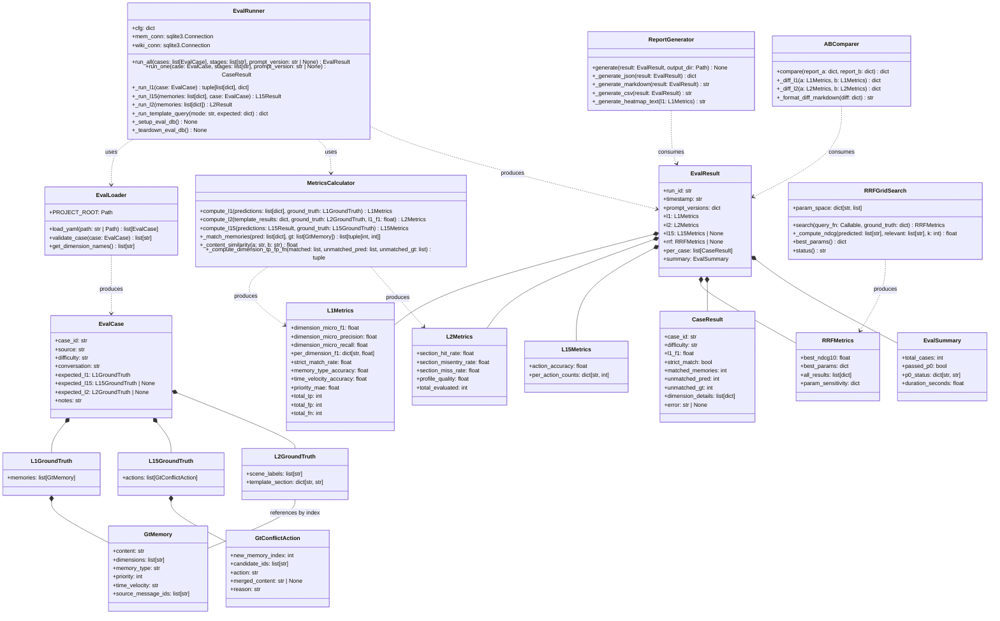
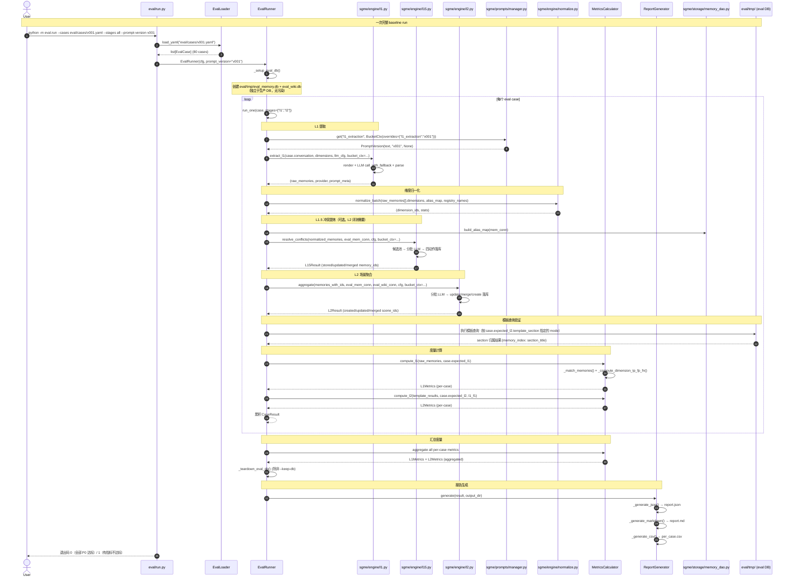
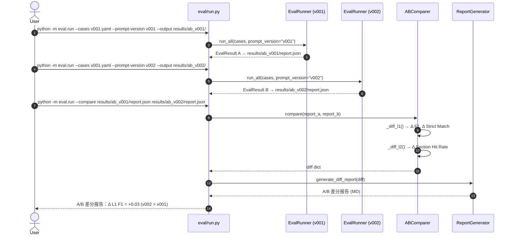
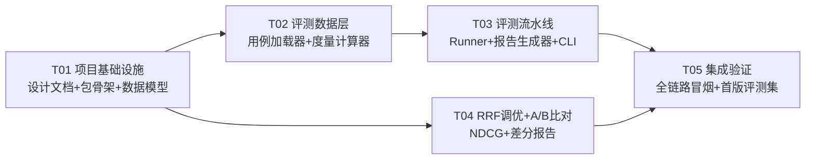

# SGME 提炼质量评测框架设计 v0.1

> 版本：v0.1
> 日期：2026-08-06
> 依据：SGME-评测基线-PRD-v0.1.md、SGME-架构设计-0.4.md §14 #32、SGME-提示词版本管理-v0.1.md（#33）
> 范围：评测引擎架构 + 评测集格式 + L1/L2/RRF 度量计算 + A/B 裁判 + 任务分解
> 约束：评测不破坏提炼链路（参数/模式开关隔离）；`eval/` 顶层目录与 `sgme/` 并列；最小侵入

---

## 0. 现状核实（已读文件确认）

| 项 | 现状 | 对评测设计的影响 |
|---|---|---|
| L1 引擎 | `sgme/engine/l1.py`：`extract_l1(conversation, dimensions, llm_cfg, ...)` 返回 `(memories, provider, prompt_meta)` | 评测直接调用 `extract_l1()`，传入 eval case 的 conversation 文本——天然可复用 |
| L1.5 引擎 | `sgme/engine/l15.py`：`resolve_conflicts(new_memories, mem_conn, cfg, ...)` → `L15Result` | 评测需提供真实 `mem_conn`（可指向临时 DB 或隔离 namespace） |
| L2 引擎 | `sgme/engine/l2.py`：`aggregate(memories, mem_conn, wiki_conn, cfg, ...)` → `L2Result` | 评测需 wiki_conn 执行模板查询，验证 section 命中 |
| 提炼调度 | `sgme/engine/refine.py`：`refine_file(file_id)` 串联 L0→L1→归一化 | 评测不走 `refine_file`（它依赖 L0 文件），直接调各引擎函数 |
| PromptStore | `sgme/prompts/manager.py`：`get(stage, ctx)` 支持版本/A-B 钉版 | 评测通过 `BucketCtx(overrides=...)` 钉版，`--prompt-version` 映射为 overrides |
| refine_runs | `sgme/storage/db.py` v3：已含 `(run_id, file_id, stage, version, variant, provider, ...)` | 评测复用 refine_runs 记录每次 eval run，`file_id` 填 `case_id` |
| 维度注册表 | `registry/dimensions.yaml`（15 维）+ `registry/aliases.yaml` | L1 F1 计算时，ground truth 维度与预测维度均已归一化为注册表 id |
| 模板引擎 | `templates/daily.yaml` `coding.yaml` `work.yaml` `full.yaml` | L2 section 命中率：执行模板查询 → 比对 section 归属 |
| 归一化 | `sgme/engine/normalize.py`：`normalize_batch()` | L1 F1 计算前对预测维度做归一化 |

---

## 1. 实现方案

### 1.1 评测如何对接现有提炼链路

**核心原则：评测套件 = 提炼链路的消费者，不做改造者。**

```
┌─────────────────────────────────────────────────────────────────┐
│                      eval/engine/runner.py                       │
│                                                                   │
│  ┌──────────┐    ┌──────────┐    ┌──────────┐    ┌───────────┐  │
│  │ 评测集加载 │ → │ L1 提取   │ → │ L1.5 冲突 │ → │ L2 场景    │  │
│  │ loader.py │    │ (调用     │    │ 提炼      │    │ 聚合       │  │
│  │           │    │  sgme.    │    │ (调用     │    │ (调用      │  │
│  │           │    │  engine.  │    │  sgme.    │    │  sgme.    │  │
│  │           │    │  l1)      │    │  engine.  │    │  engine.  │  │
│  │           │    │           │    │  l15)     │    │  l2)      │  │
│  └──────────┘    └─────┬─────┘    └─────┬─────┘    └─────┬─────┘  │
│                        │               │               │         │
│                        ▼               ▼               ▼         │
│  ┌──────────────────────────────────────────────────────────┐   │
│  │              度量计算器 metrics.py                         │   │
│  │  L1 F1 / Strict Match / memory_type Acc / time_velocity   │   │
│  │  L2 Section 命中率 / 画像质量                              │   │
│  │  RRF NDCG@10（条件：/search 实现后）                       │   │
│  └──────────────────────────────────────────────────────────┘   │
│                        │                                         │
│                        ▼                                         │
│  ┌──────────────────────────────────────────────────────────┐   │
│  │              报告生成器 reporter.py                        │   │
│  │  report.json + report.md + per_case.csv + 退出码           │   │
│  └──────────────────────────────────────────────────────────┘   │
└─────────────────────────────────────────────────────────────────┘
```

**对接方式（最小侵入）**：

1. **L1**：评测直接调用 `sgme.engine.l1.extract_l1(conversation, dimensions, llm_cfg, bucket_ctx=...)` ——与 `refine.py` 调用方式完全一致，只是 `conversation` 来自 eval case 而非 L0 文件
2. **L1.5**：评测调用 `sgme.engine.l15.resolve_conflicts(normalized_memories, eval_mem_conn, cfg, ...)` ——需要独立的 eval SQLite 数据库（`eval/tmp/eval_memory.db`），避免污染生产数据
3. **L2**：评测调用 `sgme.engine.l2.aggregate(memories_with_ids, eval_mem_conn, eval_wiki_conn, cfg, ...)` ——同理需独立 eval wiki.db
4. **模板查询**：评测调用 `sgme.profile.query_engine`（或直接 SQL）对 eval DB 执行模板查询，获取各 section 的记忆归属
5. **归一化**：评测复用 `sgme.engine.normalize.normalize_batch()`，确保预测维度与 ground truth 维度使用同一套注册表 id 体系

**隔离机制**：
- eval 使用独立的数据目录 `eval/tmp/`（含 `eval_memory.db` + `eval_wiki.db`），启动时从 `init_databases()` 创建
- eval 完成后可选清理临时 DB（`--keep-db` 保留用于调试）
- eval 不走 `refine_file()` / `refine_batch()` 等生产调度路径
- 通过 `BucketCtx(overrides={stage: version_ref})` 钉版，不修改 manifest 的 active

### 1.2 评测引擎架构

```
eval/
  __init__.py
  run.py                  # CLI 入口（python -m eval.run）
  engine/
    __init__.py
    models.py             # 数据结构：EvalCase, EvalResult, L1Metrics, L2Metrics 等
    loader.py             # 评测集加载（YAML → EvalCase 列表）
    runner.py             # 评测流水线（L1 → L1.5 → L2 → 模板查询 → 度量）
    metrics.py            # 度量计算（L1 F1, L2 命中率, RRF NDCG, 画像质量）
    reporter.py           # 报告生成（JSON + MD + CSV）
  cases/
    v001.yaml             # 首版评测集（80 条用例）
    v001_sample.yaml      # 精简样本（开发调试用 5 条）
  results/                # 评测结果输出（不入 git，但 .gitkeep 保留目录）
    .gitkeep
  tmp/                    # 评测运行时的临时 DB（不入 git）
    .gitkeep
```

### 1.3 L1 维度标注准确率计算链路

这是评测框架最核心的度量链路。从头到尾的计算过程如下：

```
┌──────────────────────────────────────────────────────────────────┐
│ 步骤 1：提取 L1 输出                                              │
│                                                                   │
│   case.conversation ──→ l1.extract_l1() ──→ raw_memories[]       │
│   （评测用例的会话文本）         │              每条含:              │
│                              │              content, dimensions   │
│                              │              (LLM 原始标签),        │
│                              │              memory_type, priority, │
│                              │              time_velocity          │
└──────────────────────────────┼───────────────────────────────────┘
                               │
                               ▼
┌──────────────────────────────────────────────────────────────────┐
│ 步骤 2：归一化预测维度（复用 normalize.py）                        │
│                                                                   │
│   raw_memories[].dimensions ──→ normalize.normalize_batch()       │
│   （如 ["技术栈", "风格"]）    │   别名表 + fuzzy 兜底              │
│                              ──→ dimension_ids                    │
│                                  （如 ["tech_stack", "style"]）    │
│   归一化失败的标签 → 丢弃（不计入 FP/FN，仅记 anomaly_log）        │
└──────────────────────────────┼───────────────────────────────────┘
                               │
                               ▼
┌──────────────────────────────────────────────────────────────────┐
│ 步骤 3：记忆匹配（预测 ↔ ground truth）                            │
│                                                                   │
│   预测记忆列表: [M_pred_1, M_pred_2, ...]                         │
│   GT 记忆列表:  [M_gt_1,   M_gt_2,   ...]                        │
│                                                                   │
│   匹配策略（内容相似度 + 最大权匹配）：                              │
│   - 对每对 (pred_i, gt_j)，计算 content 的归一化编辑距离相似度      │
│   - sim = 1 - Levenshtein(pred.content, gt.content)               │
│            / max(len(pred), len(gt))                              │
│   - 构建二分图，使用贪心最大匹配（Hungarian 可选，首版贪心）        │
│   - sim ≥ 0.5 → 匹配成功；< 0.5 → 不匹配                          │
│   - 每个预测最多匹配一个 GT，每个 GT 最多匹配一个预测               │
│                                                                   │
│   匹配结果：                                                       │
│   - matched_pairs: [(pred_i, gt_j), ...]                          │
│   - unmatched_preds: [pred_i, ...]  → 视为 FP 记忆（多提取）       │
│   - unmatched_gts:   [gt_j, ...]    → 视为 FN 记忆（漏提取）       │
└──────────────────────────────┼───────────────────────────────────┘
                               │
                               ▼
┌──────────────────────────────────────────────────────────────────┐
│ 步骤 4：维度级 TP/FP/FN 计算                                      │
│                                                                   │
│   对每对匹配 (pred, gt)：                                         │
│     pred_dims = set(pred.dimension_ids)  # 归一化后的维度 id 集合  │
│     gt_dims   = set(gt.dimensions)       # ground truth 维度集合  │
│                                                                   │
│     TP += |pred_dims ∩ gt_dims|        # 标对的维度                │
│     FP += |pred_dims - gt_dims|        # 多标的维度                │
│     FN += |gt_dims - pred_dims|        # 漏标的维度                │
│                                                                   │
│   对 unmatched_preds（多提取的记忆）：                              │
│     FP += Σ |pred.dimension_ids|       # 整条记忆的所有维度都算 FP │
│                                                                   │
│   对 unmatched_gts（漏提取的记忆）：                                │
│     FN += Σ |gt.dimensions|            # 整条记忆的所有维度都算 FN │
└──────────────────────────────┼───────────────────────────────────┘
                               │
                               ▼
┌──────────────────────────────────────────────────────────────────┐
│ 步骤 5：汇总计算 L1 指标                                          │
│                                                                   │
│   微平均 Precision = TP / (TP + FP)                               │
│   微平均 Recall    = TP / (TP + FN)                               │
│   微平均 F1        = 2 * P * R / (P + R)                          │
│                                                                   │
│   逐维度 F1：对每个维度 id 单独统计 TP_d / FP_d / FN_d → F1_d     │
│                                                                   │
│   Strict Match Rate = count(case 全部维度完全匹配) / total_cases   │
│     （某 case 的 pred_dims == gt_dims 对所有匹配 memory 成立       │
│       且无 unmatched_preds 和 unmatched_gts → 该 case strict=1）   │
│                                                                   │
│   对匹配记忆对计算：                                               │
│     memory_type Acc = count(pred.type == gt.type) / matched_pairs  │
│     time_velocity Acc = count(pred.tv == gt.tv) / matched_pairs    │
│     priority MAE = Σ|pred.priority - gt.priority| / matched_pairs  │
└──────────────────────────────────────────────────────────────────┘
```

**关键设计决策**：
- 维度注册表的作用：提供 ground truth 的维度 id 体系（`expected_l1.memories[].dimensions` 已是注册表 id），归一化层确保预测维度也映射到同一 id 体系
- 记忆匹配使用内容相似度而非顺序匹配——LLM 输出顺序不稳定，内容匹配更可靠
- 相似度阈值 0.5 为初始值，可在评测迭代中根据 IAA（标注者间一致率）校准

### 1.4 L2 Section 命中率计算

L2 评测需要完整走完 L1 → L1.5 落库 → L2 聚合 → 模板查询的全链路。

```
┌──────────────────────────────────────────────────────────────────┐
│ 步骤 1：全链路执行                                               │
│                                                                   │
│   case.conversation                                               │
│     → l1.extract_l1()      → raw_memories (含维度标签)            │
│     → normalize             → dimension_ids                       │
│     → l15.resolve_conflicts → 落库到 eval_memory.db               │
│     → l2.aggregate          → 场景聚合到 eval_wiki.db             │
│     → 模板查询（case 指定的 mode）→ section 归属                  │
└──────────────────────────────┼───────────────────────────────────┘
                               │
                               ▼
┌──────────────────────────────────────────────────────────────────┐
│ 步骤 2：模板查询执行                                             │
│                                                                   │
│   对 case.expected_l2.template_section 指定的 mode：              │
│   - 加载模板 YAML（如 templates/daily.yaml）                      │
│   - 逐个 section 执行结构化 SQL 查询（维度过滤 + 排序 + limit）    │
│   - 收集每条记忆落入的 section 标题                               │
│                                                                   │
│   section 匹配规则：                                              │
│   - 模板 section.title 是 LLM 友好的展示文本（如 "👤 基本信息"）   │
│   - 评测时比较记忆落入的 section.title 与 GT 中的                  │
│     expected_l2.template_section[memory_index] 是否一致           │
│   - 匹配以记忆的 memory_id（通过 content 关联到 GT memory）       │
└──────────────────────────────┼───────────────────────────────────┘
                               │
                               ▼
┌──────────────────────────────────────────────────────────────────┐
│ 步骤 3：计算 L2 指标                                             │
│                                                                   │
│   Section 命中率 = 命中预期 section 的记忆数 / GT 应有记忆总数     │
│     - 分子：template_section 匹配正确的记忆条数                    │
│     - 分母：expected_l2.template_section 中列出的记忆总数          │
│                                                                   │
│   Section 误入率 = 进入错误 section 的记忆数 / 查询返回记忆总数    │
│   Section 漏出率 = 未出现在任何 section 的记忆数 / GT 应有记忆总数 │
│                                                                   │
│   画像质量 = L1_Dimension_F1 × L2_Section_HitRate                 │
└──────────────────────────────────────────────────────────────────┘
```

**模板 section 匹配细节**：
- 模板 section 的 `query.dimensions`（AND 语义）决定了哪些记忆会落入该 section
- 评测脚本执行模板查询时，记录每个 section 返回的 memory_id 列表
- 通过 `scene_memories` 表或直接查询 `memory_tags`，反查每条 GT 记忆落入的 section
- GT 的 `template_section` 字段标注格式：`{memory_index: section_title}`

### 1.5 RRF 评估接口

RRF 评估依赖 `/search` 端点（当前未实现），但评测框架需要预留接口。

```
┌──────────────────────────────────────────────────────────────────┐
│ RRF 评估架构（当前：接口预留，/search 实现后接入）                │
│                                                                   │
│   eval/engine/rrf.py                                              │
│   ┌──────────────────────────────────────────────────────────┐   │
│   │ GridSearch                                                 │   │
│   │   param_space: {rrf_k, bm25_weight, top_k, bm25_k1, bm25_b}│   │
│   │   search() → list[(params, ndcg_score)]                   │   │
│   │   best_params() → dict                                    │   │
│   └──────────────────────────────────────────────────────────┘   │
│                                                                   │
│   接入方式（/search 实现后）：                                    │
│   1. 构建 RRF 评测子集（~30 条，含 expected_search_results）      │
│   2. 对每个参数组合：                                             │
│      - 调用 sgme.search.engine.search(query, params)             │
│      - 或用 HTTP 客户端调 MemoryHub /v1/search                    │
│      - 获取排序后的 memory_id 列表                                │
│   3. 与 expected_search_results 比对，计算 NDCG@10               │
│   4. 网格搜索结束 → 输出最优参数 + 敏感度曲线数据                  │
│                                                                   │
│   当前阶段（/search 未实现）：                                    │
│   - rrf.py 定义完整的接口签名与数据结构                           │
│   - GridSearch.search() 抛 NotImplementedError，附提示信息        │
│   - NDCG 计算函数可独立使用（接受任意排序列表 + GT 列表）          │
└──────────────────────────────────────────────────────────────────┘
```

**NDCG@10 计算公式**：

```
DCG@10 = Σ_{i=1}^{10} rel_i / log₂(i+1)
  其中 rel_i = 1（第 i 位记忆在 GT 相关列表中） / 0（不在）
IDCG@10 = 理想排序下的 DCG@10（GT 直接按相关性排列）
NDCG@10 = DCG@10 / IDCG@10
```

### 1.6 #33 A/B 裁判

评测框架是 #33 提示词版本管理的 A/B 裁判消费者：

```
┌──────────────────────────────────────────────────────────────────┐
│ A/B 评测流程                                                     │
│                                                                   │
│   python -m eval.run \                                           │
│     --cases eval/cases/v001.yaml \                               │
│     --prompt-version v001 \    ← A 版                             │
│     --output eval/results/ab_v001/                                │
│                                                                   │
│   python -m eval.run \                                           │
│     --cases eval/cases/v001.yaml \                               │
│     --prompt-version v002 \    ← B 版                             │
│     --output eval/results/ab_v002/                                │
│                                                                   │
│   python -m eval.run --compare \                                 │
│     eval/results/ab_v001/report.json \                           │
│     eval/results/ab_v002/report.json                              │
│   → 输出 A/B 差分报告：                                          │
│     Δ L1 F1 = +0.03 (v002 > v001)                                │
│     Δ Strict Match = +0.05                                       │
│     逐维度 F1 变化热力图                                          │
│                                                                   │
│   实现方式：                                                      │
│   - --prompt-version 映射为 BucketCtx(overrides={stage: version}) │
│   - PromptStore 的 overrides 优先级高于 manifest active           │
│   - 每个版本跑完整的全链路评测                                    │
│   - --compare 模式纯离线：读两份 report.json → diff → 输出        │
│                                                                   │
│   不做自动裁决：结论留人工 + 评测集，差分报告只呈现数据            │
└──────────────────────────────────────────────────────────────────┘
```

---

### 1.7 注入效果评测（T-20）

评测框架在 L1/L2/RRF 之外新增注入效果阶段，度量定义见 PRD §5.4。

#### 1.7.1 数据形态

评测用例在既有 L1/L2 ground truth 之外附加可选字段 `expected_inject`：

```yaml
expected_inject:
  mode: coding                          # 注入模式（daily/coding/work/full）
  subsequent_conversation: |            # 用户后续对话（注入画像之后的对话）
    [msg#2] 2026-01-02T10:00:00Z user:
      那个 Rust 项目 CI 挂了，帮我看看怎么办
  referenced_memory_indices: [1]        # 后续对话引用的 GT 记忆索引（按 expected_l1.memories）
```

`referenced_memory_indices` 是人工标注的「后续对话引用了哪些 GT 记忆」，
与 §1.3 的 ground truth 标注同一套人工流程，零 LLM 判定。

#### 1.7.2 执行链路

```
┌──────────────────────────────────────────────────────────────────────┐
│ 注入评测阶段（eval/runner.py 的 inject stage）                        │
│                                                                      │
│  case.expected_inject                                                 │
│    │                                                                │
│    ▼                                                                │
│  GT 记忆落库（复用 retrieval_gt 的确定性 memory_id 规则）            │
│    memory_id = {case_id}#{idx}                                      │
│    updated_at 取当前 UTC（模板含 time_window，必须保证记忆在窗口内）  │
│    ▼                                                                │
│  模板加载 + 注入（sgme.profile.inject / build_inject_blocks）        │
│    零 LLM 纯 SQL：query_section 逐 section 查询                       │
│    ▼                                                                │
│  画像块 blocks[]（title / items[memory_id] / present）               │
│    ▼                                                                │
│  compute_inject_metrics（eval/metrics.py）                           │
│    注入命中率 = 相关块数 / 注入块总数                                 │
│    引用覆盖率 = 命中且引用数 / 引用记忆数                             │
└──────────────────────────────────────────────────────────────────────┘
```

#### 1.7.3 度量计算（metrics.py 新增）

```
compute_inject_metrics(blocks, expected_inject) -> InjectMetrics
  # blocks: build_inject_blocks 输出（含 memory_id，present 标记）
  # 相关块：块内含 ≥1 条 memory_id 索引 ∈ referenced_memory_indices 的记忆
  # 注入命中率 = 相关块数 / present=true 的块数
  # 引用覆盖率 = (被引用且注入命中的记忆数) / len(referenced_memory_indices)
```

#### 1.7.4 文件改动

| 文件 | 改动 |
|---|---|
| `eval/models.py` | 新增 `InjectGroundTruth` / `InjectMetrics` / `CaseResult` 注入字段 |
| `eval/loader.py` | 解析并校验 `expected_inject` |
| `eval/metrics.py` | 新增 `compute_inject_metrics` / `aggregate_inject_metrics` |
| `eval/runner.py` | 新增 inject stage（复用 retrieval_gt 落库 + profile.inject） |
| `eval/reporter.py` | report.json / report.md 注入段 |
| `eval/run.py` | `--stages` 支持 inject |
| `tests/test_eval.py` | 注入度量 + runner inject stage 测试 |

---

## 2. 文件列表

### 新增文件

| 文件 | 说明 |
|---|---|
| `docs/design/SGME-评测框架设计-v0.1.md` | 本文档 |
| `docs/design/eval-class-diagram.mermaid` | 类图（§3） |
| `docs/design/eval-sequence-diagram.mermaid` | 时序图（§4） |
| `eval/__init__.py` | 评测包入口 |
| `eval/run.py` | CLI 入口（python -m eval.run） |
| `eval/engine/__init__.py` | 引擎包入口 |
| `eval/engine/models.py` | 数据结构定义（EvalCase, EvalResult, L1Metrics, L2Metrics, ...） |
| `eval/engine/loader.py` | 评测集加载器（YAML → EvalCase 列表，校验 ground truth schema） |
| `eval/engine/runner.py` | 评测流水线（串联 L1/L1.5/L2/模板查询 + 调用 metrics） |
| `eval/engine/metrics.py` | 度量计算器（L1 F1 + Strict Match + L2 命中率 + 画像质量 + NDCG） |
| `eval/engine/reporter.py` | 报告生成器（report.json + report.md + per_case.csv） |
| `eval/engine/rrf.py` | RRF 网格搜索 + NDCG 计算（接口预留，/search 实现后接入） |
| `eval/engine/ab.py` | A/B 差分报告（读两份 report.json → diff 输出） |
| `eval/cases/.gitkeep` | 保持 cases 目录存在 |
| `eval/cases/v001_sample.yaml` | 精简样本评测集（5 条，开发调试用） |
| `eval/results/.gitkeep` | 保持 results 目录存在 |
| `eval/tmp/.gitkeep` | 保持 tmp 目录存在 |
| `tests/test_eval_loader.py` | loader 单测（用例加载 + schema 校验） |
| `tests/test_eval_metrics.py` | metrics 单测（L1 F1 + L2 命中率计算） |
| `tests/test_eval_runner.py` | runner 集成测试（用 mock LLM + v001_sample） |
| `tests/test_eval_reporter.py` | reporter 单测（JSON/MD/CSV 输出） |

### 修改文件

| 文件 | 改动 |
|---|---|
| `AGENTS.md` | 文档索引增加本文档路径 |

**无需修改的文件**（评测通过现有 public API 对接，不动核心提炼逻辑）：
- `sgme/engine/l1.py` — 不动
- `sgme/engine/l15.py` — 不动
- `sgme/engine/l2.py` — 不动
- `sgme/engine/refine.py` — 不动
- `sgme/storage/db.py` — 不动（复用 refine_runs 表，评测 `file_id` 填 `case_id`）
- `sgme/prompts/manager.py` — 不动（通过 BucketCtx.overrides 钉版）

---

## 3. 数据结构与接口（类图）

见 `docs/design/eval-class-diagram.mermaid`（合并版见下）：



### 评测用例 YAML 格式

```yaml
# eval/cases/v001.yaml — SGME 评测基线 v001
# 格式约定：字段英文，注释中文；cases 数组每条为一个评测用例

meta:
  version: v001
  created_at: "2026-08-06T00:00:00Z"
  total_cases: 80
  description: "SGME L1/L2 提炼质量评测基线首版"

cases:
  - case_id: eval-001
    source: synthetic
    difficulty: easy
    conversation: |
      [msg#1] 2026-01-01T10:00:00Z user:
        我叫张明，在深圳做后端开发，用 Python 和 Go
    expected_l1:
      memories:
        - content: "张明，深圳，后端开发"
          dimensions: [identity, skills, tech_stack]
          memory_type: persona
          priority: 85
          time_velocity: static
          source_message_ids: ["msg_1"]
    expected_l2:
      scene_labels: ["个人信息"]
      template_section:
        daily:
          "0": "👤 基本信息"    # memory_index → section_title
    notes: "基础单维度标注 + 多维度拆分"

  - case_id: eval-002
    source: synthetic
    difficulty: medium
    conversation: |
      [msg#1] 2026-01-01T11:00:00Z user:
        SGME 这个项目架构从 Fork 改自研了，用 Python 重写，参考了 TencentDB-Agent-Memory 的设计
    expected_l1:
      memories:
        - content: "SGME 项目从 Fork 改为 Python 自研"
          dimensions: [projects, tech_stack]
          memory_type: episodic
          priority: 80
          time_velocity: static
          source_message_ids: ["msg_1"]
        - content: "参考了 TencentDB-Agent-Memory 的设计思想"
          dimensions: [tech_stack, values]
          memory_type: episodic
          priority: 75
          time_velocity: static
          source_message_ids: ["msg_1"]
    expected_l2:
      scene_labels: ["SGME 架构演进"]
      template_section:
        coding:
          "0": "📦 项目进展"
          "1": "🔧 技术决策"
    notes: "维度边界：项目 vs 技术栈 vs 价值观"

  # ... 其余 78 条用例
```

---

## 4. 程序调用流程（时序图）

见 `docs/design/eval-sequence-diagram.mermaid`（合并版见下）：



### A/B 对比时序



---

## 5. 依赖包列表

无新增第三方依赖。所有依赖已在 `pyproject.toml` 中：

```
- PyYAML>=6.0          # YAML 解析（eval cases + report）
- pytest>=7.0          # 测试框架
- rapidfuzz (可选)     # 高精度内容相似度匹配（stdlib difflib 兜底）
```

`rapidfuzz` 为可选依赖——首版使用 stdlib `difflib.SequenceMatcher` 做内容相似度匹配，若后续发现匹配准确率不足，再引入 rapidfuzz 替代。`difflib` 在评测规模（80 条用例 × ~5 条记忆）下性能可接受。

---

## 6. 共享知识（跨文件约定）

- **评测用例 YAML schema**：`case_id` 格式 `eval-{NNN}`（三位数字）；`source ∈ {real, synthetic, edge}`；`difficulty ∈ {easy, medium, hard}`；`expected_l1.memories[].dimensions` 必须是注册表 id（英文 snake_case）；`expected_l2.template_section` 的 key 是 mode 名（daily/coding/work/full），value 是 `{memory_index: section_title}` 映射
- **评测 DB 隔离**：eval 使用 `eval/tmp/eval_memory.db` + `eval/tmp/eval_wiki.db`（独立数据目录），每次 `run_all()` 启动时 `init_databases(eval_tmp_dir)` 创建干净 DB，run 结束后可选清理（`--keep-db` 保留）；绝不碰生产 `data/memory.db` 或 `data/wiki.db`
- **提示词版本钉版**：`--prompt-version vNNN` 映射为 `BucketCtx(overrides={"l1_extraction": "versions/l1_extraction/vNNN.txt", "l1_conflict": ..., "l2_scene": ...})`；不指定时走 manifest active（默认 @working）
- **refine_runs 复用**：评测每次 L1/L1.5/L2 调用自动记录 refine_run（engine 层已实现），`file_id` 填 `case_id`（形如 `eval-001`）；A/B 评测时同一 case 会产生两条 refine_run（version 不同），便于追溯
- **记忆匹配相似度阈值**：`_content_similarity()` 阈值 0.5（stdilb `SequenceMatcher.ratio()`），低于阈值视为不匹配；可在 `eval/engine/metrics.py` 中通过 `MATCH_THRESHOLD` 常量调整
- **维度归一化一致性**：评测使用与生产相同的 `normalize.normalize_batch()` + `alias_map` + `registry_names`，确保预测维度 id 与 GT 维度 id 在同一命名空间
- **报告格式**：`report.json` 字段英文（可机器消费）；`report.md` 中文（人类可读）；`per_case.csv` 表头英文
- **CLI 退出码**：全部 P0 指标达标 → `exit(0)`；任一不达标 → `exit(1)`（用于 CI 集成）
- **TDD 铁律**：测试文件先写（单测 + mock LLM），后写实现；mock 全绿后跑真实 LLM 冒烟

---

## 7. 任务分解（有序，含依赖）

> 实现顺序 T01 → (T02 ∥ T03) → T04 → T05；每个任务包含 >=3 个文件，总计 5 个任务（硬性上限）。

| ID | 任务 | 源文件 | 依赖 | 优先级 |
|---|---|---|---|---|
| **T01** | 项目基础设施：设计文档 + 评测包骨架 + 数据模型 | `docs/design/SGME-评测框架设计-v0.1.md`、`docs/design/eval-class-diagram.mermaid`、`docs/design/eval-sequence-diagram.mermaid`、`eval/__init__.py`、`eval/engine/__init__.py`、`eval/engine/models.py`、`eval/cases/.gitkeep`、`eval/results/.gitkeep`、`eval/tmp/.gitkeep`、`AGENTS.md`（文档索引修订） | 无 | P0 |
| **T02** | 评测数据层：用例加载器 + 度量计算器 | `eval/engine/loader.py`、`eval/engine/metrics.py`、`eval/cases/v001_sample.yaml`（5 条样本）、`tests/test_eval_loader.py`、`tests/test_eval_metrics.py` | T01 | P0 |
| **T03** | 评测流水线：Runner + 报告生成器 | `eval/engine/runner.py`、`eval/engine/reporter.py`、`eval/run.py`、`tests/test_eval_runner.py`、`tests/test_eval_reporter.py` | T02 | P0 |
| **T04** | RRF 调优 + A/B 比对 | `eval/engine/rrf.py`（NDCG + 网格搜索接口）、`eval/engine/ab.py`（A/B 差分）、`tests/test_eval_rrf.py`、`tests/test_eval_ab.py` | T01 | P1 |
| **T05** | 集成验证：全链路冒烟 + 首版评测集生成 | `eval/cases/v001.yaml`（首版 50+ 条标注用例）、`scripts/eval_ci.py`（CI 集成脚本）、`tests/test_eval_integration.py`（真实 LLM 冒烟） | T03, T04 | P1 |

---

## 8. 任务依赖图



---

## 9. 待明确事项

1. **内容相似度匹配阈值**：当前设为 0.5（difflib.SequenceMatcher.ratio），是否需要在首版评测集建成后用人工评估校准？建议在 T05 集成验证阶段跑 5 条样本，人工检查匹配对质量后调整。

2. **记忆匹配的 Hungarian 算法 vs 贪心匹配**：首版使用贪心最大匹配（简单、可解释）；若发现匹配冲突率高（同一 GT 记忆被多个预测竞抢），后续迭代可引入 Hungarian 算法。当前评测规模下贪心匹配质量可接受。

3. **L2 模板查询 section 匹配粒度**：当前设计按 section.title 精确匹配。若模板改了 title（如 "基本信息" → "👤 基本信息"），GT 中的 `template_section` 需同步更新。是否考虑用 section 的 `query.dimensions` 作为更稳定的匹配锚点？建议首版用 title，若变更频繁再改用 dimensions。

4. **eval/tmp/ 目录的 .gitignore**：`eval/tmp/` 下的 SQLite 文件不入 git，但需确认项目 `.gitignore` 已包含 `*.db` 规则（当前 `AGENTS.md` 约束 #2 已声明 `*.db` 不入 git）。

5. **RRF 评测子集的 ground truth 格式**：`expected_search_results` 字段尚未在用例结构中定义（因 /search 未实现）。建议在 `/search` 实现时同步补充该字段，标注格式为 `{query_text: [relevant_memory_ids_in_order]}`。

---

## 10. 关键设计决策（5 条）

1. **独立 eval DB，零生产污染**：评测使用 `eval/tmp/` 下的独立 SQLite 数据库（`init_databases(eval_tmp_dir)`），与生产 `data/` 目录物理隔离。每次 run 从干净 DB 开始，绝不碰生产数据。

2. **内容相似度记忆匹配**：L1 F1 计算依赖将 LLM 输出的记忆与 ground truth 记忆配对。采用 difflib 内容相似度 + 贪心最大匹配，而非顺序匹配——因为 LLM 输出顺序不稳定。

3. **复用 normalize.py 保证维度体系一致**：评测预测维度通过与生产相同的 `normalize.normalize_batch()` 归一化到注册表 id，确保与 ground truth（已在标注时使用注册表 id）在同一命名空间下比较。

4. **RRF 评估接口预留、NDCG 计算先独立**：RRF 评估的 `GridSearch.search()` 在 `/search` 实现前抛 `NotImplementedError`，但 `_compute_ndcg()` 作为独立函数可被测试和验证。评测框架不阻塞 `/search` 的开发节奏。

5. **A/B 裁判不自动裁决**：与 #33 设计一致——评测框架只产出 A/B 差分数据（Δ F1、Δ 命中率），版本优劣结论留人工判断。`--compare` 模式读两份 report.json 纯离线对比，不重新跑提炼。

---

*文档完。v0.1 初版，待团队评审后修订。*
